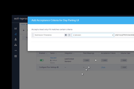
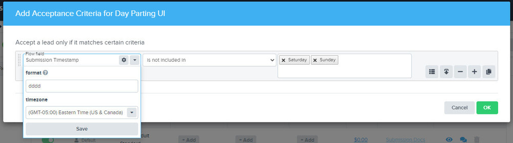

l9ACz-v4o6YOlBtkkkypMVulpAKfsExCVnDbVP1jL7dyoR9WnPHiCdPrKel1dDHVb~wxygvqqytfubsjI8TNrNquBJMMK6MesSVmnmKoyDUhsOkTefVI7SukJ10uRuaVbbPbQz374nkQCpQGjWw__&Key-Pair-Id=APKAIDFCFZ2UHE5LPIUA)](https://community.activeprospect.com/memberships/7557680-scott-mckee)

[_Scott McKee_](https://community.activeprospect.com/memberships/7557680-scott-mckee)

Updated December 1, 2020. Published December 1, 2020.

Details

# Adding a Source

# The Basics

You can add data sources to your flow using the flow editor.

From the flow's edit mode, click on the **Sources** tab, and then the **Add Source** button in the upper right corner.

In the **Select a Source or Integration** menu you will find the list of existing sources and integrations.

There are four types of Sources:

1. Default - Each flow has a default source labeled with your account name
2. Standard - Lead vendors familiar with the ActiveProspect platform
3. Account - LeadConduit account holders who opted to be listed
4. Custom - Lead sources defined by you and specific to your account e.g.
   - Your web forms
   - Twilio numbers routed through LeadConduit
   - Vendors unfamiliar with LeadConduit
   - Other non-standard use cases

In the **Select a Source or Integration** menu you can:

- Search for or scroll through the list of existing sources and integrations
- Create a new custom source, specific to your account

# Adding a New Custom Source

We only recommend creating a custom source if your source does not exist in the standard source library. When creating a new custom source you will select the type of integration it will use by default in this flow:

If you later need to change a custom source's integration type, you can edit the source in the sources library to make additional integrations available, then in your flow re-select which of those integrations will apply in that flow.

# Adding a New Web Form Source

If you want to use an existing web form as a source, and if you know the url of that form's web page, LeadConduit may be able to automatically configure the source from your web form by reading the web page itself.

First, check the sources list to be sure that you haven't already used that web form as a source for a different flow. _There's no need to create a new web form source if one already exists._

To create a new web form source, enter the web form page's url into the ""Enter Your Webform URL"" box (""D"") and follow the prompts. This option works best with simple HTML forms. Results are unpredictable with forms that are created and managed by form-generating applications or forms that are submitted via javascript:

Type something"
