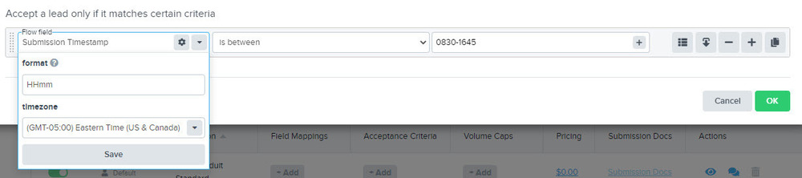

4jvSygeYmAY1ldtCtp31eXWStDnN~iPD-q2sCnWabr5-kbB-JVTwnVO7Pq6Dc5b8Z-ogixPXuZhKWaJ18yBMQpA~ubfuEEb~fvyH3a5LGFnOF~doFMzG3srM0fHroau37MMRQQja4zkJBK7RTDA__&Key-Pair-Id=APKAIDFCFZ2UHE5LPIUA)](https://community.activeprospect.com/memberships/7557680-scott-mckee)

[_Scott McKee_](https://community.activeprospect.com/memberships/7557680-scott-mckee)

Updated March 22, 2021. Published January 29, 2021.

Details

# Creating a Delivery in JSON Format

With LeadConduit, the platform can deliver the data in various formats to your CRM, and a lot of them have already been developed for easy consumption. Before you get started with creating your own delivery step, you should check out [the integration landing page](https://activeprospect.com/integrations/?type=delivery) to see if ActiveProspect has already created one that fits your needs. If you cannot find what you are looking for, then please continue to read this post on how to perform this integration.

The first step is to gather the required information such as:

- Posting documentation
  - The API endpoint URL
  - Describe how the data format should be
  - Describe how the response format should be
- Any credential that is needed

**NOTE:** For this post, we will assume that the API endpoint doesn’t require any credentials.

To help illustrate the post’s purpose, we will create some fake API endpoints and data examples.

# Example Posting Document

- **API Endpoint:** [https://my\_test\_AP\_endpoint](https://my_test_ap_endpoint/)
- **Data Format:**

- **Response Format:**

All of the information in the example posting document is useful for LeadConduit configuration and is the minimum requirement.

# Implementation Steps

01. Log into LeadConduit.
02. Click ""Flows"" in the top header menu.
03. Click “Edit Flow” in the Actions column to the right of your Flow.
04. Click on the “Steps” tab if it doesn't default to that tab.
05. Click the “Add Step”  button and select “Recipient Step”.

    
06. In the pop-up window, scroll down to and select “Custom” (the one with the ""Custom"" Icon)

    

07. Give your recipient a unique, meaningful name. This name will be used to identify this recipient as the origin of its appended data and in LeadConduit reporting.

    
08. If a similarly-named recipients already exist, you'll be prompted to optionally choose one of them instead.

    
09. Select the ""Custom Json"" integration type. You'll be able to change this selection later on, or if you use this same recipient elsewhere in a flow.

    
10. Click the new delivery to expand it and click “Edit Field Mappings” to start mapping fields and values to recipient properties.
11. Map the API's URL and HTTP Method. The Method will usually be ""POST"". ""PUT"" and ""DELETE"" are other methods that the recipient may specify in their docs. If nothing is specified, use

    ""POST"".

    
12. Map the Data Properties

    The next step is to map your data to fit the Json structure specified in the recipient's posting docs. LeadConduit will leverage Dot Notation to create the structure. If you're not familiar with Dot Notation, [here's a tool](https://www.convertjson.com/json-path-list.htm) that can convert Json objects to dot notation.
    1. Start at “Add a new mapping” by clicking on the “+” sign

       
    2. On the left, or ""Map"" side, click the ""+"" to select a field. If you want to hard-code a value into the mapping, type the value into ""Map"" side instead. Note that once entered, fields will be displayed on a green background, while hard-coded values will be displayed without a background.

       
    3. On the right, or ""to"" side, select ""Json Property"" from the drop-down.

       

       
    4. Then enter the Dot Notation corresponding to the recipient property.

       
    5. Repeat this process for the other parameters to be sent to the recipient.

       
    6. Here is an example of mapped properties, some of which are ""wrapped"" in other properties.

       
13. Finally, set up Response Parsing mappings to teach this delivery step how to recognize a success response and where, if the recipient rejects the lead, to capture the reason from their response. Search the Community for "" **Response Parsing**"" to find instructions.

|     |
| --- |
| To learn more about this topic, please also see [""Response Parsing: Did my lead Delivery step succeed or fail?""](https://community.activeprospect.com/series/4093977-response-parsing-did-my-lead-delivery-step-succeed-or-fail), particularly the post [""Parsing JSON Response Bodies Using Dot Notation""](https://community.activeprospect.com/series/4093977/posts/4064908-parsing-json-response-bodies-using-dot-notation). |

Type something"
