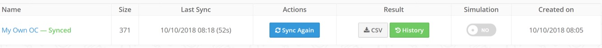
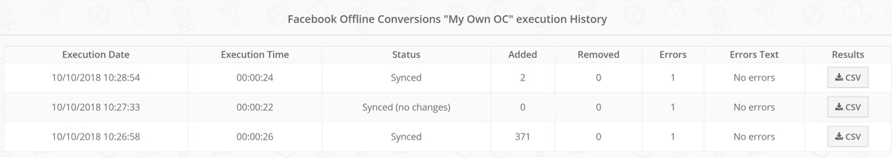

drlkLKj0NZ4L2bZMi2zFS2scXycbchT3I8FUU5D1xm2XODS7ULn2GyNDZTuSBdIGxbfD3ESZjSVjzFGY7P-sd0ICZCXcL3Dv~Mu217qxghMSN6fplpTGt2xGlKCQ4zCto2RP5HFLulc2F~WTAvg__&Key-Pair-Id=APKAIDFCFZ2UHE5LPIUA)](https://community.activeprospect.com/memberships/8017840-claudia-melis)

[_Claudia Melis_](https://community.activeprospect.com/memberships/8017840-claudia-melis)

Updated December 1, 2023. Published June 20, 2023.

Details

# Getting Started with Facebook Custom Audiences

LeadsBridge’s Custom Audience Sync is a tool to create retargeting audiences between your CRM/platform and Facebook. It gathers information, such as email addresses and phone numbers, and keeps them always updated.

Create better Ads targeting people with specific interests and behavior. Set and forget campaigns, and use audiences mirrored with every stage of your funnel.

## Custom Audience Overview

### Custom Fields

By accessing more information from your CRM/platform, Facebook can create more profiled Custom Audiences and Lookalike Audiences to target with advertising, improving the efficiency of the Ads.

Not only you can sync basic information such as email and phone number, but also the First and Last name, Birthday, Country, Zip code, State, City, and Gender. Map as many fields as you want to achieve higher-performing data matching to people on Facebook.

### Customer Lifetime Value

Include the Lifetime Value of your clients/leads to create a value-based [Lookalike Audience](https://www.facebook.com/business/help/164749007013531?id=401668390442328). That Lookalike Audience will then be made up of the people most similar to your highest-value customers, while a regular Lookalike Audience can only find people similar to all your clients/leads.

The LTV allows Facebook to focus on an audience similar to the clients who spend more money in the long run.

### Source Filter

Segment contacts by filtering them based on certain conditions. This is useful when you have big lists, or rather when you’d like to retarget only a group of people, excluding other contacts that don’t match the filter’s conditions added.

Learn more on [how to use the Source Filter](https://community.activeprospect.com/posts/5090356-how-to-filter-incoming-leads-on-leadsbridge) option.

### Audience Manager

Along with the Custom Audiences Sync, we introduced our manager with powerful additions:

- See the last audience size synced
- Check the _History_ of the sync processes
  - See the last execution date and time, contacts synced, added, or removed.
  - See the last error received
  - Download the CSV report of the sync
- Simulate the next run

LeadsBridge automatically detects and tries to fix errors like wrong date format, wrong column format, or wrong API responses for some specific records.

You can reap the benefits of the Custom Audience Sync in all of our plans.

Type something"
