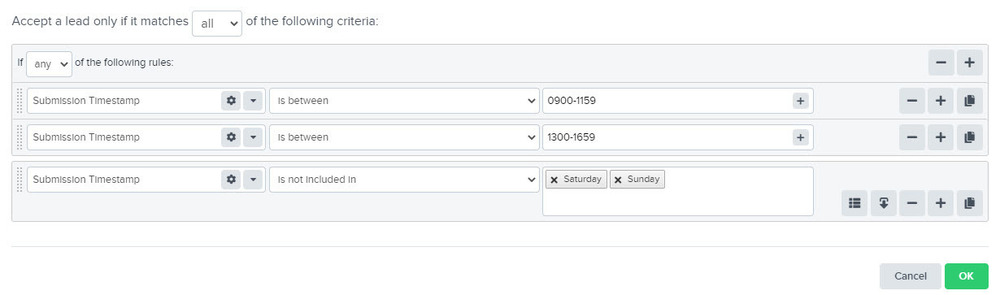

66tcRyFXY1bxLes3G7g0Ac5y~BUZaxKji3Lgirn1VkpwQHAuqEPJ5m-3L4ehrNSOC5LygGD56BxoX2lPlCErUm27kJR9RlY4rsKJtoHsf9J3fKq9nMb4nEYjoStIE8joZbDVGTGL~buC24BMDcw__&Key-Pair-Id=APKAIDFCFZ2UHE5LPIUA)](https://community.activeprospect.com/memberships/9624817-ayesha-akhtar)

[_Ayesha Akhtar_](https://community.activeprospect.com/memberships/9624817-ayesha-akhtar)

Updated November 20, 2023. Published November 20, 2023.

Details

# Implementing TrustedForm on Landbot

How to add TrustedForm to a Landbot form.

Begin by logging into your Landbot account.

Select the bot you want to use with TrustedForm by clicking edit or create a new bot where you could add a form:

Once the bot has opened, make sure you are in the 'Build mode'. Click on the Blue arrow to hide/unhide the side menu.

Create a simple chatbot flow using the 'Simple' and 'Advanced' components on the left hand side. Make sure to add a form to your flow where you aim to capture user information.

From can be added by clicking 'Advanced' > scroll to 'Questions' > then click on 'Forms'.

Once your flow is built, click on 'Design' at the top, then click on 'Custom code'. You may need a 'Starter' plan to access this feature.

Under 'Add JS (Custom scripts)',  copy and paste the TrustedForm script, then click on 'Apply' button below to save changes.

On the top right, click on 'Share & Publish'.

That's it! Now you should be able to publish and test the form, and the certificates should be created successfully.

Type something"
