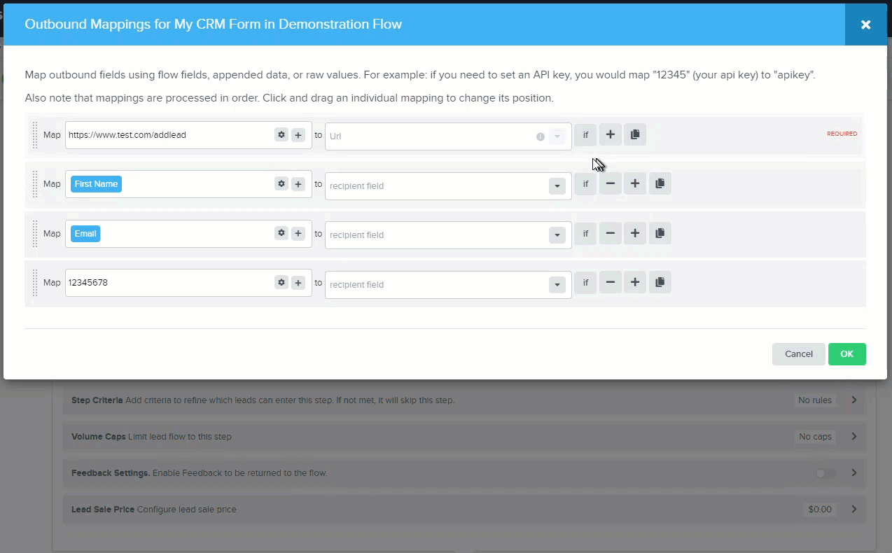
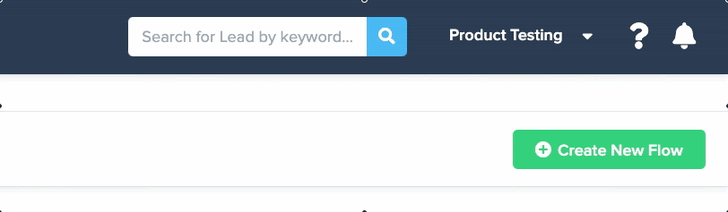

h1I6gvH4zedJ68ex-jaTCqDqcU0MrAHoBcVRJAk7uwgNyuCwxmGqSJS992FBZHnpUrkBwl8qFOsQHXOjlKQWorgezGSM-KtEIgcearIObR97axX5hADiNn3yqnMKBbmLeeGRyAbK~KCR5iZMkUw__&Key-Pair-Id=APKAIDFCFZ2UHE5LPIUA)](https://community.activeprospect.com/memberships/7557680-scott-mckee)

[_Scott McKee_](https://community.activeprospect.com/memberships/7557680-scott-mckee)

Updated December 20, 2021. Published December 20, 2021.

Details

# Introduction to Mappings

Specifying what goes where.

**What are Mappings?**

You can’t just dump everything you know about a lead to a recipient application. The recipient’s program was written to expect certain pieces of data, each with a name as well as a value, and it expects them to be formatted in a certain way. The recipient will provide you with this information, usually referred to as posting docs or submission instructions.

Example of Recipient Posting Docs

The recipient’s parameter name and data format requirements are unlikely to match the way LeadConduit stores data, so you’ll need to configure your flow’s recipient step to make the needed translations.

This sounds like a daunting, super-technical task, and normally a developer would have to spend a lot of time and effort writing code to format request data. But LeadConduit steps let you do it quickly and easily with the fill-in-the-blanks style “edit field mappings” screen.

Mappings tell LeadConduit where to send the data, what data values to send, and what name to assign to each value.

Basic LeadConduit recipient mappings have two parts.

**The Left Box**

The box on the left is where you place the value that you’re sending to the recipient. In most cases that will be a field placeholder that you select from the dropdown list.

The list includes the submitted flow fields, internal data like the lead’s ID and submission timestamp, and it includes placeholders for any data that’s been appended or captured from the responses returned to LeadConduit by any previous enhancement or delivery steps.

You can also enter plain text into the box so that the same value is sent to the recipient for every lead. This is called “hard-coding” and is useful for values that will never vary from lead to lead, like the target URL, your account ID with the recipient app or the name of the marketing campaign.

Here we've mapped placeholders for the target URL ""https://www.test.com/addlead"", flow fields ""Email"" and ""First Name"", and a hard-coded value ""12345678"" into the value side of three mappings:

Next we need to map the recipient's parameter names for those values.

**The Right Box**

In the box to the right we'll provide LeadConduit with the parameter name that identifies the left-side values to the recipient, as defined in the recipient’s posting docs.

There are two parts to this box. First, we select the parameter type ""form field"" from a list, then enter the name of the parameter as provided in the recipient’s posting docs.

We map our flow’s First Name and Email fields to the recipient’s parameters named “fname” and “emailaddress”, and the ""hard-coded"" value to ""account\_id"".

The parameter-type list will vary, depending on which recipient integration you’re using. We’ll delve into the various integration types later in this series.

The list also includes special LeadConduit functions used for setting up non-data parameters like security authentication and request headers. We’ll deal with these in detail later as well.

Finally, we tell LeadConduit how to, based on the recipient’s posting docs, look in the “status” parameter of the recipient’s response for the word “success” to indicate an accepted lead and in the response’s “reason” parameter for the reason, if the lead isn’t accepted.

Now our delivery step is set up and ready to deliver leads to MyCRM. LeadConduit will read MyCRM's response to determine if the lead was accepted or rejected and, if rejected, why.

A filter step following this one can then reject the lead back to the source if needed.

This is a simple example of recipient mappings, but most recipients aren’t much more complicated than this to set up.

Type something"
