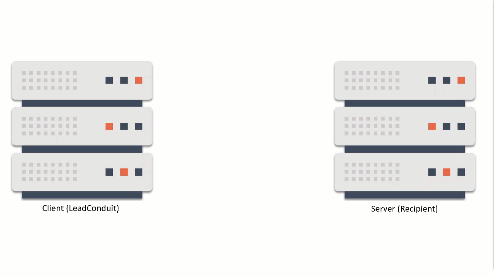

6NfAYpt~hcTJBagMa1WhGSI9w7ZKTskaAhx1avRNz~stjWw7w0lYzpIukGinSsbjz4ECx-eq77AgI26YRv34OG8EnzQHPCXa1LdxTdSqr8yp9UeKsQPHMBUG40m9YGXWcJyzJdmjKh-4LtxXvaQ__&Key-Pair-Id=APKAIDFCFZ2UHE5LPIUA)](https://community.activeprospect.com/memberships/7557680-scott-mckee)

[_Scott McKee_](https://community.activeprospect.com/memberships/7557680-scott-mckee)

Updated April 12, 2024. Published December 20, 2021.

Details

# Introduction to Recipient Steps

Getting data from here to there, and from there to here.

**Connect, Request, Response, Disconnect**

Recipient steps are all about sending data to a program on a computer outside of your LeadConduit flow. That program could be a CRM, Call Center software, email validation service, or just about anything that can consume that data.

The process starts with a single, temporary network connection between LeadConduit and the recipient’s program.

The machine that originates the connection, in this case one running LeadConduit, is called the Client. It sends data over that connection to the recipient machine, called the Server. The data the client is sending is called a Request.

The Server will read the Request data and do with it whatever its (the Server’s) programming tells it to do. Then the Server sends a Response back to the Client, confirming that it understood the Request and indicating whether it’s accepting or rejecting the data, perhaps including additional information related to the data in the request.

Once the Server sends its response, it closes the connection to the Client. That connection can’t be used again. If the Client wants to send more data to that recipient, it will have to will establish a brand-new connection, unrelated to the previous one.

By the way, when Sources submit data to LeadConduit this same process is used, except that the Client is the Source’s platform or the user’s browser with a Form Page loaded, and the Server is your LeadConduit Flow.

For a deeper dive into configuring and using recipient steps, check the ""Distributing Lead Data [s](https://community.activeprospect.com/series/4558737-leadconduit-recipient-steps)"" series.

Type something"
