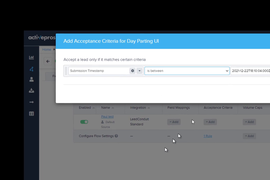

sXuugCrtfwmzOe1V-dV6dDdbpH-k75g~fBNbWPXAIsIx1i1bNla576NJ8QHPQoa7ZgTHMFSI~FyLwXGMQs-8RxshZ-9eNkd085dmvCUBBKvUSG0bvD8KQMfdWvkNSAPXELUtXH~yb62w~FjXOCQ__&Key-Pair-Id=APKAIDFCFZ2UHE5LPIUA)](https://community.activeprospect.com/memberships/7557680-scott-mckee)

[_Scott McKee_](https://community.activeprospect.com/memberships/7557680-scott-mckee)

Updated June 28, 2022. Published February 23, 2021.

Details

# LeadConduit Feedback

Marking leads as returned or converted

[Lead Feedback Overview_Scott McKee_\\
\\
Published on November 30, 2020Reporting lead returns and conversions\\
\\
1\\
\\
](https://community.activeprospect.com/series/4180128/posts/4096342-lead-feedback-overview)

[Enabling a Recipient to Send Feedback to LeadConduit_Scott McKee_\\
\\
Published on November 30, 2020Feedback is not enabled by default. You must configure each delivery step to allow the recipient of that step to send feedback.\\
\\
2\\
\\
](https://community.activeprospect.com/series/4180128/posts/4096395-enabling-a-recipient-to-send-feedback-to-leadconduit)

[Sending Feedback to LeadConduit_Scott McKee_\\
\\
Published on November 30, 2020Code examples for recipients sending individual feedback to LeadConduit.\\
\\
3\\
\\
](https://community.activeprospect.com/series/4180128/posts/4096909-sending-feedback-to-leadconduit)

[Importing Feedback in Bulk_Scott McKee_\\
\\
Published on December 23, 2020If recipients provide Feedback in batches rather than real-time, you can import that Feedback from a CSV file.\\
\\
4\\
\\
](https://community.activeprospect.com/series/4180128/posts/4117497-importing-feedback-in-bulk)

[Enabling Real Time Feedback to a Source _Scott McKee_\\
\\
Published on November 30, 2020Configure Flow Sources so that LeadConduit can deliver feedback to them.\\
\\
5\\
\\
](https://community.activeprospect.com/series/4180128/posts/4096811-enabling-real-time-feedback-to-a-source)

[Find an Event ID after the lead has been processed_Scott McKee_\\
\\
Published on March 15, 2021\\
\\
6\\
\\
](https://community.activeprospect.com/series/4180128/posts/4203581-find-an-event-id-after-the-lead-has-been-processed)

## Comments

Schedule a time \| Chili Piper

Loading

"
