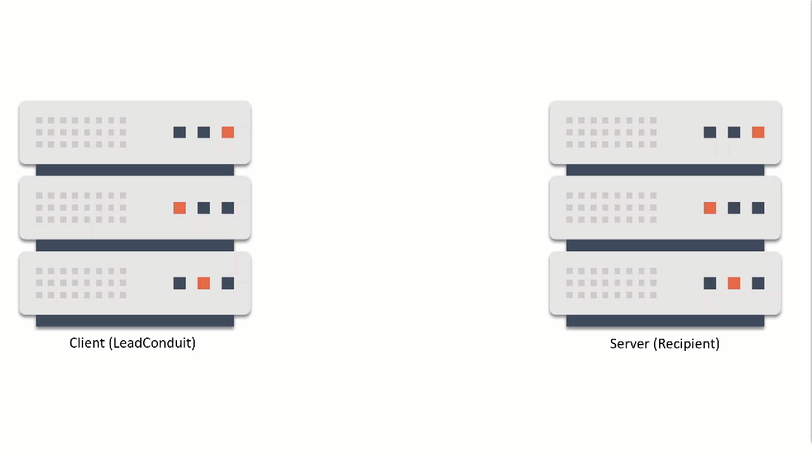
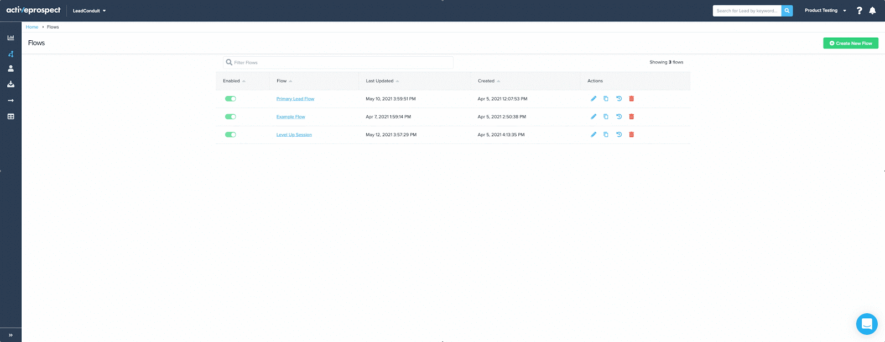

4jvSygeYmAY1ldtCtp31eXWStDnN~iPD-q2sCnWabr5-kbB-JVTwnVO7Pq6Dc5b8Z-ogixPXuZhKWaJ18yBMQpA~ubfuEEb~fvyH3a5LGFnOF~doFMzG3srM0fHroau37MMRQQja4zkJBK7RTDA__&Key-Pair-Id=APKAIDFCFZ2UHE5LPIUA)](https://community.activeprospect.com/memberships/7557680-scott-mckee)

[_Scott McKee_](https://community.activeprospect.com/memberships/7557680-scott-mckee)

Updated February 24, 2025. Published December 8, 2021.

Details

# LeadConduit Field Classes

LeadConduit offers a number of different flow field classes. These classes make if possible to break down a value into component parts for use in rules and to translate it into different formats for mapping out to recipients and enhancements.

When selecting from the fields list in a rule or mapping you can view a field’s available components by clicking the ellipsis visible to the right of the field name.

In some field classes, LeadConduit recognizes submitted synonyms or a variety of commonly-used formats. These are translated to a standard format by default.

For instance, phone-class fields recognize the “(111) 222-3333” format, the “111-222-3333” format, and numerous others, and will store store the number in the default “1112223333” format.

Gender-class fields recognize “F”, “f”, “female”, and “Female” and will translate these to “female” for internal use.

When a field is submitted to LeadConduit its value may be stored internally in a standardized form. The standardized form always used in rules and is the default format used in, but the “raw”, as-submitted format is also available for mappings.

For example, an email field is submitted as [MikeJones@GMAIL.com](mailto:MikeJones@GMAIL.com). LeadConduit will standardize it to all-lowercase “mikejones@gmail.com and store it that way, and will by default use mikejones@gmail.com in recipient mappings.

As mentioned above, in mappings you can select available field components, but for some fields, like phone, date, and timestamp fields classes you can also translate the format to selected commonly-used formats by clicking the “gear” icon next to the field name.

Range-class fields are a special type of numeric field. Range values can be submitted as digits like 5 or 428, in which case they’ll evaluate just like number-class fields. But if ranges can also be submitted in the dash-separated format like 18.5-101. In this case LeadConduit will calculate the maximum, minimum, average and integer middle values of the range.

The table below documents LeadConduit's field classes with each class's valid submission formats, default internal format, available components and outbound formatting options.

|     |     |     |     |     |
| --- | --- | --- | --- | --- |
| **Field Class** | **Submission Formats** | **Default format** | **Components** | **Outbound Formatting** |
| **Boolean** | T,F, True, False, 1,0 (Case-insensitive) | true,false (lowercase) | - | No |
| **Date** | Numerous common US | yyyy-mm-dd | - | Selectable: Numerous common formats |
| **Email** | valid email address | lowercased | Raw, User, Domain, Host, Top level domain | Customize using Components |
| **Gender** | male, female, other, m,f,o (case-insensitive) | male, female, other | Raw, Abbr (M,F,O) | Customize using Components |
| **IP** | Well-formed IPV4 and IPV6 Note: IPV4 Class D, E, and Loopback addresses will evaluate as ""format is invalid"" if tested. | IPV4 or IPV6 as received | - | No |
| **Number** | Integer, floating point, Currency | floating point | - | No |
| **Phone** | Common US/Canadian Phone | pure digits | Raw, area, exchange, line, number, extension, Country Code,Is Toll-free | Customize using Components |
| **Postal Code** | US ZIP and Zip+4 | US: 5-digit ZIP | As submitted, ZIP, Plus 4, Country Code | Customize using Components |
| **Postal Code** | Canada | Canada: Postal Code | As submitted, Country Code, Forward Sort Area, Local Delivery Unit | Customize using Components |
| **Range** | Single floating point value or two floating point values delimited by a hyphen. | As-submitted | Raw, Middle (Integer), Max, Min, Avg (Floating point) | Customize using Components |
| **State** | US State / Canadian Provice. Full name or 2-letter code | Two-letter Code | Raw, Name | Customize using Components |
| **Street** | Any text | As-submitted | Raw, Number, Name | Customize using Components |
| **String** | Any text | As-submitted | - | As-submitted |
| **Time** | Common time and timestamp formats | yyyy-mm-ddThh:mm:ss.sssZ Note: Converts to UTC time zone | - | Selectable: Numerous common formats plus time zone translation. |
| **URL** | Well-formed URLs | As-submitted | Raw, Protocol, Host, Port, Path | Customize using Components |
| **TrustedFormURL** | TrustedForm CertificateURLs | As-submitted | Raw, Protocol, Host, Port, Path, Age, is\_expired, Type (web, mobile, Facebook, masked) | Customize using Components |

Type something"
