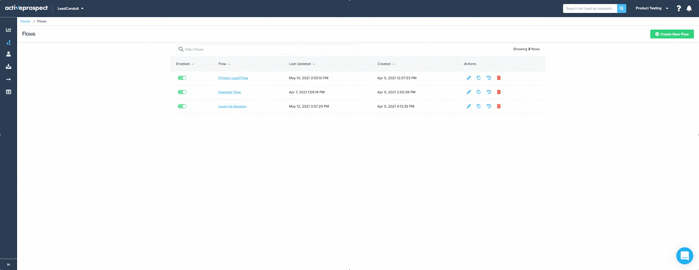

~lNNeJ8Ky8bylbqFvvAJWhgH9OlYfNcSHMqlUfTey3qtwgBiWqJzLk3cL2wNBptSme-BIwb5erSDy4g73KrykNYA90EBefOT7eYuFi29K-gxgb5zfA~Nyw7gDeGVmUN-TzPG3NwRaeCVc~suADg__&Key-Pair-Id=APKAIDFCFZ2UHE5LPIUA)](https://community.activeprospect.com/memberships/7557576-caitie-clarke)

[_Caitie Clarke_](https://community.activeprospect.com/memberships/7557576-caitie-clarke)

Updated May 25, 2021. Published May 24, 2021.

Details

# LeadConduit New Navigation

As of June 1, 2021 LeadConduit will have a new look and feel. This article outlines the updates and provides context to where to find everything you need.

Collapse

00:00

01:27

#### newnavmenu.mp4

# Overview

LeadConduits new navigation provides a modern left-hand side menu with the ability to expand and collapse based on user preference, while elevating priority features to top-level menu items.

# Top Navigation Bar

This is where you will access:

- ActiveProspect Product Navigation
- Search Bar
- Company Name, My Account, Switch Accounts, Settings, and Credentials
- System Status
- Help Center
- Product Notifications

# Side Navigation Bar

This is where you will access all main features of LeadConduit:

- Dashboards
- Flows
  - Flows
  - Fields
- Leads
  - Leads
  - Lead Events
- Sources
- Recipients
  - Recipients
  - Batch Files
- Reporting

# Expand or Collapse Side Navigation Bar

Based on your preference or familiarity, you can choose to have the side navigation bar locked in an expanded view (with names) or collapsed (icons only) and only open dynamically upon hover-over. Select the right facing arrows to expand and lock or the left facing arrows to unlock.

Full-size imageClose-up image

Type something"
