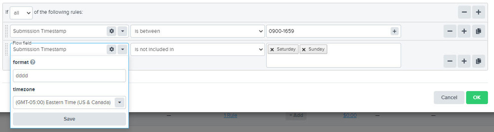

4jvSygeYmAY1ldtCtp31eXWStDnN~iPD-q2sCnWabr5-kbB-JVTwnVO7Pq6Dc5b8Z-ogixPXuZhKWaJ18yBMQpA~ubfuEEb~fvyH3a5LGFnOF~doFMzG3srM0fHroau37MMRQQja4zkJBK7RTDA__&Key-Pair-Id=APKAIDFCFZ2UHE5LPIUA)](https://community.activeprospect.com/memberships/7557680-scott-mckee)

[_Scott McKee_](https://community.activeprospect.com/memberships/7557680-scott-mckee)

Updated July 12, 2024. Published July 6, 2021.

Details

# LeadConduit Outbound Steps Explained

What do Enhancements do? Marketplace vs Bring Your Own Credentials Enhancements. Cost.

What is a LeadConduit Outbound Step?

LeadConduit Add-on steps are pre-built integrations that connect your LeadConduit Flow to services that respond with new information about a lead. For example, an email or phone validation service may return information about the current ability to contact an email address or phone number. This “appended” information is then available for use in subsequent flow steps. It can be used in rules to make decisions and it can be mapped into delivery steps and sent to a CRM, dialer, and data warehouse.

Example of Appended Data in a Flow (Telesign)

Two classes of Outbound events

There are two classes of Outbound Integrations, Add-ons and Integrations. With the exception of SuppressionList and TrustedForm enhancement steps,  Outbound Integrations utilize third-party services.

**Integrations**

The primary difference between Add-ons and outbound Integrations  is that you must establish your own account with the service's provider. LeadConduit’s add Integration steps merely provide ready-built integrations to simplify connect with and consume those services. When adding a Integration step to a flow you will need to map the credentials for your account with that provider. The service provider will invoice you independently for the services you consume, plus each request will count as a standard LeadConduit transaction event toward your ActiveProspect contract.

Example of where to add your credentials to a BYOC IntegrationAdding Bring Your Own Credentials Integrations to a Flow

Add-ons

By contrast, Add-ons can be used by all LeadConduit customers without the need to establish an account with the service provider. ActiveProspect supplies the account in the background, and you get the benefit of our preferred rates, “piggybacking” off our high volume and negotiating power. You may add or remove Add-ons  from your flows at will. There are no volume minimums or caps imposed on your use of third-party Add-ons, so feel free to “test” Add-on services. Add-ons are generally billed on a per-transaction basis, with the accrued charges automatically added to your ActiveProspect invoice. The per-transaction cost of each Add-on is shown when you’re editing your flow in LeadConduit, in the “Add Add-on” modal.

Adding Marketplace Add-Ons to a Flow

Integrating with other Service Providers

If you need to integrate your flow with a service that LeadConduit doesn't have a pre-built integration for, you can use a customizable delivery step. Contact your Customer Success Manager or ActiveProspect Support.

Type something"
