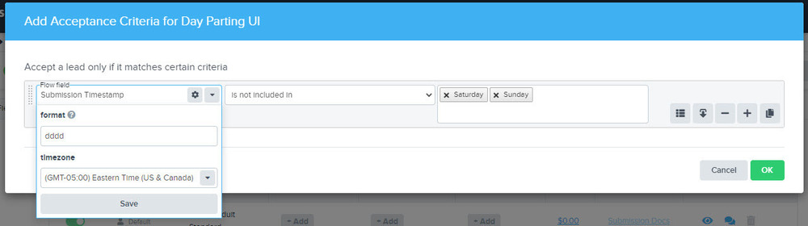

nJS1poLUkW42dIwfu82QyaLDi01oI-O~~2uhb3JgX6iuHF33tAiC5n6GdUUA-bEeJyt275N6yzhEVlEzkgmb7DwfhbUA1pRscgetBKkeBmCJfnX8hzSCd8qB3~As3CQMVYdfAqnaN0nVbyf3whA__&Key-Pair-Id=APKAIDFCFZ2UHE5LPIUA)](https://community.activeprospect.com/memberships/7557576-caitie-clarke)

[_Caitie Clarke_](https://community.activeprospect.com/memberships/7557576-caitie-clarke)

Updated May 15, 2023. Published November 12, 2020.

Details

# Volume Caps

Volume Caps allow you to limit the number of leads accepted into a flow or sent to another system. Volume caps are configurable to accept a specific number of leads over one or more predefined durations (minute, hour, day, week, month).

A volume cap does not prevent a lead vendor from submitting leads to LeadConduit, it only prevents further processing and delivery of the lead.

# Definitions

**Flow Caps** apply to all leads entering the flow.

**Source Caps** apply to all leads from a specific source.

**Step Caps** apply to outbound delivery.

# General Behaviors

**Cap Count:** If a lead fails for any reason, the lead will not be counted against any cap.

**Source/Flow Cap:** If a lead is submitted against a maxed out Source/Flow Cap, the lead's outcome will be a failure, with the reason **Cap reached**. Flow caps are checked first, then source caps.

**Step Cap:** If a lead is submitted with a maxed out Step Cap, the recipient step will be skipped. The lead's outcome will be unaffected (unless a filter is configured to stop the flow).

**Cap Name:** The default name pattern is ""<Flow Name (if the cap counter appears on the main dashboard)>: <Flow\|Source\|Step Name> <Type (Flow\|Source\|Step)> - <Cap Location>""

For example: ""Social Leads Flow: WebForm A Source - Cap 1"".

Caps can be renamed.

# When Caps Reset

Each cap has a counter that starts at zero and is incremented by one whenever the cap's rules match a lead which is received into or sent out of LeadConduit with a successful outcome. Once the counter exceeds the cap's maximum, leads will stop flowing.

The cap's duration configuration determines when the counter is reset back to zero. At the end of each specified duration in the account's configured time zone, the counter is reset. For example, if you set a duration of **2 days**, the counter will be set to zero at 11:59 PM on the 2nd day. If you specify a duration of **2 weeks**, the counter will be set to zero at 11:59 PM on Sunday night of the 2nd week.

When the duration of an existing cap is reduced or when the rules are changed, the counter is set to zero. When the duration of an existing cap is increased, the counter will not be reset until the new longer duration has elapsed.

# Changing the Cap Quantity Affects the Cap Counter

1\. When you create a new cap, the cap counter begins at zero. It does not take into account any leads processed before that point in time.

2\. For a simple cap, with no ""IF"" rules: The counter does not change when you change the cap quantity.

3\. For a cap with rules, if you change the cap quantity but not any of the rules: The counter will not reset to 0.

4\. For a cap with rules, if you add, remove or change part of a rule: The counter resets to zero whether you change the quantity or not.

# Expected Behavior for Multiple Caps + Nested Caps

If multiple caps are configured on a flow, they will be evaluated individually. If multiple caps match, they will all be incremented. If one cap's limit is reached, the event outcome will be a **failure**, and unreached caps will not be incremented.

If a rule is configured on a top level cap, leads for its nested caps will not be evaluated if the rule for the top level cap isn't met.

# Configuring Volume Caps

Volume Caps are configurable on a per Flow, Source, or Step (delivery) basis.

**Flow/Source** level caps are configurable from the Flow Editor Sources tab.

**Step Caps** are configurable from a specific step in the Flow Editor Steps tab.

Volume Caps can be simple or complex, including conditional values, nested caps, and multiple caps with different conditions.

# Multiple Caps + Conditional Cap

# Nested Caps

After saving volume cap changes, the status of the configured caps will be shown on both the Flow and LeadConduit dashboards (once new leads are submitted).

# Flow Dashboard

# LeadConduit Dashboard w/Nested Caps

Type something"
