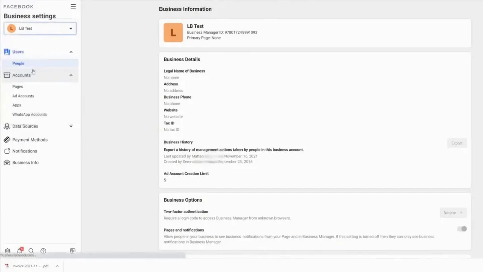
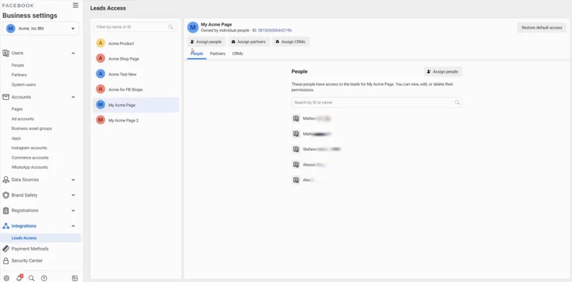
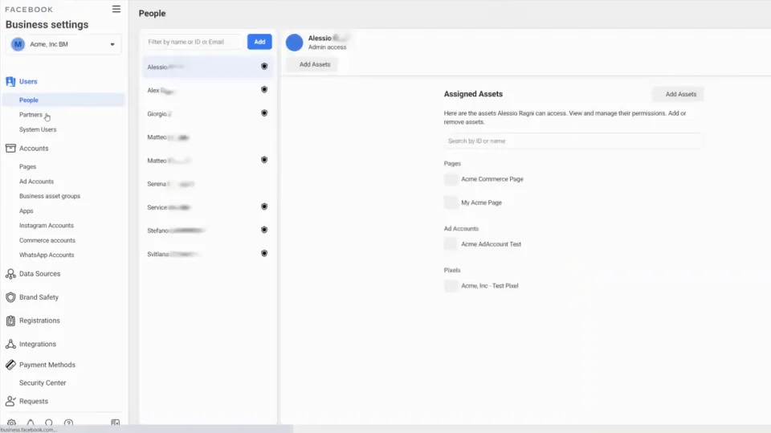

ZigfN0bRQrsDFhGK8gSwZjSoNh29C0Zu5mc9nM6EVc5LHcXWVs4qQWuTecCSXl97~dLLidDTuOUI5cF6T5s~76dkaWj9E9yYJ0sIjcOEV4FqSx5S1-4fykeDvdYko9tA9NMlhc9kmCSEAnVBjjg__&Key-Pair-Id=APKAIDFCFZ2UHE5LPIUA)](https://community.activeprospect.com/memberships/8017840-claudia-melis)

[_Claudia Melis_](https://community.activeprospect.com/memberships/8017840-claudia-melis)

Updated October 22, 2024. Published May 24, 2023.

Details

# Why aren’t leads synced in real-time from Facebook Lead Ads to my CRM?

If you are experiencing an issue retrieving leads in real-time from Facebook, you may need to make sure you granted to LeadsBridge the Lead Access permission from your [Facebook Business Manager.](https://www.facebook.com/business/help/442345745885606?id=180505742745347)

The Business Manager is a Facebook tool designed to improve assets management: with this tool, you’ll be able to manage your Pages, Ad Accounts, Apps, Partners, etc., giving specific Asset permissions to Users and Partners.

As a result of this management, if permissions are not properly configured, you could encounter one of the following situations:

- You are not able to fetch any lead when opening the Leads Table of your bridge.

- You’re only able to see the test leads sent from your Facebook account.

- You’re able to see the leads, but they are not being automatically synchronized in real-time by LeadsBridge

If one of the above-mentioned situations arises, the following guidelines will help you set the correct permissions inside Business Manager. Be sure to follow the step-by-step instructions carefully.

### **Do you have access to a Business Manager?**

**NO** → You should contact the Owner/Admin of the Business Manager that owns the Page you want to connect with LeadsBridge and ask them to follow the steps below on your behalf.

**YES** → Log into the Business Manager and go to [Business Settings](https://business.facebook.com/settings/).

### **Can you see Integrations » Leads Access on the left side of the screen?**

**NO** → You should contact the Owner/Admin of the Business Manager that owns the Page you want to connect with LeadsBridge and ask them to follow the steps below on your behalf.

**YES** → This means that you are the Owner/Admin of the Business Manager.

### **Once you’re inside the Business Manager and you know you’re the Owner/Admin**

1. Go to **Accounts » Pages**. Do you want to give access to a User or a Partner?

1. **USER**

      1. Go to Users » People

      2. Click on the User name

      3. Make sure that the BM User has a role (ADS, LEADS, CONTENT: Create, Manage or Moderate) inside the Facebook Page
2. **PARTNER**

      1. Go to Users » Partners

      2. Click on the Partner name

      3. Make sure that the Business Manager Partner has a role inside the Facebook Page

Collapse

Facebook BM Permissions Admin

Click for sound

0:39

1. Go to **Integrations » Leads Access**

1. HELP! I can’t see “Integrations » Leads Access” This means that you’re not a Business Manager Owner/Admin → Go back to the beginning of the guide

2. Click on the Page

3. Do you want to give access to a User or a Partner?

      - **USER** → Make sure the User has been added to the People section, otherwise add it using the Assign People button

      - **PARTNER** → Make sure the User has been added to the Partners section, otherwise, add it using the Assign Partners button.

Collapse

Facebook BM Permissions Leads Access People

Click for sound

0:23

1. Do you see the **CRMs** tab?

1. **NO** → Contact the Business Manager Owner/Admin that Owns the Page and ask them to follow the steps described in this guide.

2. **YES** → Click on CRMs: Is LeadsBridge listed under the Apps section?

      1. **YES** → GREAT! Everything has been set up correctly!

      2. **NO** → Click on Assign CRMs, is LeadsBridge listed under Add CRMs and Set Permissions?

         1. **NO** → Log into your LeadsBridge application and Publish a bridge connecting the Page you’re working with

         2. **YES** → Select LeadsBridge and click on Assign

Collapse

Facebook BM Permission Leads Access App

Click for sound

0:49

Type something"
