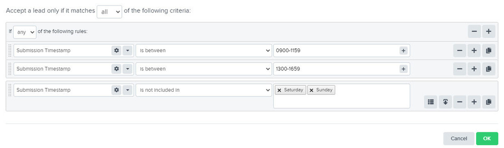

Vb9j6Vj2kH5A-wBK2ldtVtOpctHAj8aQxwagcmgbkFvBT4CA0FIgD7DO3vZ71~Qp-K-Es7tpWkdy9-QOL~XLrwjfxX2Ttci9yixS8x~ZBKa61lR3TJZ1cHd98K~07d6m14DpSmVyRBt37w5hbeQ__&Key-Pair-Id=APKAIDFCFZ2UHE5LPIUA)](https://community.activeprospect.com/memberships/7557680-scott-mckee)

[_Scott McKee_](https://community.activeprospect.com/memberships/7557680-scott-mckee)

Updated April 26, 2024. Published November 30, 2021.

Details

# Working with LeadConduit Flows

[Introduction to LeadConduit _Scott McKee_\\
\\
Published on December 8, 2021LeadConduit 101: What does it do? Who needs it and why? \\
\\
1\\
\\
](https://community.activeprospect.com/series/4539489/posts/4547947-introduction-to-leadconduit)

[Building a Simple LeadConduit Flow _Scott McKee_\\
\\
Published on November 30, 2021\\
\\
2\\
\\
](https://community.activeprospect.com/series/4539489/posts/4539473-building-a-simple-leadconduit-flow)

[Adding Sources to a Flow _Scott McKee_\\
\\
Published on December 2, 2021\\
\\
3\\
\\
](https://community.activeprospect.com/series/4539489/posts/4541251-adding-sources-to-a-flow)

[Introduction to LeadConduit Rules _Scott McKee_\\
\\
Published on December 7, 2021What are rules, and how are they used, with basic examples.\\
\\
4\\
\\
](https://community.activeprospect.com/series/4539489/posts/4545476-introduction-to-leadconduit-rules)

[Acceptance Criteria _Scott McKee_\\
\\
Published on December 1, 2020\\
\\
5\\
\\
](https://community.activeprospect.com/series/4539489/posts/4098818-acceptance-criteria)

[Volume Caps_Caitie Clarke_\\
\\
Published on November 12, 2020\\
\\
6\\
\\
](https://community.activeprospect.com/series/4539489/posts/4082860-volume-caps)

[LeadConduit Hours of Operation_Scott McKee_\\
\\
Published on January 11, 2022In LeadConduit you can use a weekly schedule to accept leads during your hours of operation.\\
\\
7\\
\\
](https://community.activeprospect.com/series/4539489/posts/4556635-leadconduit-hours-of-operation)

[LeadConduit Day Parting_Scott McKee_\\
\\
Published on December 20, 2021Using Submission Timestamp in Rules\\
\\
8\\
\\
](https://community.activeprospect.com/series/4539489/posts/4540073-leadconduit-day-parting)

[LeadConduit 101: Submission Instructions_Scott McKee_\\
\\
Published on June 27, 2022\\
\\
9\\
\\
](https://community.activeprospect.com/series/4539489/posts/4738143-leadconduit-101-submission-instructions)

[LeadConduit Field Classes _Scott McKee_\\
\\
Published on December 8, 2021LeadConduit offers a number of different flow field classes. These classes make if possible to break down a value into component parts for use in rules and to translate it into different formats for mapping out to recipients and enhancements.\\
\\
10\\
\\
](https://community.activeprospect.com/series/4539489/posts/4547852-leadconduit-field-classes)

[LeadConduit Outbound Steps Explained_Scott McKee_\\
\\
Published on July 6, 2021What do Enhancements do? Marketplace vs Bring Your Own Credentials Enhancements. Cost.\\
\\
11\\
\\
](https://community.activeprospect.com/series/4539489/posts/4372571-leadconduit-outbound-steps-explained)

[Filters Overview_Scott McKee_\\
\\
Published on December 1, 2020\\
\\
12\\
\\
](https://community.activeprospect.com/series/4539489/posts/4098942-filters-overview)

[Filtering Duplicates with SuppressionList_Scott McKee_\\
\\
Published on December 22, 2020Use SuppressionList to filter duplicate leads based on any flow field.\\
\\
13\\
\\
](https://community.activeprospect.com/series/4539489/posts/4116582-filtering-duplicates-with-suppressionlist)

[Introduction to Recipient Steps _Scott McKee_\\
\\
Published on December 20, 2021Getting data from here to there, and from there to here.\\
\\
14\\
\\
](https://community.activeprospect.com/series/4539489/posts/4558735-introduction-to-recipient-steps)

[Introduction to Mappings_Scott McKee_\\
\\
Published on December 20, 2021Specifying what goes where.\\
\\
15\\
\\
](https://community.activeprospect.com/series/4539489/posts/4558772-introduction-to-mappings)

[Creating a Delivery in JSON Format_Scott McKee_\\
\\
Published on January 29, 2021\\
\\
16\\
\\
](https://community.activeprospect.com/series/4539489/posts/4148089-creating-a-delivery-in-json-format)

[""Recipe"" for a Delivery Step: Form POST Example_Ashley Thomas_\\
\\
Published on February 1, 2021This article addresses how to build a delivery step for the most common type of delivery-point API, often called a ""Form POST"" .\\
\\
17\\
\\
](https://community.activeprospect.com/series/4539489/posts/4149927-recipe-for-a-delivery-step-form-post-example)

[Mapping Values to a Custom XML Outbound Integration_Sable Childs_\\
\\
Published on December 1, 2020\\
\\
18\\
\\
](https://community.activeprospect.com/series/4539489/posts/4098606-mapping-values-to-a-custom-xml-outbound-integration)

[SERIES: Response Parsing: Did my lead Delivery step succeed or fail?_Scott McKee_\\
\\
Published on November 25, 2020How to configure a LeadConduit Delivery step to recognize a recipient's ""success"" response and capture the the rejection reason from a failure response.\\
\\
19\\
\\
](https://community.activeprospect.com/series/4539489/series/4093977-response-parsing-did-my-lead-delivery-step-succeed-or-fail)

[Discovering Reasons for Failed Leads_Arthur Holmes_\\
\\
Published on March 8, 2021LeadConduit makes it easy to figure out why your leads are failing.\\
\\
20\\
\\
](https://community.activeprospect.com/series/4539489/posts/4195562-discovering-reasons-for-failed-leads)

[SERIES: LeadConduit Pro Tips_Scott McKee_\\
\\
Published on January 19, 2022Work smarter and faster with these tips and tricks\\
\\
21\\
\\
](https://community.activeprospect.com/series/4539489/series/4583478-leadconduit-pro-tips)

[SERIES: LeadConduit Reporting_Scott McKee_\\
\\
Published on February 17, 2021\\
\\
22\\
\\
](https://community.activeprospect.com/series/4539489/series/4173161-leadconduit-reporting)

## Comments

Schedule a time \| Chili Piper

Loading

"
