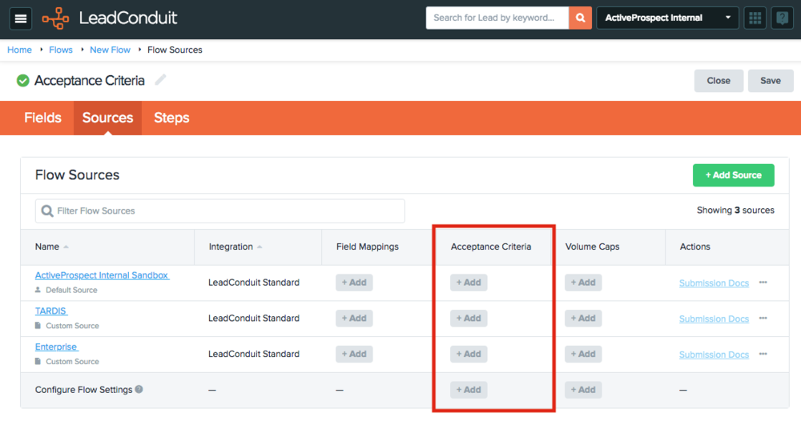
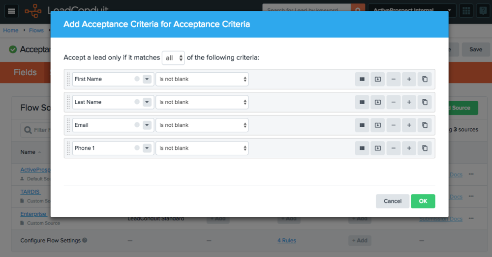

[_Scott McKee_](https://community.activeprospect.com/memberships/7557680-scott-mckee)

Updated April 12, 2024. Published December 1, 2020.

Details

# Acceptance Criteria

One baseline method to help enforce quality data is to configure Acceptance Criteria, meaning the minimum data required to successfully process a lead. If the configured conditions are not met, the lead will be rejected outright.

Acceptance Criteria can be set both at the:

- **Flow level**: applies to all Sources
- **Source level**: applies only to that Source

The audit of Acceptance Criteria occurs at the beginning of the lead flow before any enhancements or validation occurs, so the best configuration is to check for basic data such as:

- Is there a value for this field
- Does the value of this field match a pre-defined list of acceptable answers

# Required Fields as Acceptance Criteria

Required Fields are a common use case for Acceptance Criteria. You define required fields by listing the fields and setting the operator to ""is not blank"".

**Note: Acceptance criteria are case-insensitive.** All values, whether hard-coded or field values, are evaluated in a case-insensitive context i.e. ""test"" == ""TEST"" == ""Test""

Type something
