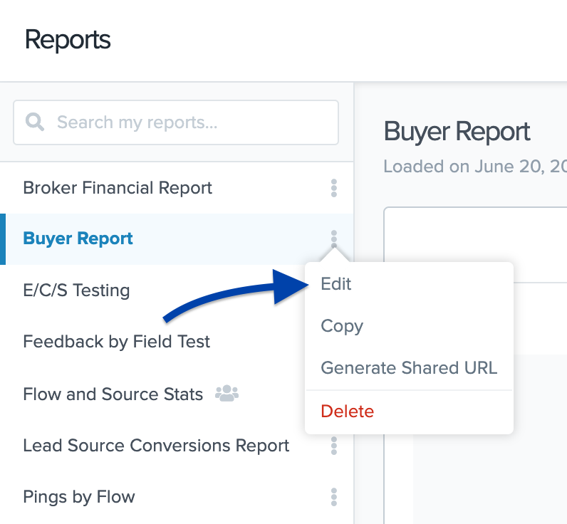
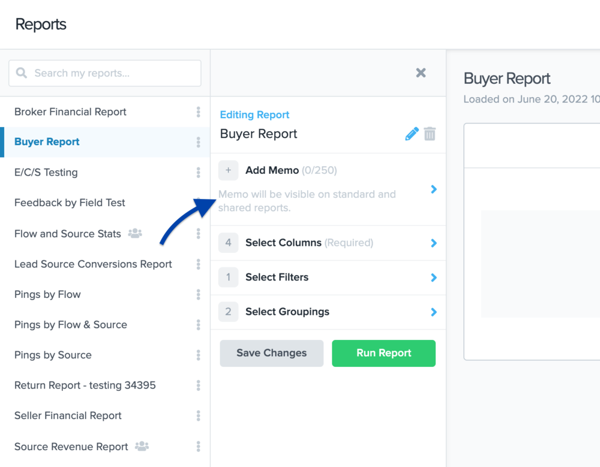
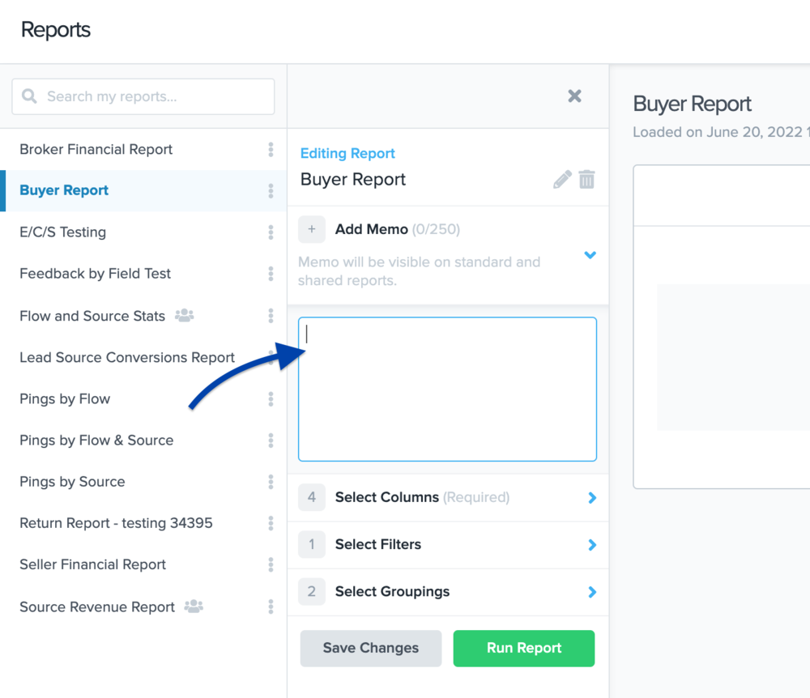
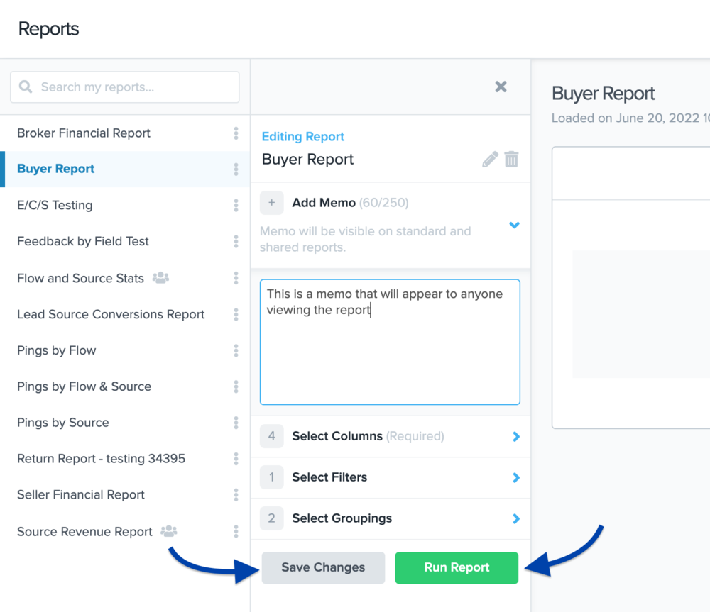

2022.

Details

# Adding Memos to Reports

Provide context to your internal team or external partners through the memo field

Sometimes when you're sharing reports with others, a little context can make the difference between building a shared understanding or causing confusion. LeadConduit's Reporting capability provides a ""Memo"" field you can use to add this context to reports. Adding a memo is simple.

First, go into ""Edit"" mode on the report in question.

Then click anywhere on the ""Add Memo"" area to open the memo field.

Enter in your text, noting that you cannot exceed 250 characters.

Click ""Save Changes"" to save the memo field to the Report or click ""Run Report"" to see the change in the report itself!

Now whenever the report is run, the Memo will appear above the table of data!

# FAQ

## Does the memo appear in the downloadable CSV?

No, since the CSV export is a comma delimited file it is limited only to the tabular data.

Type something
