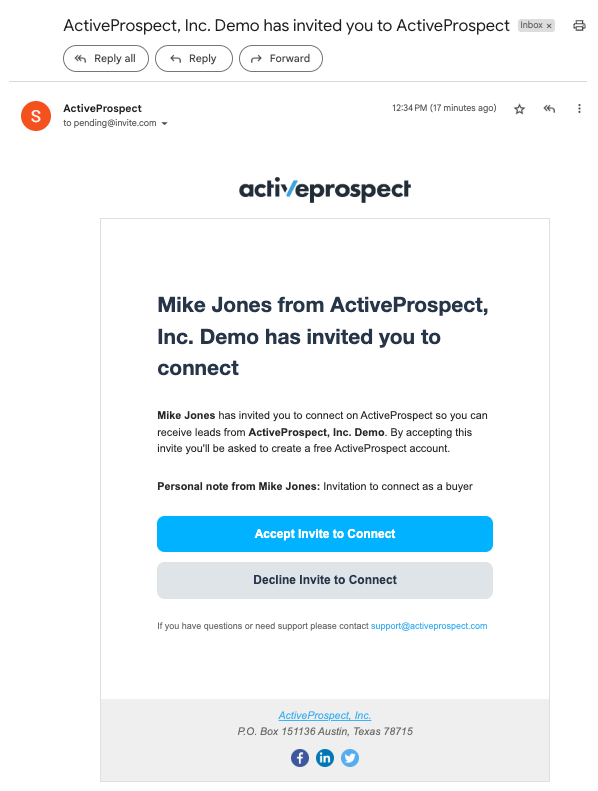
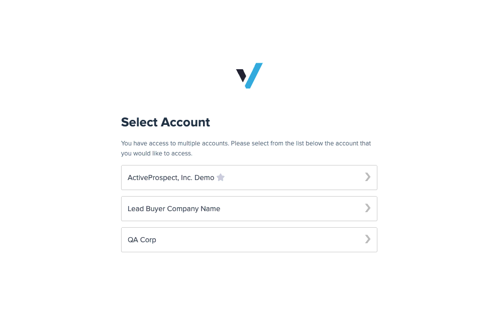
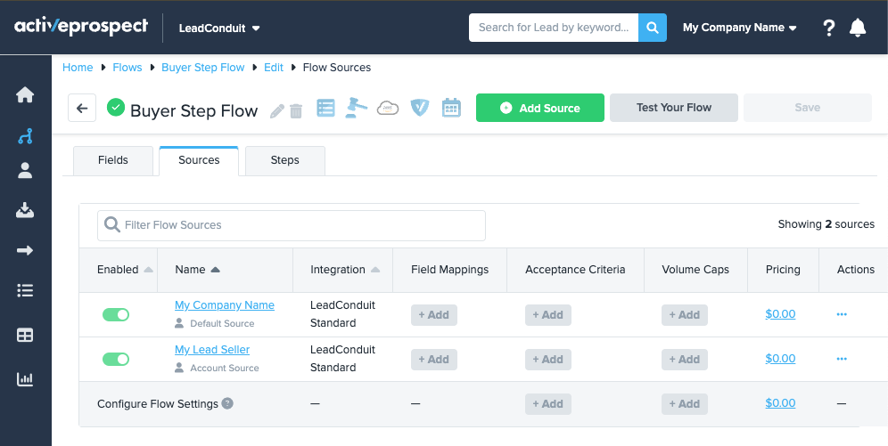
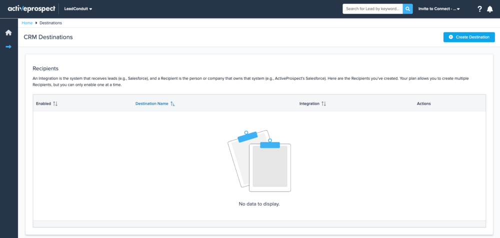
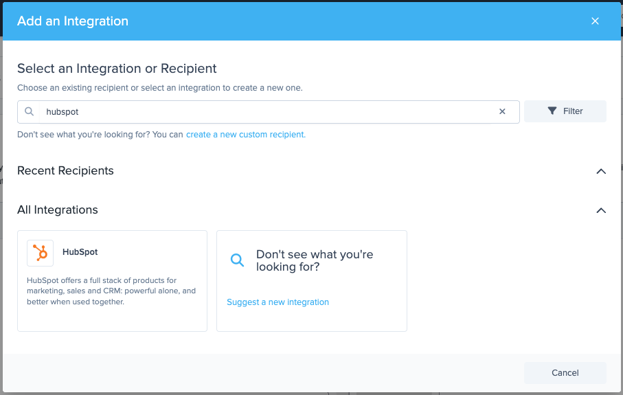
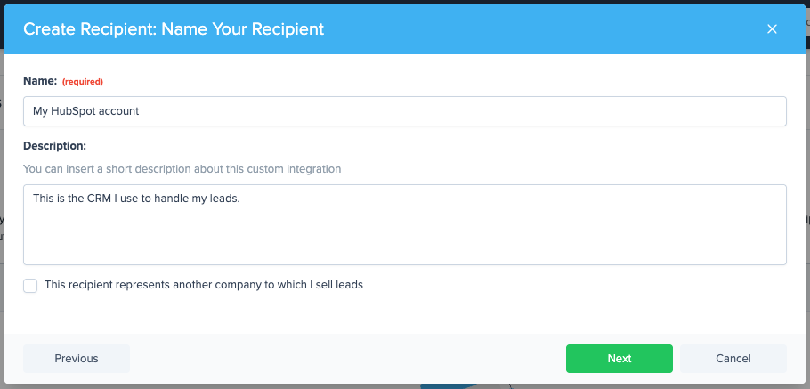
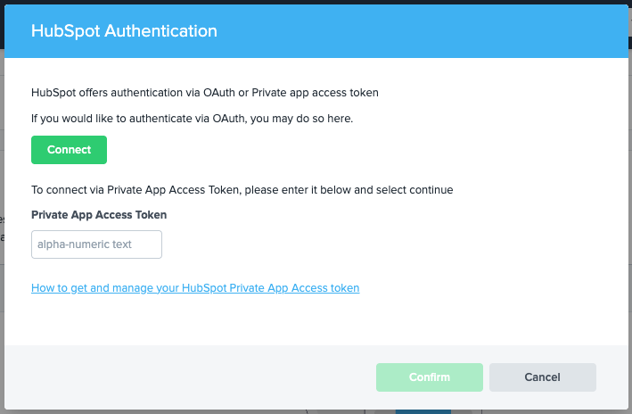
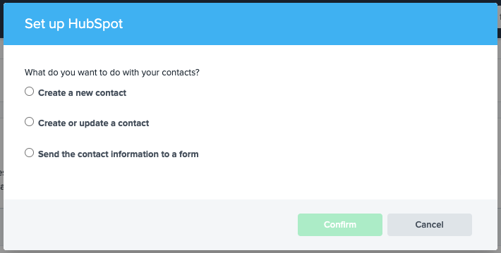
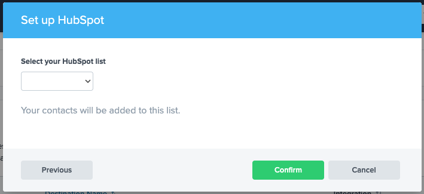
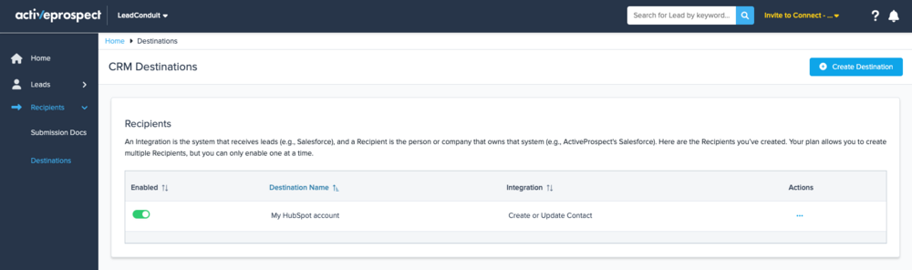

[_Leandro Estrella_](https://community.activeprospect.com/memberships/7866389-leandro-estrella)

Updated May 6, 2025. Published May 5, 2025.

Details

# Buyer Step for Buyers

## Why should I use this?

Some of the values you get as a Buyer from being invited by your lead buyer with this new feature are:

- Streamline your communication - easily receive leads to your partner’s account.
- Connect with your partners on ActiveProspect and formalize your working relationship.
- You get access to a free LeadConduit for Partners account.

## How does it work?

Once you have received an invitation from your lead Seller, like the one below, consolidating the connection with your partner can be achieved in a few steps; these steps will vary depending on whether you already have an ActiveProspect account.

#### I am not connected with my lead Seller, and I don't have an ActiveProspect Account

If you don’t have access to an ActiveProspect account, don’t worry. The invite sent to you by your lead seller will provide you with a free LeadConduit for Partners subscription.

|     |     |     |     |
| --- | --- | --- | --- |

After following the sign-up steps to create an ActiveProspect account, you’ll be automatically redirected to LeadConduit. This allows you to easily create and configure the Destination where you’d like to start receiving your leads; follow the guidelines below for further details on Destinations.

|     |     |     |
| --- | --- | --- |

#### I am already connected with my lead Seller within ActiveProspect, but I don’t have access to LeadConduit

You might already have an ActiveProspect account that only has access to TrustedForm; if you accept the invitation with that account, you will automatically be assigned a free LeadConduit for Partners subscription.

After accepting the invite, you can access LeadConduit, which allows you to easily create and configure a Destination to receive the leads sent by your partners; follow the guidelines below for further details on Destinations.

|     |     |     |
| --- | --- | --- |

#### I am already connected with my lead Seller, and I have access to a paid LeadConduit subscription

If you are already connected to your lead seller, when accepting the invite, you’ll be asked to select the Flow in which you’d like to receive leads sent by your partner.

|     |     |
| --- | --- |

After you select it, an Account Source representing your partner’s account will be automatically assigned to your Flow, and they will be notified to start submitting leads to your Flow.

## How do I create and configure a new Destination?

If you have accepted your partner's invite, either by creating a new or previously created account with a free LeadConduit for Partners subscription, you are ready to create your first Destination.

#### What is a Destination?

A Destination is the lead management system you use to handle your leads, usually a CRM like Salesforce or a Call Center like Five9.

The destination systems currently available in LeadConduit are listed in [THIS](https://activeprospect.com/leadconduit/integrations/?type=delivery) public catalog; you can also create Destinations with custom integrations such as JSON or Form POST.

#### How does it work?

1. Go to the _Destinations_ page from your account and click on Create Destination

2. Search and select the integration to which you handle the leads submitted by your lead Seller; for this example, we will use HubSpot.

3. Afterward, you’ll be asked to assign a name and an optional description to your Destination.

4. Then, you will be prompted to choose the authentication method you’d like to use, usually an API Key or with OAuth, depending on the integration you have selected; for this example, with HubSpot, we will use a _Private App Access Token_.

Subsequently, you should select which action to use to submit the lead to your Destination; this will vary depending on the Integration you have selected; for this example, we will use _Create or update a contact_.

5. Some Integrations will require further details during the creation of the Recipient; for HubSpot, we are asked to specify the list to which we want to add our leads.

6. That's it, now your Recipient has been created and added to your Destinations list, your partner will get notified so that they can start submitting leads to you.

## FAQ

1. What happens if I decline my partner’s invitation?

If you decline your partner’s invitation, your email address will be removed from the account that sent you the invitation; if you declined the invitation by mistake, you’ll need to request your partner to send you a new invitation.

2. Are there any requirements for accepting and using LeadConduit as a lead Buyer?

The only requirement you’ll have as a lead Buyer is an ActiveProspect account with a LeadConduit subscription; if you don’t have one, you can create it for free from your lead Seller’s invite.

3. What happens if I receive an invitation but don’t have an ActiveProspect account?

When you accept the invitation, you’ll be able to create a new ActiveProspect account, which will give you access to a free LeadConduit for Partners subscription.

4. What happens if I receive an invitation and I don’t have access to LeadConduit in my ActiveProspect account?

You might already have an ActiveProspect account that only has access to TrustedForm; if you accept the invitation with that account, you will automatically be assigned a free LeadConduit for Partners subscription.

5. What happens if I accept the invitation and have access to a free LeadConduit subscription in my ActiveProspect account?

If you accept the invitation with an account that previously had access to a free LeadConduit for Partners subscription, your partner’s account will be automatically assigned and connected to your Destination.

6. What happens if I accept the invitation and have access to a paid LeadConduit subscription in my ActiveProspect account?

If you accept the invitation with an account that previously had access to a paid LeadConduit subscription, you’ll be asked to select the Flow in which you’d like to receive leads from your Seller.

After you select it, an Account Source representing your partner’s account will be automatically assigned to your Flow.

7. Why is ActiveProspect implementing this?

Our customers have worked together on LeadConduit (and LeadConduit Classic) for over a decade, but we have never formalized that.

The Buyer Step formalizes that relationship via a connection. This connection will provide value to both users across all ActiveProspect products (not just LeadConduit).

These connections will also be foundational for building a platform where buyers and sellers can easily find one another.

8. How does this work for the Seller?

See [THIS](https://community.activeprospect.com/series/5621463/posts/5621470) article for details on how the Buyer Step works for lead sellers.

9. Why can I not enable multiple Destinations?

If you cannot enable more than one Destination, it means that you have a free LeadConduit for partners subscription; to enable more than one, you should upgrade to a paid LeadConduit subscription, which will provide you access to the Flow editor.

Type something
