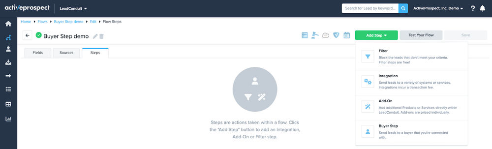
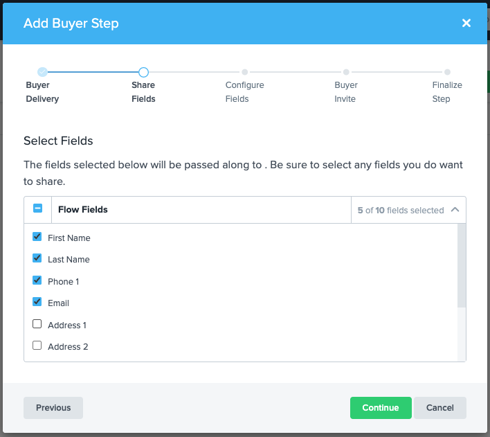
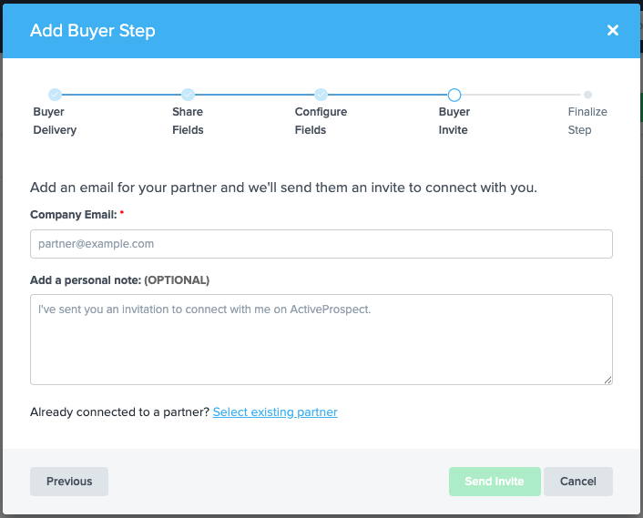
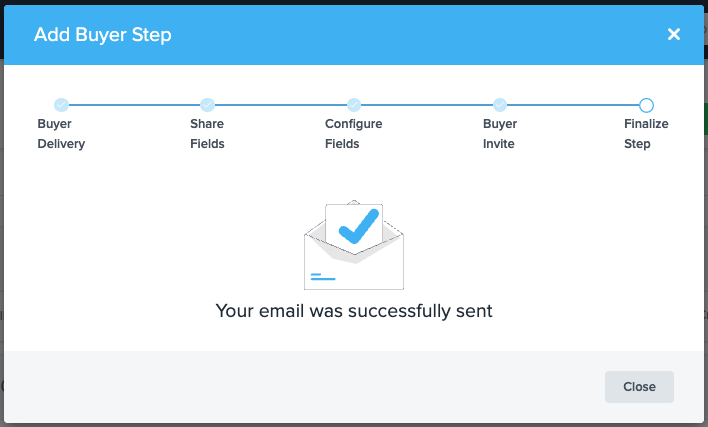
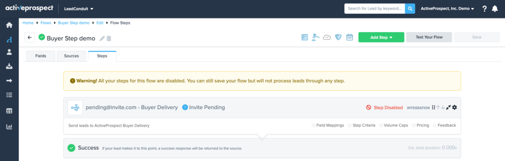
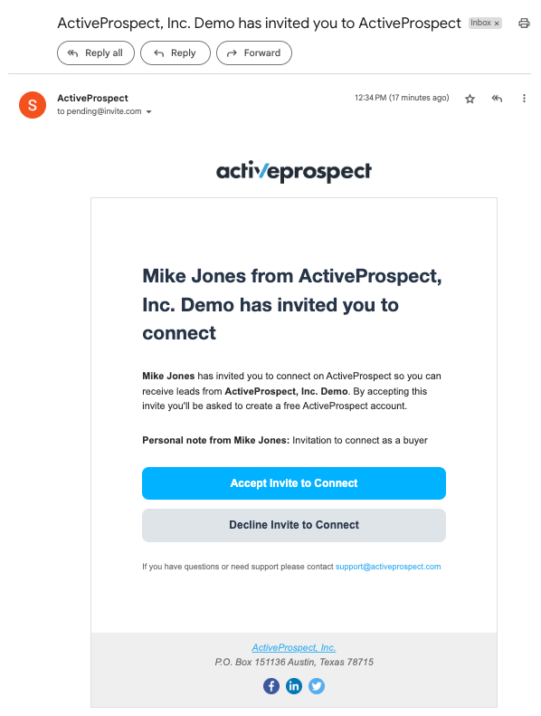
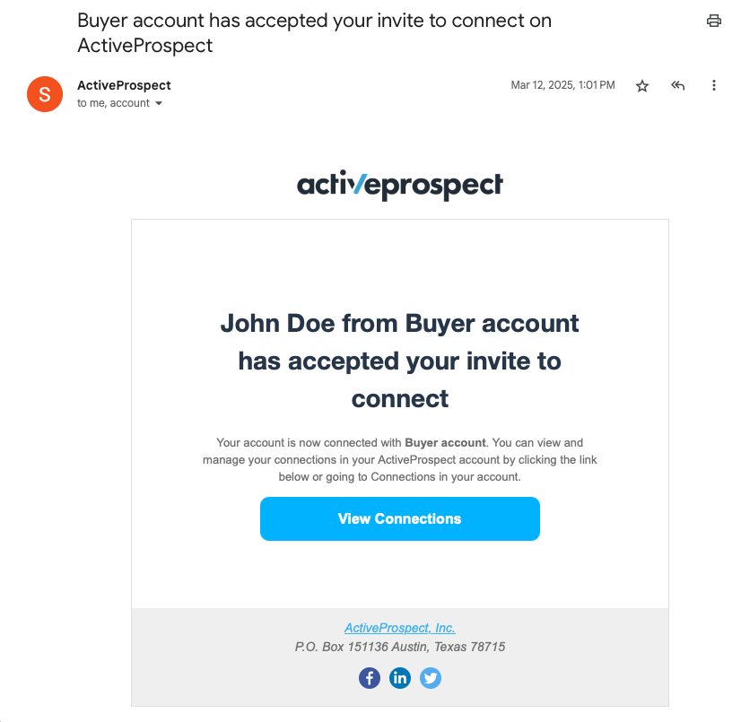
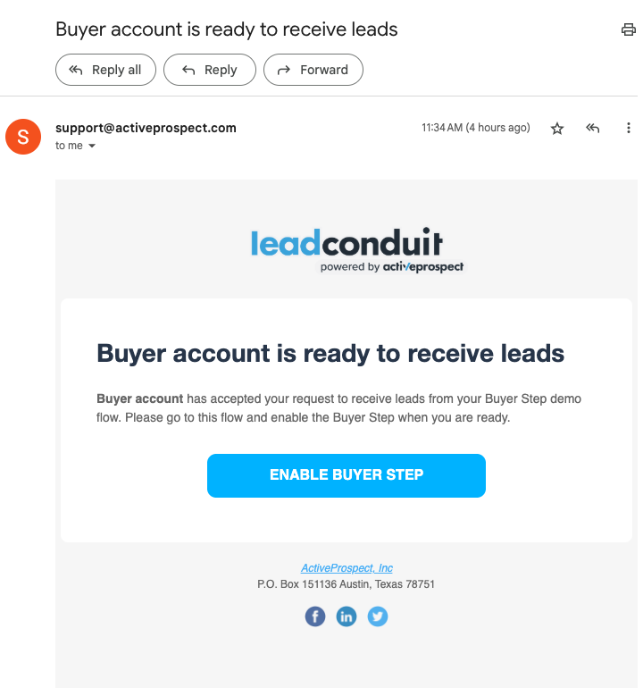
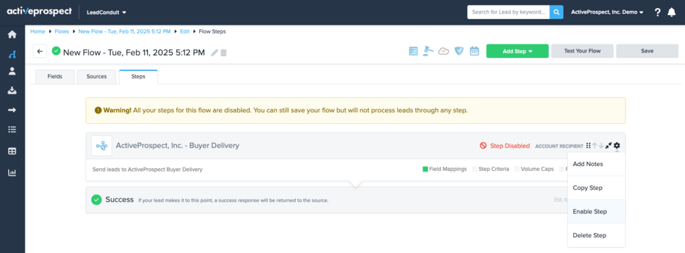
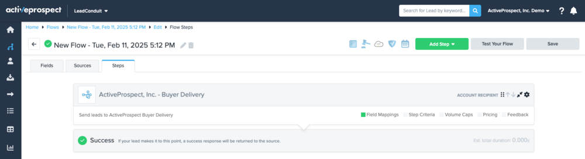

[_Leandro Estrella_](https://community.activeprospect.com/memberships/7866389-leandro-estrella)

Updated May 6, 2025. Published May 5, 2025.

Details

# Buyer Step for Sellers

## Why should I use this?

Some of the values you get as a Seller by inviting your Buyer as a recipient with this new feature are:

- Streamline your communication - easily submit leads to your partner’s account.
- Connect with your partners on ActiveProspect and formalize your working relationship.
- Your partner will get access to a free LeadConduit for Partners account.

## How does it work?

The process for adding a Buyer Step is similar to adding an Integration step; from the LeadConduit Seller's perspective, how you add a new Buyer Step will vary depending on whether the Buyer is already connected to your account.

01. Create or Edit the Flow in which you want to add a Buyer Step to send leads to a Buyer you haven’t already connected with; go to the _Steps_ tab, open the _Add Step_ menu, and click on the _Buyer Step_ option.

    

02. You will get the _Share Fields_ step. In this step, you can select the fields you’d like to submit to your Buyer with each lead. Once you have selected those, click _Continue_.

    

03. Adding a Buyer Step to an account to which you are **already** connected \[coming soon\]

    The _Buyer Invite_ step allows you to select a Buyer account with which you have already connected or a pending invitation you might have sent to some of your partners; select the account or pending invite to which you want to submit leads and click on _Continue_; otherwise, if you're going to invite a new partner, you should click on _Send invitation_.

    

04. Adding a Buyer Step to an account, you are **not** connected

    If you want to invite a new partner, after clicking _Send Invitation_, you should fill in the invitation details and click _Send Invite_.

    

05. Finally, after you send an invitation, you’ll get a confirmation screen, and the Buyer Step will be added to your Flow.

    

06. If you have sent a new invitation or selected a pending invite, your Buyer Step will remain disabled until your partner accepts your invite; make sure to save your Flow to prevent the loss of the Buyer Step you just added.

    

07. Your partner will receive an invitation like the following:

    
08. After your partner has accepted your invite, either with an existing ActiveProspect account or by creating a new one for free, you’ll receive an email notification like the following:

    
09. Then, after your partner has made the required configurations on their side to accept your leads, you’ll receive an email notification like the following:

    
10. Finally, upon going back to edit your Flow, you’ll notice that the Buyer Step has been updated with your Partner’s account name and flagged as Invite Accepted.

    

    You can now Enable the Buyer Step, Save your Flow, and start submitting leads to your Partner.

    

## FAQ

01. What happens if my invite gets declined?

    If your partner declines your invite, the pending Buyer Step will be automatically removed from your Flow and Recipients.

02. Are there any requirements for using the Buyer Step as a lead Seller?

    Your only requirement as a lead Seller is an ActiveProspect account with a paid LeadConduit subscription.

03. What happens if my partner doesn’t have an ActiveProspect account?

    If the Buyer doesn’t have an ActiveProspect account, they can create one for free from your invitation, giving them access to a free LeadConduit forPartners subscription.

04. What happens if my partner has an ActiveProspect account but doesn’t have access to LeadConduit?

    It might happen that the Buyer already has an ActiveProspect account that only has access to TrustedForm; when they accept your invitation with that account, they will be automatically assigned a free LeadConduit for Partners subscription.

05. What happens if my partner already has an ActiveProspect account with access to a free LeadConduit subscription?

    If the Buyer accepts the invitation with an account that previously had access to a free LeadConduit for Partners subscription, your account will be automatically connected to their Destination to start receiving your leads.

06. What happens if my partner already has an ActiveProspect account with access to a paid LeadConduit subscription?

    If the Buyer accepts the invitation with an account that previously had access to a paid LeadConduit subscription, they’ll be asked to select the Flow in which they’d like to receive your leads. Then, an Account Source representing your account will be automatically assigned to their Flow.

07. Why is ActiveProspect implementing this?

    Our customers have worked together on LeadConduit (and LeadConduit Classic) for over a decade, but we have never formalized that.

    The Buyer Step formalizes that relationship via a connection. This connection will provide value to both users across all ActiveProspect products (not just LeadConduit).

    These connections will also be foundational for building a platform where buyers and sellers can easily find one another.

08. How does this work for the Buyers?

    See [THIS](https://community.activeprospect.com/series/5621463/posts/5621479) article for details on how the Buyer Step works for lead buyers.

09. Why can I not enable my Buyer Step?

    You can enable and start submitting leads to a Buyer with the Buyer Step only after they have accepted your invite.

10. Does this new feature change how I assign and use Recipient integrations in my Flows?

    No, adding a Recipient representing a specific integration, such as Salesforce, remains the same.

Type something
