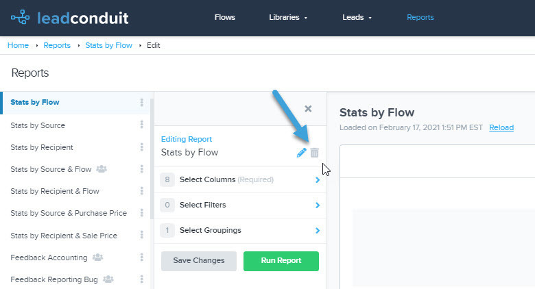

[_Scott McKee_](https://community.activeprospect.com/memberships/7557680-scott-mckee)

Updated February 17, 2021. Published February 17, 2021.

Details

# Deleting a Report in LeadConduit

# From the Main Screen

1. Locate your report on the reports menu.
2. Select the vertical ellipsis to the right of the report name to open the options menu.
4. A drop-down menu will open. Select the ‘Delete’ option.

# From the Edit Menu

When editing a report, you can delete the report by selecting the trashcan icon at the top of the editing menu to the right of the report name.

Type something
