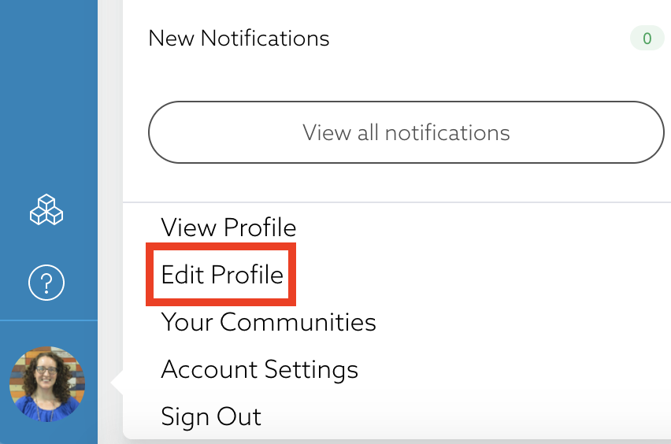

[_Paul Matzelle_](https://community.activeprospect.com/memberships/7557660-paul-matzelle)

Updated October 26, 2020. Published October 26, 2020.

Details

# Editing Your Community Profile

Your profile is a helpful part of your Community experience that identifies who you are.

Customizing your profile allows you to update your username (email) and password, and add your profile picture, bio, expertise, and interests. The more detailed your profile is, the easier it will be for other users to find you when they need help with a specific subject.

The following profile fields are available for editing:

- First name
- Last name
- Email
- Job title
- Company
- Skills and expertise

To edit your profile, click on your avatar in the lower left corner of the menu bar and select **Edit Profile**.

You can edit the following information from the Profile Editor page. (Remember to choose **Save** at the bottom of the Profile Editor when you are done.)

- **Profile Picture:** Profiles that include photos help users put faces to the names of subject matter experts in their community.
- **Bio:** We recommend including a short bio so that other users can learn more about you. Other community members can see this information about you, and your bio will appear in search results based on it's contents
- **Skills:** This enables other members to find you when searching for a subject matter expert. Start by typing a skill or area of expertise, such as SaaS, in the **Skills and expertise** box and press enter. Add more skills as needed.
- **Following:** Enter any community members, tags, and search terms that you are interested in. This information will be used to help populate your Following feed on the homepage with the content that's most important to you.
- **Time Zone:** If you're traveling or have moved, you can change the time zone on your Profile Editor.
- **Email Language:** This allows you to customize the language of your community email notifications. You can select English 🇺🇸, español 🇲🇽, or français 🇨🇦.

Type something
