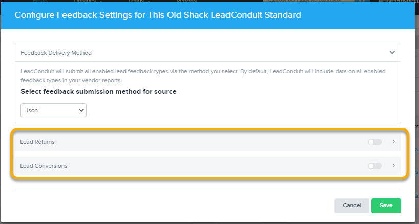

[_Scott McKee_](https://community.activeprospect.com/memberships/7557680-scott-mckee)

Updated December 17, 2021. Published November 30, 2020.

Details

# Enabling Real Time Feedback to a Source

Configure Flow Sources so that LeadConduit can deliver feedback to them.

Feedback can be reported to a lead's Source in real time if the Source has provisioned an end point to receive it.   _Note: Only Standard Sources can be configured for Real Time Feedback._

That end point must accept one of these HTTP data request types:

- Query (GET)
- Form POST
- JSON
- XML
- SOAP

Navigate to the Flow ""Sources"" tab, then click the ""Feedback Setting"" icon for the Source whose Feedback delivery you want to configure.

Choose the type of HTTP submission required by the Source's end point (Can not be ""Batch Delivery"". That will be covered in another article in this series.)

Toggle ""Lead Returns"" and/or ""Lead Conversions"" depending on what types of Feedback the Source will accept.

As you toggle each option on, a configuration modal will open. Configure the Source's Feedback delivery much as you would a flow Delivery step, mapping the end point's URL and parameters. Returns can be sent to a different end point than conversions, since each is configured separately.

At the bottom of the mappings section you may optionally set criteria to limit the nature of Feedback added to the batch file.  The ""advanced mode"" allows you to create custom rules.

It is not recommended that you configure feedback to a source if selling the same lead to multiple buyers.

Type something
