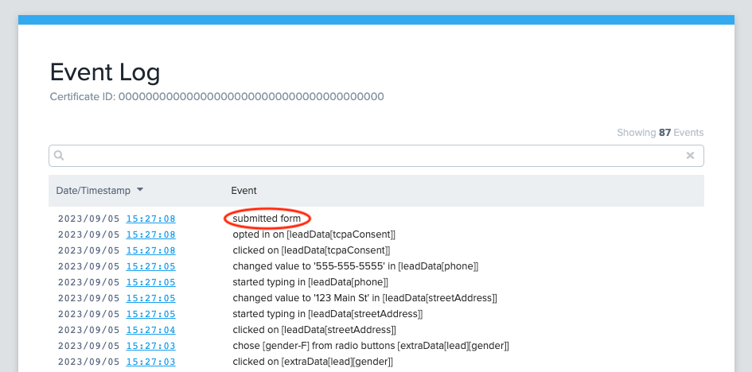
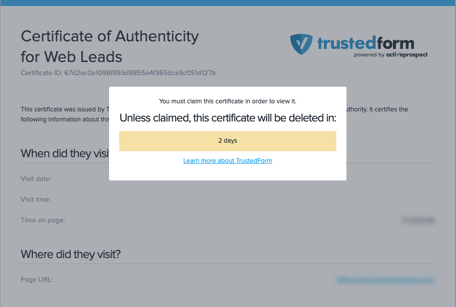
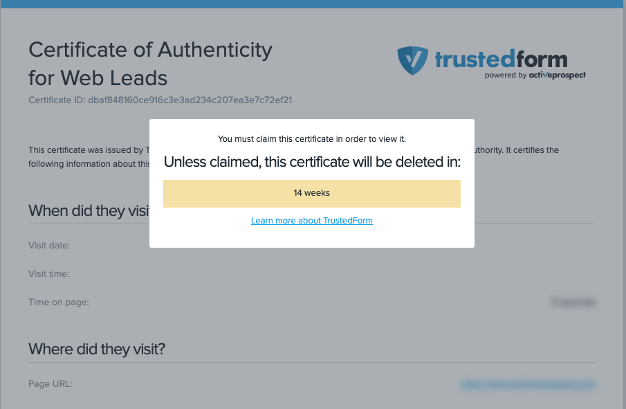

[_Christopher Williams_](https://community.activeprospect.com/memberships/7846678-christopher-williams)

Updated May 9, 2024. Published October 8, 2021.

Details

# Extended Retention Window for Submitted Leads

TLDR; By default certificates are only available to retained for 3 days. If a submission event is detected this gets extended to 90 days.

Once a certificate has been created, there is a limited window of time after which the certificate can no longer be retained. If you are planning to retain a certificate in long-term storage, you must do so before this retention window expires.

TrustedForm now extends the period a certificate is eligible to be retained if a submit event is detected on its lead generation form. By default certificates are only able to be retained for 3 days following their creation. This creates problems when you purchase aged leads / warm transfers as you often obtain the lead data after the retention period has ended. This means you miss out on having the opportunity to store the certificate and be protected. Extended certificates are able to be retained for 90 days which should give you more than enough time to retain relevant TrustedForm certificates. Prior to this change the only ways to extend a certificate required that you reach out to your lead vendor so they could implement the necessary steps to extend certificates. Now this happens automatically for leads that TrustedForm can validate were submitted!

## How it Works

TrustedForm Certify has been updated with new abilities that allow it to listen for events that explicitly indicate a form has been submitted or are associated with elements on a page that behave like a submit button. Certify is expected to accurately capture these submit events from any webpage using a standard <form> tag with a submit button embedded inside of it. Unfortunately, when publishers use less conventional means to submit lead data these events become more obscured and may not be caught. If a submission event is detected with high confidence, TrustedForm will automatically send this event and trigger the process to extend the certificate. We have observed that ~80% of certificates acknowledged to contain submitted leads are automatically extended. This process will take at least 15 minutes before it begins to ensure that all user activity is captured. Once it is complete you will see a longer time until the certificate is deleted if you visit the certificate URL before retaining it.

## Caveats

- Using the expiration of certificates as a means to avoid purchasing aged leads is no longer a reliable solution.

- The format of certain forms may prevent TrustedForm Certify from capturing submit event data.

- If a certificate does not get extended, that should not be considered a definitive indicator that the form wasn’t submitted.

- Certificate extension does not happen immediately after the lead submits their data which could lead to false assumptions that the certificate will not be extended.

- Certificates generated from Facebook Lead Ads always have a 12 week retention window.
## Frequently Asked Questions

- **How can I avoid reaching out to old leads that weren't generated recently?**

Check the lead age on TrustedForm certificates to determine if the lead was created recently.
- **How can I tell if Certify is detecting submit events for my certificates?**

View one a certificate for a lead from each of the forms you want to check. View the Event Log and search for ""submitted form"" event. If this event exists then it means a form submission was successfully captured.

- **What can I do to make sure that the certificates I generate get extended?**

Reach out to support@activeprospect.com if certificates you generate are not being extended automatically and you would like to troubleshoot why.
- **I just received a certificate and it says it will be deleted in 2 days, is this feature working?**

Wait at least one hour after the certificate was generated before expecting to see an extended deletion date on the TrustedForm certificate UI. If the certificate has not been extended after this period have your vendor reach out to us so we can help them troubleshoot.

Standard Certificate

Extended Certificate

Type something
