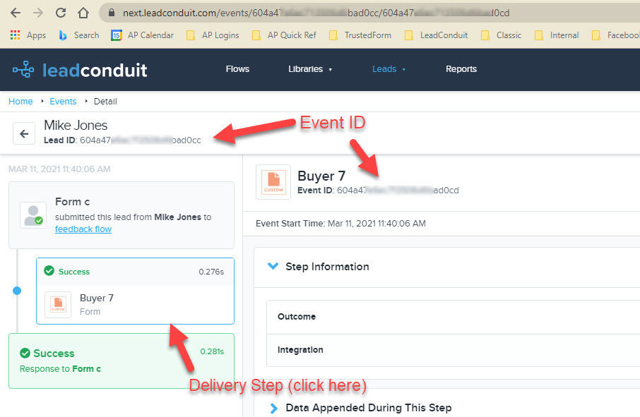

[_Scott McKee_](https://community.activeprospect.com/memberships/7557680-scott-mckee)

Updated March 15, 2021. Published March 15, 2021.

Details

# Find an Event ID after the lead has been processed

If you need to find the Event ID for a particular delivery step in a particular lead, you can see it in the lead's detail view in the ""Leads"" -->  ""Explore Lead Events"" tab.

Click on the delivery step in the left menu.

The Event ID for that step in that lead is visible below the step name , plus the URL in your browser's address bar will be updated to contain the Event ID as it's final parameter.

Type something
