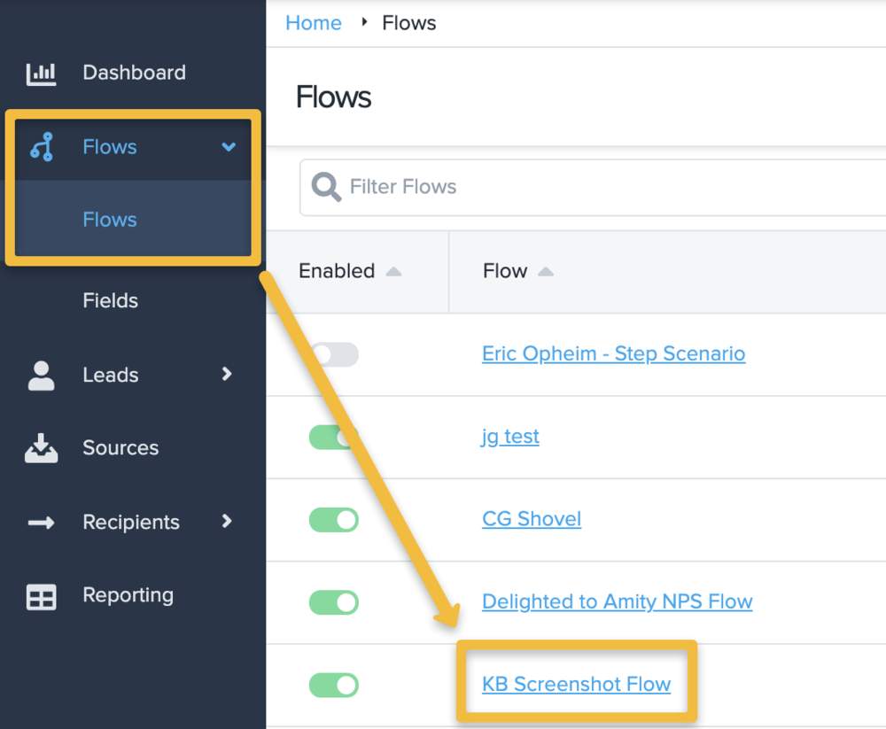
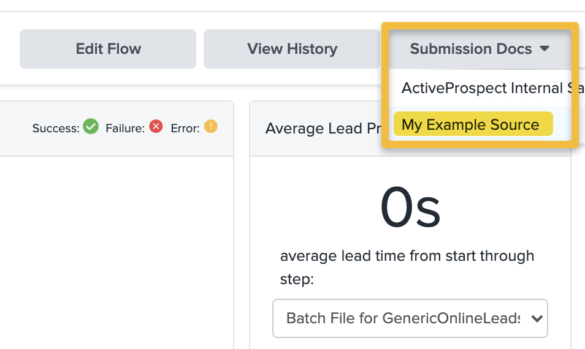
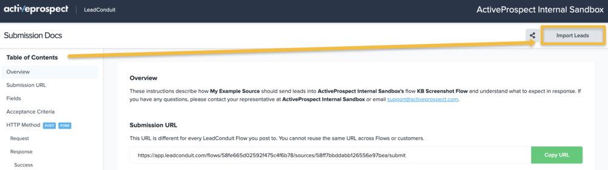

[_Scott McKee_](https://community.activeprospect.com/memberships/7557680-scott-mckee)

Updated September 9, 2021. Published December 14, 2020.

Details

# Finding and Using Submission Docs

Now that your flow is built, either you or your Lead Vendors will need Submission Docs in order to get your lead data into LeadConduit.

LeadConduit account holders can access Source-specific Submission Docs by following these steps:

1. On the navigation menu, click the heading ""Flows"" to expand, click the sub-heading ""Flows"" to refresh the page, and click on your ""Flow"" title to go to that specific Flow.

2. On the Flow page, go to the top right and click the ""Submission Docs"" dropdown menu to select the Source-specific Submission Docs for that Flow.

Once you select a Source, a new page will open with a unique hashed URL for this Flow + Source combination.

Here is a short video showing the process of accessing Submission Docs:

2021-09-09\_13-52-55 - TechSmith Screencast

[Video](images/video-1.mp4)

Your browser cannot play this video.

An annotation is now visible

0:00 / 0:00

[Acknowledgements](https://www.techsmith.com/redirect.asp?target=SmartPlayerAcknowledgementLink&ver=1.0.0&lang=enu&os=na&product=smartplayer)

Player Settings

Closed Captions

Playback Speed2.01.751.51.25normal0.750.50.25

[Acknowledgements](https://www.techsmith.com/redirect.asp?target=SmartPlayerAcknowledgementLink&ver=1.0.0&lang=enu&os=na&product=smartplayer)

If this is for an external lead vendor, you can safely share this Submission Docs URL with your lead vendor. No LeadConduit account credentials are required.

On the Submission Docs page, there are in-depth instructions on how to submit lead data to LeadConduit, including any requirements you configured in the Acceptance Criteria section of the flow, a sample lead request and response in various supported formats.

You can also Batch Import Leads (in CSV format) directly to LeadConduit from the Submission Docs page by clicking the ""Import Leads"" button at the top right of the page.

The batch import process takes place in your browser. The browser processes the CSV and dispatches each lead request individually. Most browsers have a maximum of 6 concurrent http requests so, at most, 6 leads are being processed simultaneously. From there it depends on the overhead inherent in http itself plus whatever the actual processing time is for each lead.

Type something
