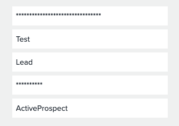

[_Christopher Williams_](https://community.activeprospect.com/memberships/7846678-christopher-williams)

Updated July 24, 2024. Published November 9, 2020.

Details

# Flagging Sensitive Data with TrustedForm Certify

# Overview

Per the [TrustedForm EULA](https://activeprospect.com/trustedform-eula/), the TrustedForm service may not be used to capture sensitive consumer data. Examples of sensitive data include credit card numbers, bank account numbers, social security numbers (SSNs), and driver's license numbers. If you use [TrustedForm Certify](https://activeprospect.com/trustedform/certify/) to collect sensitive data, you **must** flag these fields as sensitive.

# How Do I Protect Fields with Sensitive Data Flagging?

TrustedForm Certify allows you to flag any part of a form that contains sensitive data. When this feature is used, we apply a cryptographic hash to the flagged fields making it infeasible for anyone, including us, to store, retrieve, reverse-engineer, or utilize the data that was volunteered by the end-user in that flagged data field.

When a TrustedForm session replay is viewed, the data in a flagged field will be seen only as a series of asterisks or removed completely. In order for you to protect sensitive data and still have a recognizable certificate for compliance, we recommend only flagging fields that truly collect sensitive data.

# Implementation

## Flagging Individual Fields as Sensitive Data

By default, field data collected in form inputs are not considered sensitive by TrustedForm Certify. If you use it as provided and do not flag any fields as sensitive, it will capture any fields filled out while it is active.

Sensitive Fields in a TrustedForm Certificate

To protect the value of a field flag it as sensitive using the below attribute:

`data-tf-sensitive=""true""`

Example: Sensitive field

`<input type=""text"" name=""ssn"" data-tf-sensitive=""true"" />`

_Note: Checkboxes and widgets such as date-pickers will have their value protected but will still show visual indication of what the consumer clicked. To hide this completely please flag their parent element as sensitive._

## Flagging Content as Sensitive Data

By default, all content on the page is captured as part of the session replay. If you wish to hide more than the field value you may use the `data-tf-sensitive=""true""` attribute on a content tag(e.g. div, img, p, span) to obscure that tag and all of its child elements. The content will be replaced by a placeholder that indicates it has been hidden by you.

Sensitive Content in a TrustedForm Certificate

Example: Sensitive image

``

Example: Sensitive div containing a checkbox

`
`

`  <input type=""checkbox"" />`

`
`

## Treating All Fields as Sensitive Data

TrustedForm also supports the ability to treat all fields as sensitive data. When this option is selected, you can flag individual fields that you don't want to be treated as sensitive.

In order to switch to this option, toggle the **invertFieldSensitivity** variable in the TrustedForm Certify Web SDK to true.

When the **invertFieldSensitivity** variable toggle is enabled, you must explicitly mark fields you want the TrustedForm Certify to capture:

`<input type=""text"" name=""phone"" data-tf-sensitive=""false"" />`

_Note: This only applies to standard input tags. Other elements you use to collect user input will not be treated as sensitive._

Type something
