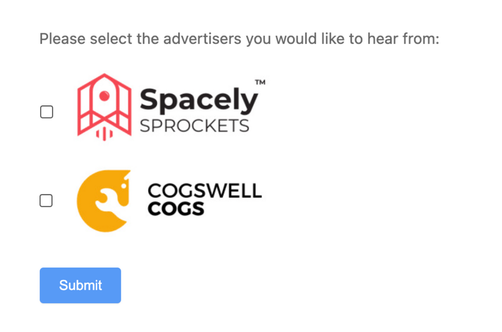

[_Christopher Williams_](https://community.activeprospect.com/memberships/7846678-christopher-williams)

Updated January 10, 2025. Published September 15, 2024.

Details

# How do I add TrustedForm Consent Tags when using logos/images instead of text to obtain one-to-one consent?

When [adding TrustedForm consent tags](https://developers.activeprospect.com/docs/trustedform/consent-tagging/) you are instructed to add a tag to the text identifying the advertiser being granted consent to contact. This may seem confusing because some forms use the advertiser's logo or an image to show the consumer who may contact them. However, you must still include text that contains the advertiser's name as shown to the consumer to properly add consent tags. If you prefer not to display this text to the consumer, you can hide it's parent element it from view. This allows TrustedForm Certify to document it while maintaining the desired experience for consumers. Ensure that the text accurately represents the advertiser name shown in the image or logo to avoid potential disruption or loss of service.

See the below example for inspiration of how to add this to your form.

​x

11

1

```
<div>Please select the advertisers you would like to hear from:</div>
```

2

```
<label style=""display:flex;align-items:center;"">
```

3

```
  <input type=""checkbox"" data-tf-element-role=""consent-opted-advertiser-input-1"">
```

4

```
  
```

5

```
  <div style=""display:none""><span data-tf-element-role=""consent-opted-advertiser-name-1"">Spacely Sprockets</span></div>
```

6

```
</label>
```

7

```
<label style=""display:flex;align-items:center;"">
```

8

```
  <input type=""checkbox"" data-tf-element-role=""consent-opted-advertiser-input-2"">
```

9

```
  
```

10

```
  <div style=""display:none""><span data-tf-element-role=""consent-opted-advertiser-name-2"" style=""display:none"">Cogswell Cogs</span></div>
```

11

```
</label>
```



Type something
