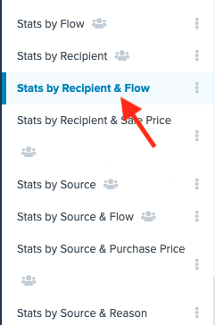

[_Christopher Murphy_](https://community.activeprospect.com/memberships/8598466-christopher-murphy)

Updated June 1, 2023. Published June 1, 2023.

Details

# How Do I Make a Report Showing How Many Leads Go Through a Recipient Step?

This article will go over making a report showing leads sent to specific recipient steps.

#### Getting Started

First, you will need to navigate to the reporting tab in LeadConduit. This can be found in the sidebar on the left hand side of the application.

If you haven't made a report before, you will notice that there are reports already populated in the reporting section. These are the default reports populated in every LeadConduit instance.

The report you will need for the purpose of this article is titled ""Stats by Recipient & Flow"".

You can then choose a date range from the drop down menu in the top right of the report to refine the data to a specific timeframe.

#### Further Refining Your Data

If you wish to include more data in this report, there's a couple of ways that you can do so. If you want to keep the original report, you can click the three vertical dots next to the report name and click ""Copy"". Otherwise, simply click the ""Edit"" option in the same menu.

When editing the report, you can select different filters or groupings to show in the report. Note: If you select a flow in the filters section, you will need to remove Flow in the ""Groupings"" section.

#### Need More Help?

If you need more help setting up reports or notice something not working as it should, please contact Support by emailing [support@activeprospect.com](mailto:support@activeprospect.com)!

Type something
