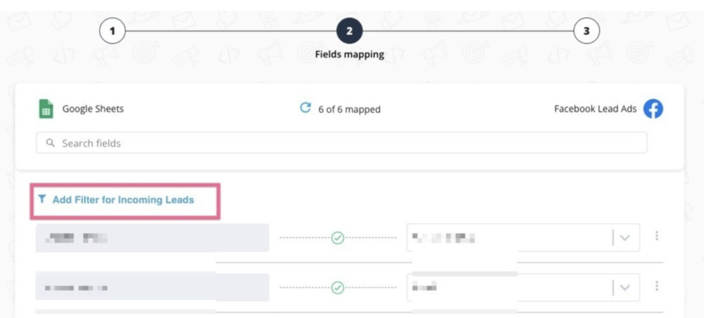

[_Claudia Melis_](https://community.activeprospect.com/memberships/8017840-claudia-melis)

Updated October 23, 2023. Published June 20, 2023.

Details

# How to filter incoming leads on LeadsBridge?

On LeadsBridge, it's possible to quickly refine incoming leads directly from your Bridge with the **Filter Incoming Leads** tool.

This tool will allow you to refine the leads that get synced using the information you're receiving from your Source so that you may reach out to those leads that meet specific criteria in a more precise and nurturing way and concentrate your efforts on the leads that have the set of characteristics that work for your objective.

For instance, you may filter your leads by their geographic area so that a single Bridge handles the leads coming from a specific location and let your marketing automation be even smoother, ensuring that only leads indicating a particular area will pass through to your Destination, and any other lead won't be handled further.

This Filter allows you also to filter only specific contacts to be synced in your **Facebook Custom Audiences**, **Google Match Audiences,** or **Linkedin Matched Audiences.**

**Note**: Filters are available starting from the [Starter plans](https://community.activeprospect.com/posts/5039672-how-do-i-choose-the-right-leadsbridge-plan-for-me). If you’re on a Free plan, you can get a free 14-day trial to test this feature.

## How does it work?

To use the filtering tool, you should follow the steps below:

1\. Open your Bridge

2. Go to the **Fields mapping** step

3\. Click on the **Add** **Filter for Incoming Leads** button at the top left

4\. Then, select the source field that needs to be analyzed by the filtering tool. In this case, we have selectedthe _Created Time_ field.

5\. In the second drop-down menu we can choose between different conditions depending on the type of field we have previously selected. Since we have selected a _Date Time_ field, we can set conditions such as: Before, Equals, After, BeforeLastDays, and AfterLastDays.

6\. After that, depending on the condition you have chosen, a final set will be available; in there, we should specify the value that needs to match the settings previously selected.

Following the EXAMPLE below, we will type the number _7_ since we only want to sync leads collected in the last seven days.

There are different conditions and filtering that we can set in the tool.

7\. Remember to click on **Save Changes** to save the filtering settings. Or, you can click on the **Delete** **all rules** button to delete any filter you have created or click on the plus (+) button to add multiple filtering conditions; notice that the lead will get synced only if all conditions are met.

Once you finalize your Bridge filters, you'll see a filter symbol under the **Icon** column of your Bridge list; this symbol will show only in the bridges that have the **Filter Incoming Leads** function set up.

**NOTE**:  It is also important to keep in mind that the filtering conditions will be applied from the moment you set them. This means that if you apply the filters to an existing Bridge or Audience, the conditions will be applied only starting from the next sync.

Type something
