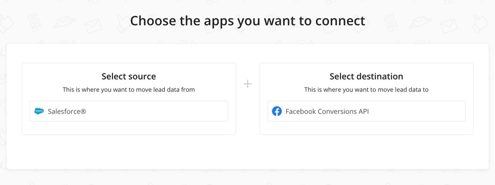
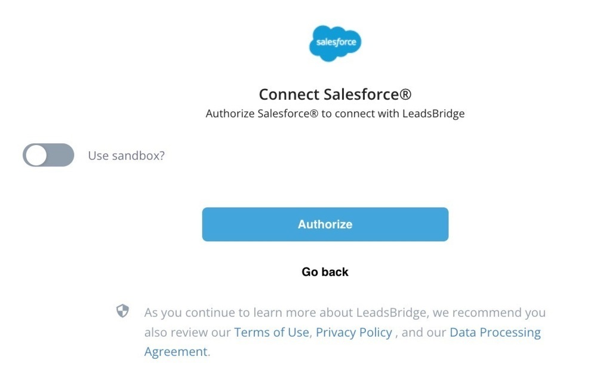
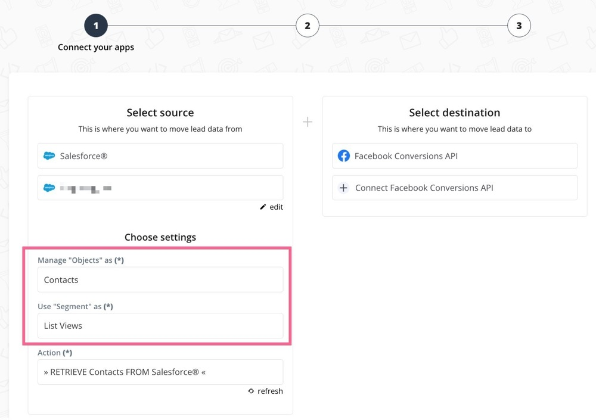
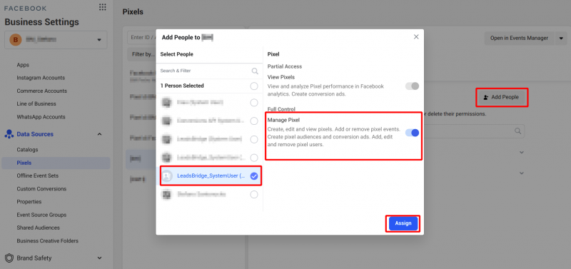
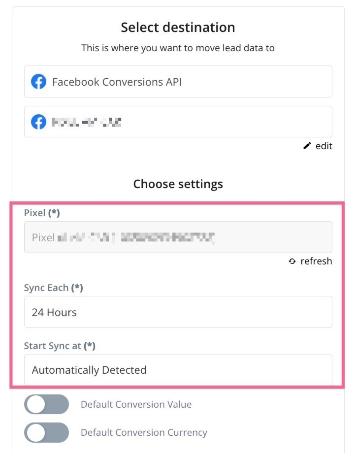
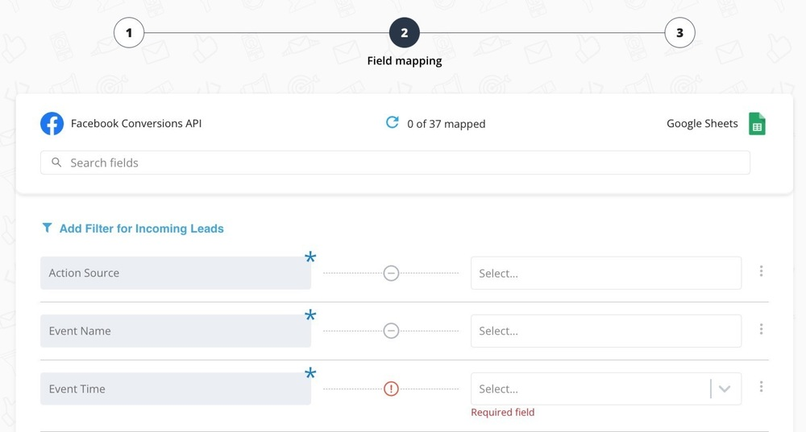
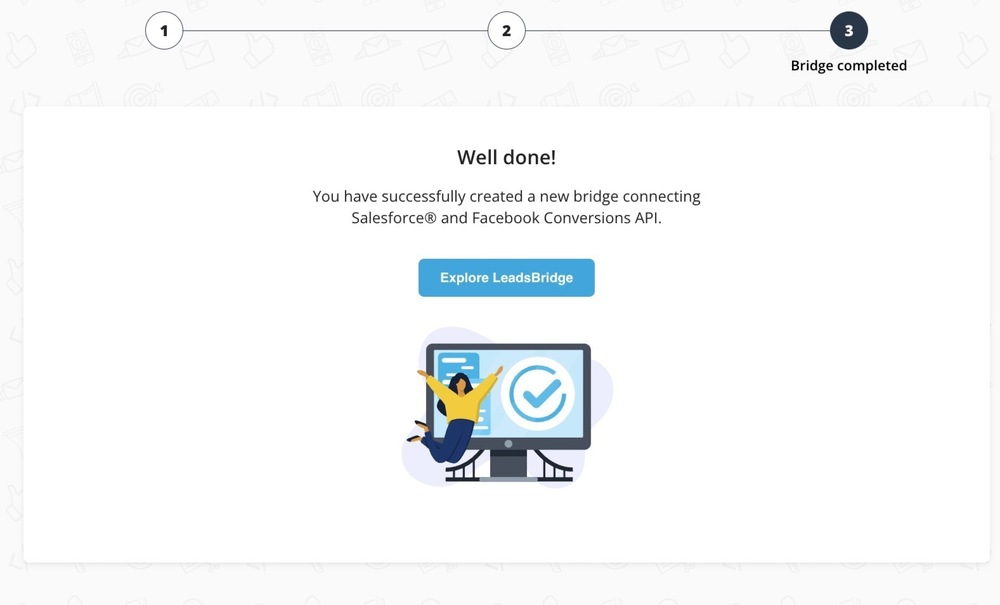

[_Claudia Melis_](https://community.activeprospect.com/memberships/8017840-claudia-melis)

Updated November 7, 2023. Published June 20, 2023.

Details

# How to setup Facebook Conversion API?

Facebook Conversions API (or Server-Side API) is designed to help businesses maintain data privacy while delivering personalized experiences to their customers without relying on browser-based tools like cookies.

Additionally, Conversions API provides businesses:

- **Full funnel visibility:** it offers businesses the ability to share a wider array of data with us currently captured by Pixel. This gives businesses full-funnel visibility.

- **Accurate data sharing:** data sharing through Conversions API is more accurate than other methods; businesses don’t have to worry about data getting lost because of a browser crash or an ad blocker.

- **Data control:** Conversions API gives businesses more control over what they share. That means businesses that implement the Conversions API can decide what to share and when to share it.
LeadsBridge will send anonymized data to Facebook using the SHA-256 algorithm. By design, LeadsBridge will not store any sensitive data in its database.

LeadsBridge only acts as a “hub” or “middle-ware” that retrieves the information from your data warehouse (e.g. CRM, etc.), validates the information, and push to Facebook using their API.

In this guide, you’ll learn how to create a Bridge between your Facebook Conversions API and your CRM.

A **Bridge** is a word we use to describe a connection between a Source, in this case, your CRM, and a Destination, in this case, your Facebook Conversions API.

Facebook Conversions API lets you:

- **Measure customer actions in more ways.** For example, you can share delayed values, user scores, or lead scores and use them for optimization in our other business tools.

- **Improve reliability to send events for measurement and optimization when used along with the pixel.** The Conversions API will help capture events that you may lose due to poor network connectivity or long page load times.

- **Control the data you share.** You can include more meaningful data about your users, such as their user scores, alongside the event data you share with Facebook via the Conversions API.
This can help you better understand the ROI of your advertising and allows you to optimize for the outcome that matters most to your business.

After you finish your Bridge setup, LeadsBridge will start automatically syncing your data, retrieving them from your CRM, and keeping them synced with your Facebook account.

## Conversions API step-by-step setup

### **1\. Select the source**

This is the first part of the **Sources** step; in this step, you should select the CRM or Platform from which LeadsBridge will retrieve your data.

For these guidelines, we will use _Salesforce_ and create a new _Salesforce_ Integration. Still, you can use any of the hundreds of integrations available in LeadsBridge (e.g. _SFDC_, _HubSpot_, _SFTP_, _Database_, _CSV files_).

After we have selected our Integration, we can select the **Destination** settings.

### **2\. Integration setup**

This is the **Integration** step; in this step, you will create the connection with your CRM by clicking **Create a new integration**, in this case, Salesforce. You can click on **Authorize** to set the connection between _Salesforce_ and LeadsBridge.

Since we are using _Salesforce_, you set set some integration options such as **Use sandbox?**

If you have already created your Integration, you can jump to the next step.

The parameters may vary according to the Integration you’re using. You should type your Integration name and confirm it. So, you will be redirected to the bridge.

### **3\. Source setup**

This is the second part of the **Sources** step; in this step, you can select the type of segmentation concept you want to use while retrieving the selected Source objects. For example, if you choose _Salesforce_, LeadsBridge will retrieve your _List Views_, which is a _Salesforce_ segmentation concept.

After that, in the **Manage ”Objects“ as** dropdown, you should choose the kind of object you want to retrieve from Salesforce. If, for instance, your business uses the _Salesforce Opportunity_, please select that option in the dropdown. Otherwise, if you want to keep the _Leads_ or _Contacts_ from your websites synced, choose those kinds of objects.

Then, in the **Use ”Segment“ as** dropdown, you should choose the type of segmentation concept you would like to use when retrieving your Integration objects. Since we are using _Salesforce_, we may select **List Views** as a segment to receive the contacts that belong to a specific _List. For_ instance, let’s say that you have a specific _List View_ that contains all the contacts that showed _Interest_ when being reached by your call center.

### **4\. Account information**

This is the **Destination** step; in this step, you need to select the System User you want to connect to. When the Bridge is ready, LeadsBridge can periodically sync and update your CRM data with your Facebook Conversions API.

Initially, you’ll need to connect to LeadsBridge the Facebook Ad Account that you’ll be using in your Campaigns, and create a System User.

1. Select the _System User_ that you previously created from the dropdown. Alternatively, click on the **Create a new Integration** button and select the Business Manager you want to create the System User. LeadsBridge will attempt the System User creation for you.

2. Now, on the Facebook side, follow these steps:

1. Go into **Business Manager Settings**: [https://business.facebook.com/settings](https://business.facebook.com/settings ""https://business.facebook.com/settings"")
2. Select your Business Manager
3. From the left menu, select **Data Sources** and then **Pixels**
4. Select the Pixel you want to connect to CAPI (e.g. “My Facebook Pixel”) and click on the **Add People** button
5. Select **LeadsBridge\_SystemUser** (which has been created at the end of step 5 above) and tick **Manage Pixel**
6. Click **Assign** to save and submit

Now that you have connected the Facebook Ad Account and created the System User, we can proceed with the bridge configuration steps.

### **5\. Pixel settings**

This is the first part of the **Settings** step; in this step, you should select the **Pixel** to which you want to send your data.

1. In the **Pixel** dropdown, choose between creating a new Conversions API or select one that you’ve previously created.

2. Under the **Sync Each** dropdown, you should define the Sync frequency you would like to use; we recommend using the _24-hour_ sync frequency.

3. Then, in the **Start Sync At** dropdown, you may choose at which specific time of the day you would like to start the syncing process; we advise you to leave it as _Automatically Detected_.

4. If you are ingesting conversions without a specific value, we suggest flagging the default conversion value to 1 and the default conversions currency to USD.

5. In this last selection option, you may set your Bridge on **Live Sync** and start sending your data into your Facebook Pixel, or set it as **Simulation** and allow LeadsBridge to elaborate and validate your source data, excluding the syncing process. Thanks to this latter option, you will be able to double-check the information sent to Facebook when you set the Bridge on **Live Sync** mode.

6. Finally, click on the **Continue** button

### **6\. Source Filter**

Also, if you click on **Add Filter for Incoming Leads**, you will define **Conditions** on which you can set further segmentation filters for your contacts. In this way, you may allow contacts to be sent into your Facebook Pixel based on some conditions like, for instance, a filter that will only allow the syncing of contacts that have been assigned a specific _State_ or _Stage_ in your CRM.

After you have selected your _Segmentation_ and optionally assigned your _Source Filter_, you can click on **Save Changes** to continue with the following step.

### **7\. Fields Mapping**

This is the **Fields Mapping** step, and it is the most important part of the Bridge creation. In this step, LeadsBridge will ask you to do the mapping between the fields requested by Facebook to recognize the Pixel with your CRM data.

Notice that Facebook doesn’t need to receive your contact's _Email address_, _Phone number,_ and so on, but this kind of mapping between Facebook and the source CRM fields will increase the Matching Rate.

> _Facebook allows advertisers to send multiple pieces of information to recognize their users._
>
> _You can map 1st party data (e.g. email, phone, etc) or additional data (e.g. lead\_id, browser agent data, fbclid, etc) to allow the Facebook platform to properly match your data with the Facebook platform data._
>
> _For sure, the more data you will send to the Facebook platform, the higher will be the matching rate, and the more accurate will be the attribution rate._
>
> _Here you can find a list of full matchable data_ [_https://developers.facebook.com/docs/marketing-api/server-side-api/parameters_](https://developers.facebook.com/docs/marketing-api/server-side-api/parameters ""https://developers.facebook.com/docs/marketing-api/server-side-api/parameters"")

Make sure to map every mandatory value marked with a blue star. Usually, **Action Source**, **Event Name,** and **Event Time** are mandatory values, so you should map them accordingly.

You may also want to map fields such as **Event Value** or **Event Currency** if, for instance, you’re syncing your opportunities, which usually have a specific amount.

Once you have mapped all the required and optional fields, you can click on **Continue** to activate your Bridge.

That’s it. When the sync period begins, your Bridge will start the elaboration and validation of your Source data and, if you have set your Bridge on **Live Sync**, LeadsBridge will sync the data to your Facebook Pixel.

So, once the first sync process ends, you’ll be able to see your matched CRM contacts inside your Facebook Events Manager.

Type something
