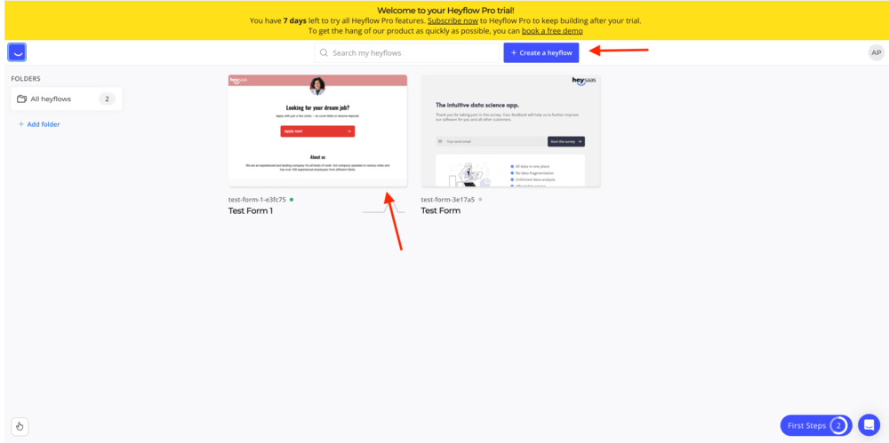
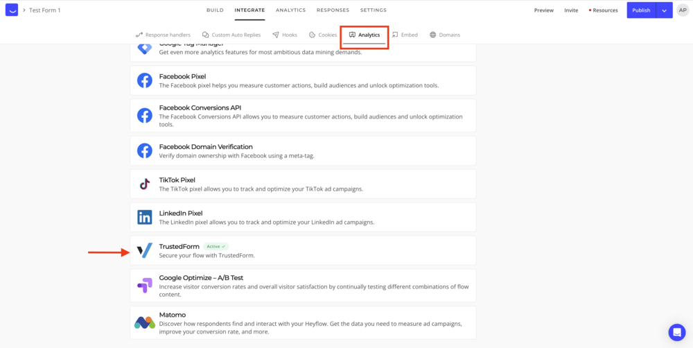
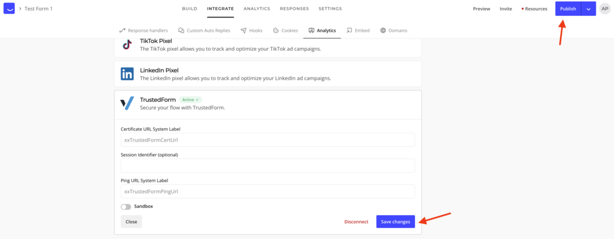

[_Ayesha Akhtar_](https://community.activeprospect.com/memberships/9624817-ayesha-akhtar)

Updated December 8, 2023. Published December 8, 2023.

Details

# How to use TrustedForm with HeyFlow

HeyFlow has  a built-in integration with TrustedForm. However, in order to use TrustedForm, you need to subscribe to HeyFlow’s Business plan.

Begin by logging into your HeyFlow account.

Select the form you want to use with TrustedForm by clicking on an existing form or create a new form:

Once you have created you form in 'Build' mode, click on the 'Integrate' tab:

Then click on 'Analytics' tab, scroll down and click on 'TrustedForm':

The TrustedForm option expands as can be seen below. Here fill in the Certificate URL System Label, Session Identifier (optional), and Ping URL System Label using the information in your TrustedForm account. You can also enable Sandbox using the toggle option.

Once you have updated the information, click on 'Save changes'. Once you're done, you can click on 'Publish' on the top right-corner, this take a minute or so. Then once it is published, click on the arrow, and select view.

That's it! Now you should be able to view and test the form, and the certificates should be created successfully.

Type something
