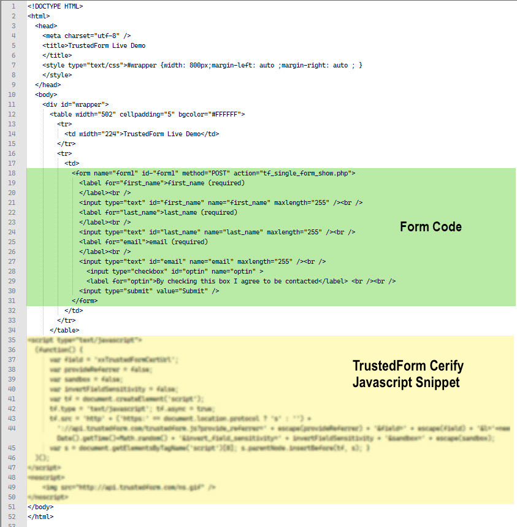
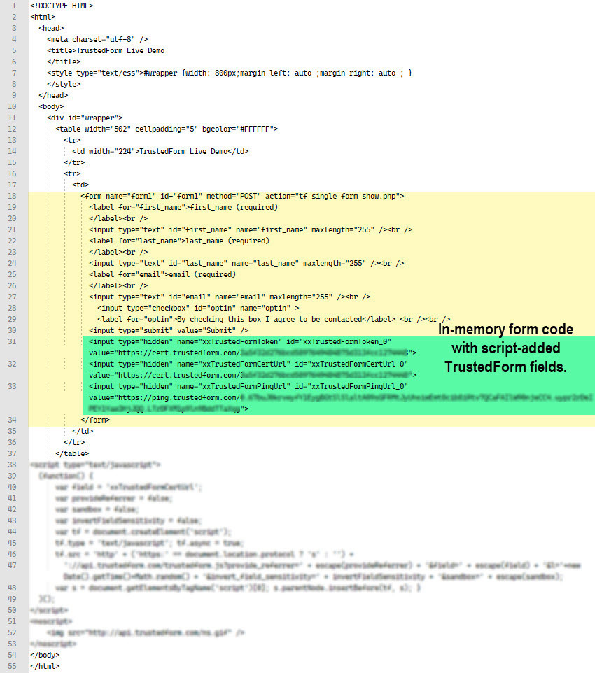
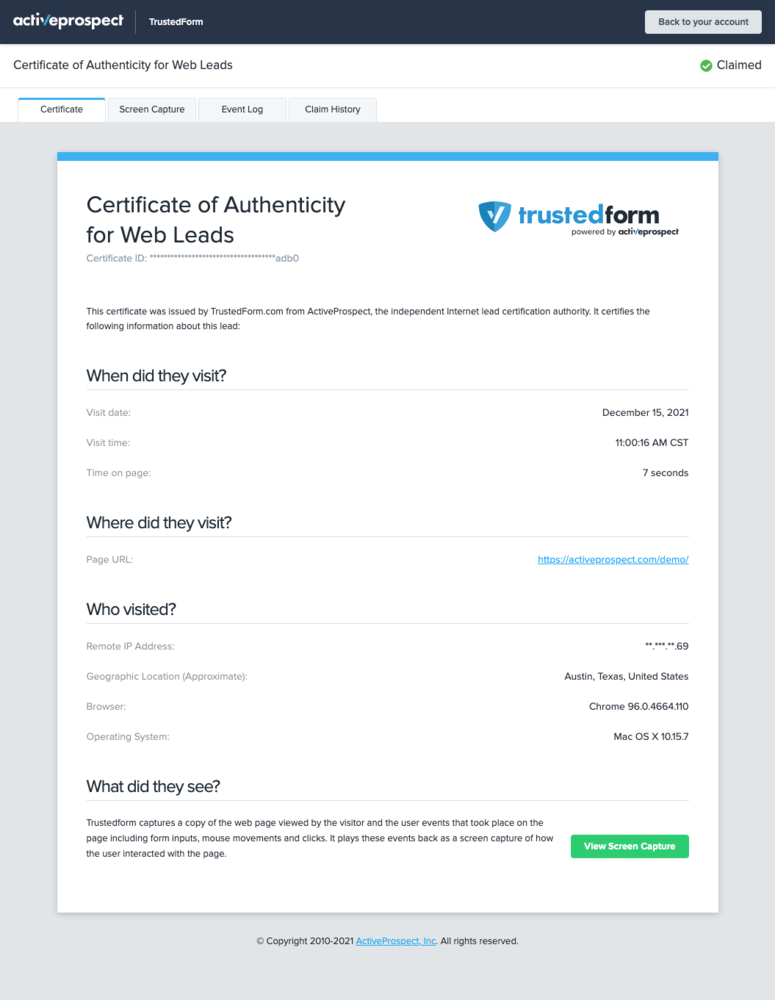

[_Christopher Williams_](https://community.activeprospect.com/memberships/7846678-christopher-williams)

Updated August 31, 2023. Published January 13, 2021.

Details

# How TrustedForm Certify Works

What happens when a consumer views a web page using TrustedForm Certify?

When a consumer visits a web page using a browser, the browser downloads a set of instructions on how to display the page to the consumer. Those instructions are called the Document Object Model, or DOM. The browser retains a copy of the DOM in the computer’s memory and uses it to create the visual elements on screen. The DOM may also instruct the browser to fetch additional files as needed (images, videos, sound, scripts and more).

Here’s the DOM of a simple form page using TrustedForm Certify:

The TrustedForm Certify javascript snippet is part of the DOM, placed there by the web site’s developer. It executes once the page has loaded, first establishing a connection between the user’s browser and the TrustedForm service. Then begins a series of exchanges that occur in the background while the consumer has the page open:

- The browser sends to TrustedForm a copy of the DOM and details about the user’s computer environment (operating system, IP address, browser type and more).
- The TrustedForm service sends the script running in the browser a unique identifier string in the form of a URL. This is the TrustedForm certificate URL. The script modifies the in-memory DOM, adding hidden fields to the web forms in the page, and populating them with the TrustedForm certificate URL string, So now, the TrustedForm certificate URL fields become part of the data payload to be submitted to whatever server the form has as its target.

Here's our simple web page with the script-added TrustedForm fields:

- As the consumer moves or clicks their cursor or presses keys, the browser sends a record of those events to TrustedForm.
- When the consumer either abandons the page or submits a form (which also causes page abandonment) the connection between the user’s browser and the TrustedForm service closes.
- At this point TrustedForm saves everything that the browser has sent up to it. This is the TrustedForm Certificate. It retrieves any additional files specified in the DOM from their respective servers and adds them to the Certificate, which is now complete.

TrustedForm will store the certificate for 72 hours. This period will be extended to 90 days if the consumer actively submitted a form indicating their intent to have their information saved. During that period, any one who makes a paid request to retain that certificate will have a copy of it stored in their account for 5 years (unless a different storage length is negotiated). They can then log into their TrustedForm account and visit the  TrustedForm certificate URL using their browser to view the certificate. The certificate displays the metadata about the visit / lead event and a recreation of it by replicating the user’s cursor and key events on top of a copy of the website as it appeared at that time (the “session replay”).

Here’s an example of a certificate created by our example form:

Try our live [TrustedForm Demo](https://activeprospect.com/products/trustedform-demo/) to see how it works for yourself and view a live certificate and it's session replay.

Type something
