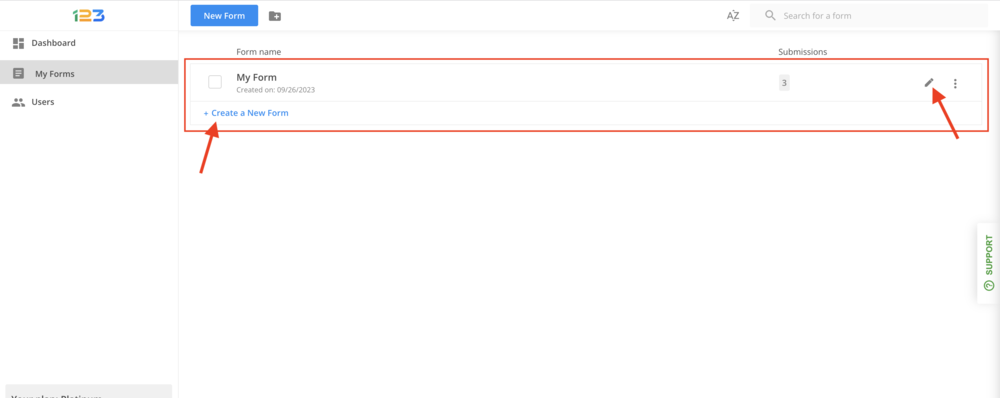
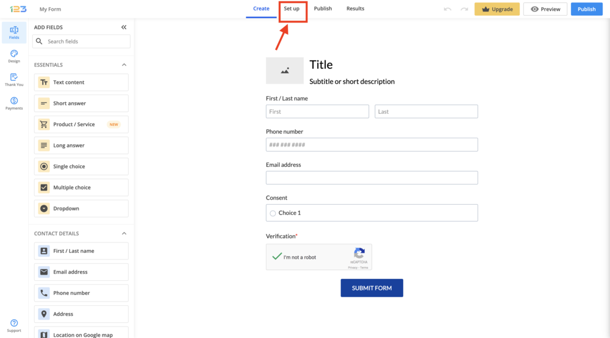
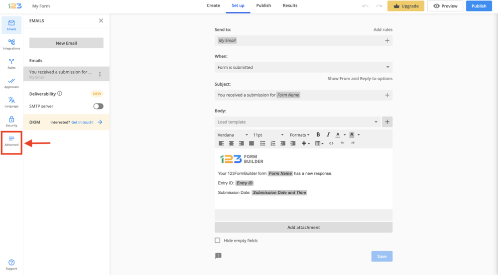
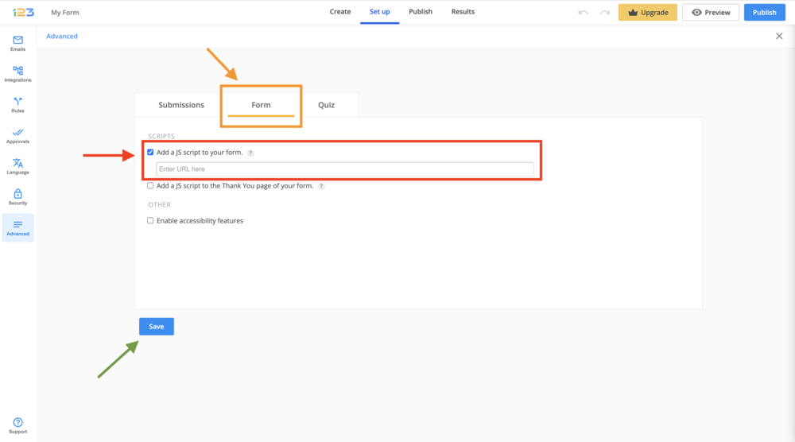

[_Ayesha Akhtar_](https://community.activeprospect.com/memberships/9624817-ayesha-akhtar)

Updated February 21, 2024. Published October 12, 2023.

Details

# Implementing TrustedForm on 123FormBuilders

How to add TrustedForm to a 123FormBuilders form.

Begin by logging into your FormBuilders account.

Select the form you want to use with TrustedForm by clicking edit or create a new form:

Click on the 'Set up' tab:

Then click on 'Advanced' on the left side bar:

Then click on the 'Form' tab. Then select 'Add a JS script to your form'.

Here we will be entering the URL of a .js file which holds the TrustedForm script.

To do that, first create a JS file that holds our TrustedForm script, then upload the JS file on a trusted web server or your own and use the URL where the file is located (e.g. https://mydomain.com/my-javascript.js). There are web services that host JavaScript files for you, but they represent certain risks, such as data corruption or service retirement. That’s the reason why it is best to host them on a web service where you have administrative access.

Once you have entered the URL of the JS file, click on 'Save', as follows:

That's it! Now you should be able to publish and test the form, and the certificates should be created successfully.

Type something
