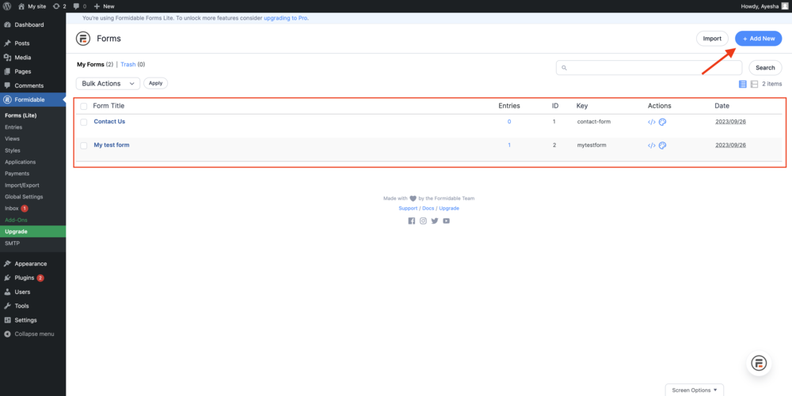
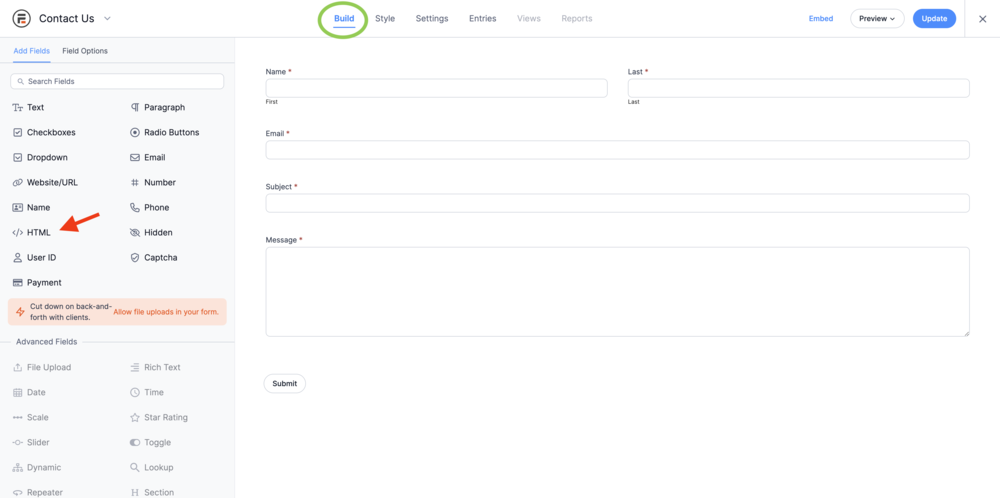
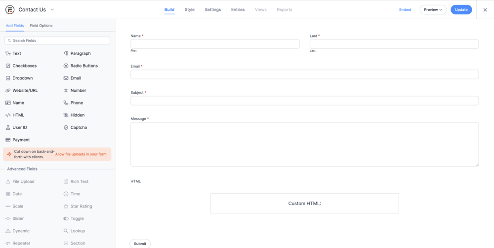
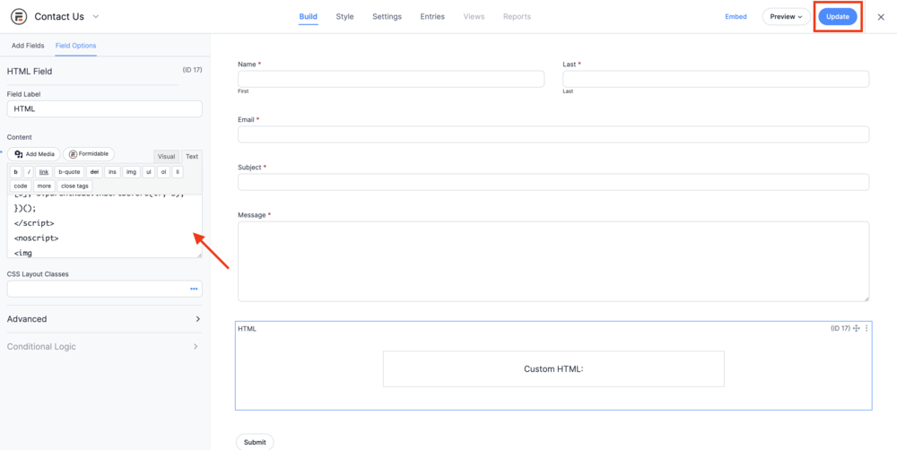

[_Ayesha Akhtar_](https://community.activeprospect.com/memberships/9624817-ayesha-akhtar)

Updated March 4, 2024. Published October 16, 2023.

Details

# Implementing TrustedForm on Formidable

How to add TrustedForm to a Formidable form.

Open WordPress, and navigate to Formidable forms, and here either create a form( 'Add New' ) or open an existing form. In the example below, we're using a simple contact form.

Make sure you're under the 'Build' page. Now click on '</> HTML' on the left side bar.

As soon as you click, an HTML block would get added to you form, make sure it gets added just before the submit button, if not, then drag and change its position, so it's placed before the submit button.

Now click on the 'Custom HTML' block, and a small 'Content' window will appear in the left side bar, here you copy and paste the TrustedForm script, then click on 'Update' button on the top right corner.

**To get the TrustedForm script:**

- Log into your Trusted Form ActiveProspect account, then navigate to the Certify tab.
- Here you will find the TrustedForm script under 'Javascript Snippet', copy this script.

That's it! Now you should be able to preview and test the form, and certificates should be created successfully. Look for the hidden field (xxTrustedFormCertUrl) in the inspect tool, which is where you'll find the certificate URL.

Type something
