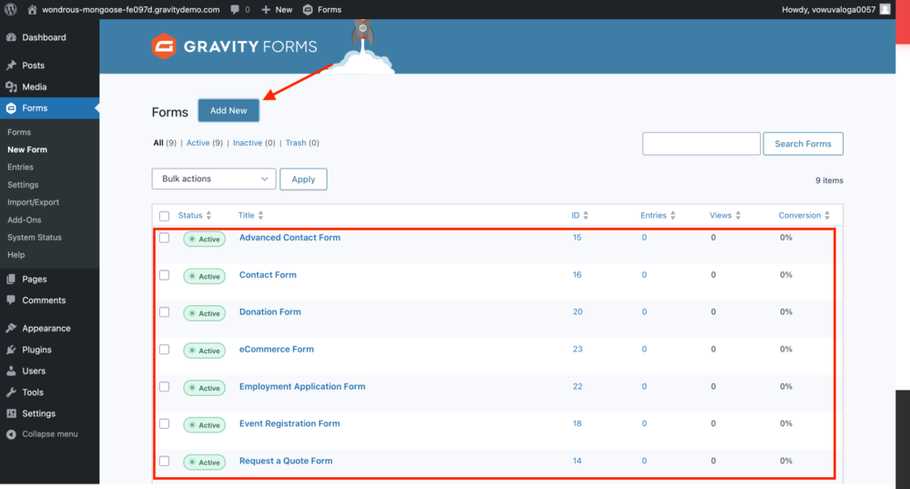
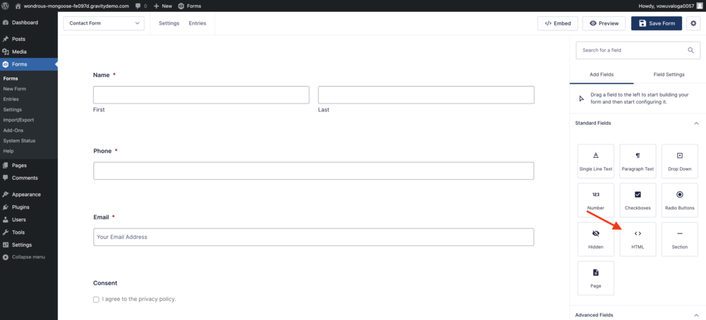
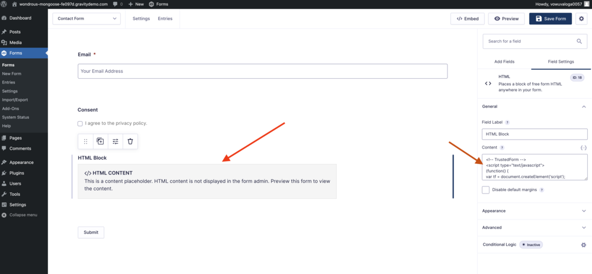
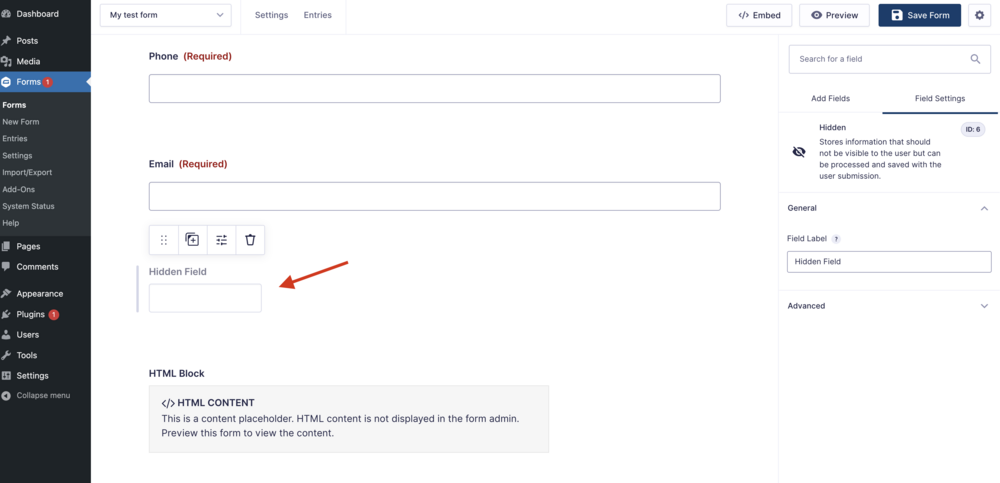
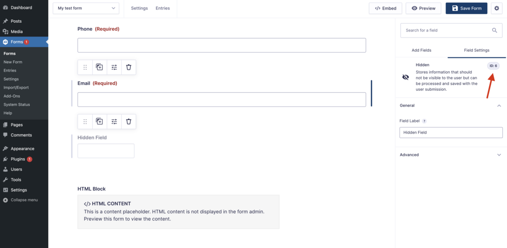
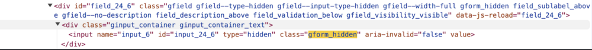
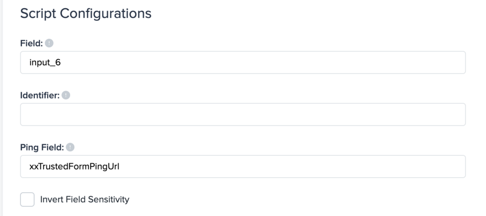

[_Christopher Williams_](https://community.activeprospect.com/memberships/7846678-christopher-williams)

Updated August 23, 2024. Published July 14, 2021.

Details

# Implementing TrustedForm on WordPress with Gravity Forms

How to add TrustedForm to a WordPress site using a single-page GravityForms form.

To implement the TrustedForm script and begin submitting TrustedForm Certificate URLs with GravityForms leads, follow the steps below.

Open WordPress, and navigate to GravityForms, and here either create a form( 'Add New' ) or open an existing form. In the example below, we're using a contact form.

**Adding the TrustedForm Script to your GravityForms Page**

Now in the GravityForms editor, let’s add The TrustedForm script to our form page.

From the right side bar, under 'Add Fields' > 'Standard fields' look for an '<> HTML' field.

Now click and drag an “HTML” block onto the page and make sure to add it just before the submit button. Click on the HTML Content block, then on the right side bar expand the “General”  section so you can see the “Content” block.

You’re now going to paste the TrustedForm script into the Content block and update the form to save your changes.

**To get the TrustedForm script:**

- Log into your Trusted Form ActiveProspect account, then navigate to the Certify tab.
- Here you will find the TrustedForm script under 'Javascript Snippet (Web SDK)', copy this script.

# That's it! Now you should be able to preview and test the form, and certificates should be created successfully.

# Checking Whether the Script Is Working

You can check a loaded form page for the presence of a populated hidden field named ""xxTrustedFormCertUrl\_0"" in the browser's page DOM by using the browser's ""inspect"" feature. Look for the hidden field (xxTrustedFormCertUrl) in the inspect tool, which is where you'll find the certificate URL.

If you’ve done everything right, you’ll see an “https:// cert.trustedform.com…” url as the hidden field’s value.

**How to adjust the SDK to insert the Certificate URL into your Gravity Forms hidden field**

**Step 1:**Insert a hidden field into your form within GravityForms.

**Step 2:** Save the form, and then note the ID assigned to your hidden field by checking the hidden field settings in the top-right corner. In our example, the ID is 6. This ID is used to name the hidden field, and it will typically be formatted as **input\_ID**, so in this case, it will be **input\_6**.

You can also obtain this information by following these steps:

- Visit your website and open the page you want to inspect using your browser's developer tools.
- Locate the hidden field in your form, which should have a class of ""gform\_hidden"".
- Take note of the input name assigned by Gravity Forms (e.g., **input\_6**)

**Step 3:** Go to the [certify tab](https://app.trustedform.com/certificates/issue) of your TrustedForm account to edit the field names used in the Javascript Snippet (SDK). Navigate to the Script Configurations section, then update the ""Field"" blank to match the input name assigned to your hidden field by Gravity Forms. As you update the 'Field', the Javascript Snippet below gets updated too.

**Step 4:** Now copy the modified Javascript Snippet (SDK) and insert it into your Gravity Forms, in the same place you added the SDK previously.

After this, the TrustedForm Certificate should be inserted into the hidden field you created.

Type something
