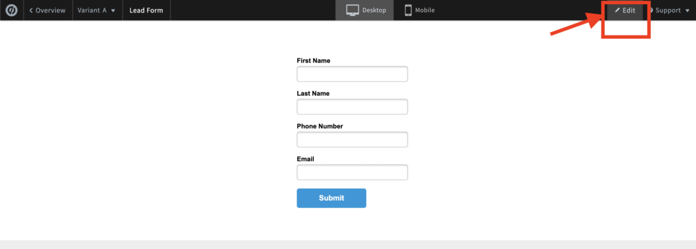
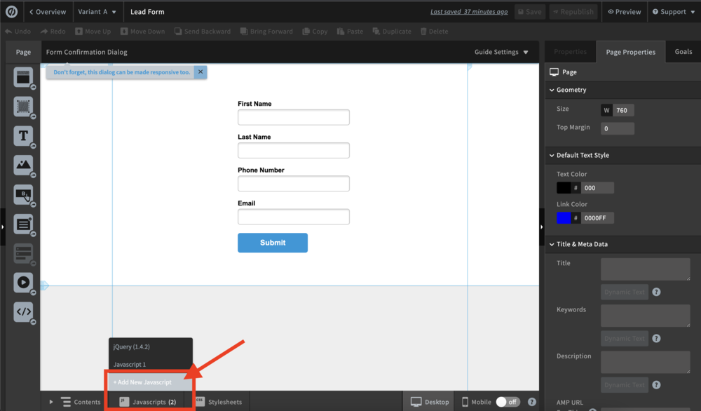
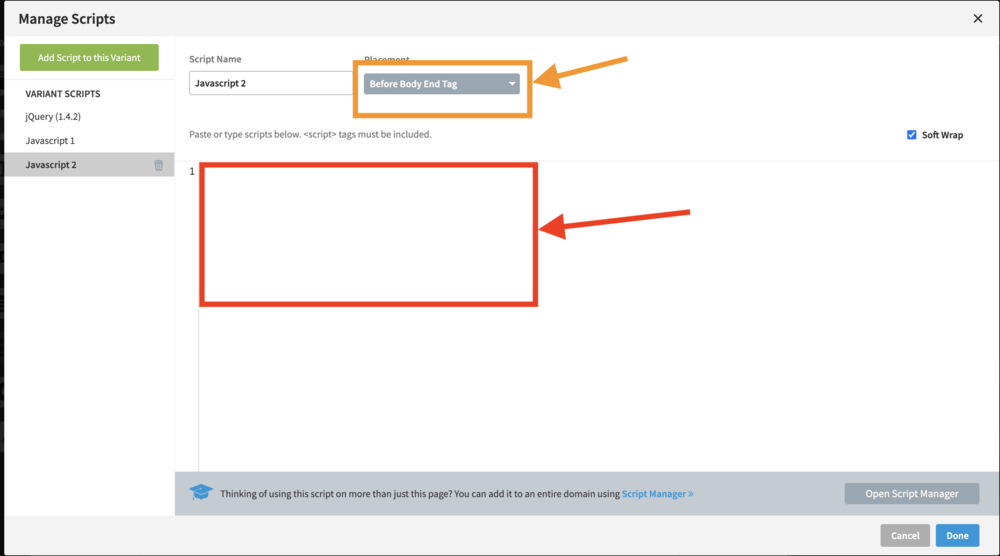
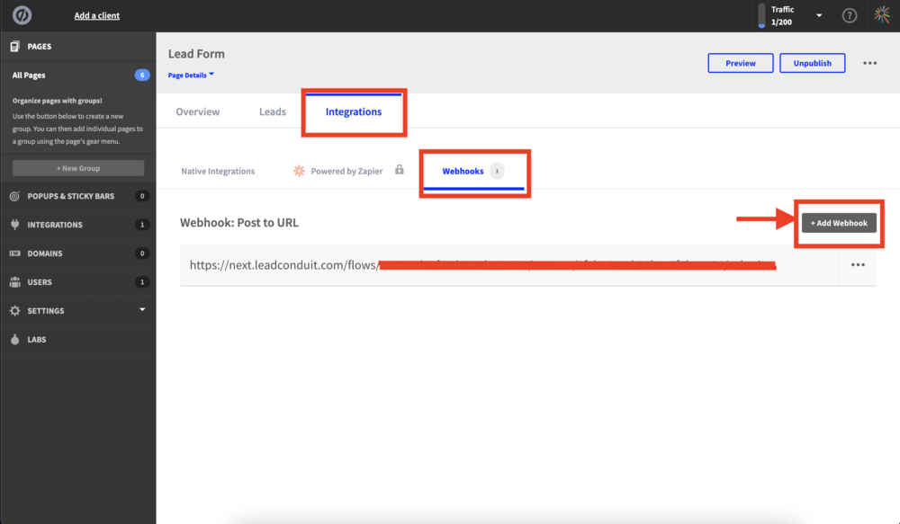

22.

Details

# Implementing TrustedForm on Your Unbounce Page

How to add TrustedForm to an Unbounce form.

Begin by logging into your Unbounce account. Select the page you want to use with TrustedForm:

Then click ""edit"":

Click ""Add New Javascript"":

This is where you paste the TrustedForm script. _N_ _ote that it is best to leave the default of ""Before body end tag"" for placement._

To submit from this page directly to LeadConduit, go back to the Unbounce page's overview and add a webhook integration, using the submit link from your LeadConduit submission docs.

Type something
