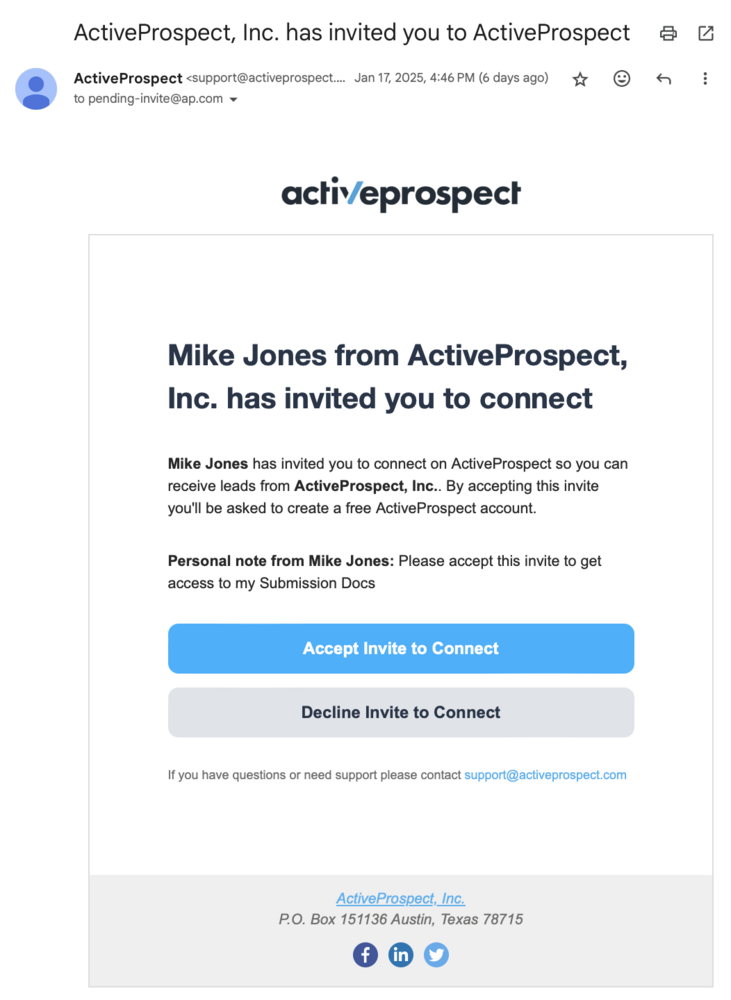
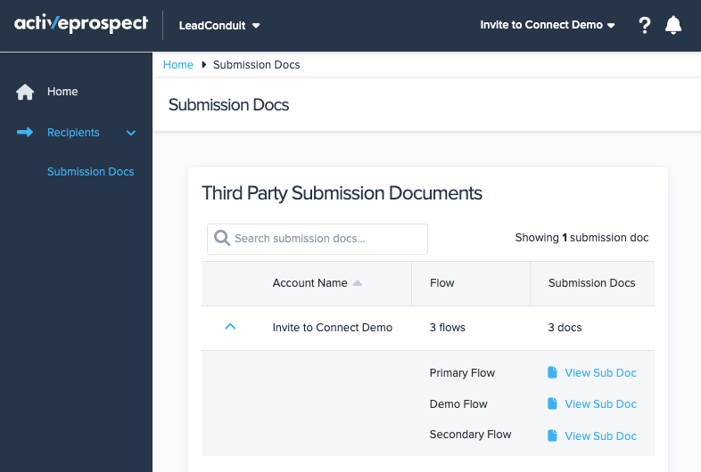

[_Leandro Estrella_](https://community.activeprospect.com/memberships/7866389-leandro-estrella)

Updated February 3, 2025. Published February 3, 2025.

Details

# Invite to Connect for Sellers

## Why should I use this?

Some of the values you get as a Seller from being invited by your lead buyer with this new feature are:

- Streamline your communication - automatically get Submission Docs from your partner.
- Connect with your partners on ActiveProspect, and formalize your working relationship by getting all your buyers listed in a single place.
- You get access to a free _LeadConduit for Partners_ account

## How does it work?

Once you have received an invitation to connect from your lead Buyer, like the one below, consolidating the connection with your partner can be achieved in a few steps; these steps will vary depending on whether you already have an ActiveProspect account.

#### I am not connected with my lead buyer, and I don't have an ActiveProspect Account

If you don’t have access to an ActiveProspect account, don’t worry. The invite sent to you by your lead buyer will provide you with a free _LeadConduit for Partners_ subscription.

After following the sign-up steps to create an ActiveProspect account, you’ll be automatically redirected to LeadConduit, allowing you to easily access the [Submission Docs](https://app.leadconduit.com/submissiondocs) for any current or future Flows in which your partners might include you as a Source.

#### I am already connected with my lead buyer within ActiveProspect, but I don’t have access to LeadConduit

It might happen that you already have an ActiveProspect account that only has access to TrustedForm; if you accept the invitation with that account, you will automatically be assigned a free _LeadConduit for Partners_ subscription.

After accepting the invite, you can access LeadConduit, which will allow you to easily access the [Submission Docs](https://app.leadconduit.com/submissiondocs) for any current or future Flows, in which your partners might include you as a Source.

#### I am not connected with my lead buyer, but I have an ActiveProspect account with access to LeadConduit

If you accept the invitation with an account with access to LeadConduit, you’ll immediately get access to the [Submission Docs](https://app.leadconduit.com/submissiondocs) for any current or future Flows, in which your lead buyer might include you as a Source.

#### I am already connected with my lead buyer, and I have access to LeadConduit

If you are already connected to your lead buyer, from the [Submission Docs](https://app.leadconduit.com/submissiondocs) section, you’ll immediately get access to any current or future Flows in which your partner might include you as a Source.

## FAQ

1. **Are there any requirements for using Invite to Connect as a lead Seller?**

The only requirement you’ll have as a lead Seller is an ActiveProspect account with a LeadConduit subscription; if you don’t have one, you’ll be able to create it for free from your lead Buyer’s invite.

2. **How does this work for the Buyer?**

See [THIS](https://community.activeprospect.com/series/5554657/posts/5549918) article for details on how Invite to Connect works for lead buyers.

3. **What happens if the seller declines the invitation?**

If the invitee declines the invitation, they will be removed from the buyer pending connections and sources; if the invitation was mistakenly declined, the buyer should go through the invitation process again.

4. **Why is ActiveProspect implementing this?**

Our customers have worked together on LeadConduit (and LeadConduit Classic) for over a decade, but we have never formalized that.

Invite to Connect formalizes that relationship via a connection. This connection will provide value to both users across all ActiveProspect products (not just LeadConduit).

These connections will also be foundational for building a platform where buyers and sellers can easily find one another.

5. **Would this new feature affect how I connect with Standard and Custom Sources?**

Invite to Connect won't impact the process you were using to add Sources like Facebook Lead Ads or from your owned and operated web pages into your Flows; instead, it will offer you a new type of Source connection best suited for Sources like _HomeAdvisor_ or _LendingTree_.

6. **What happens if I receive an invitation but don’t have an ActiveProspect account?**

When you accept the invitation, you’ll be able to create a new ActiveProspect account, which will give you access to a free _LeadConduit for Partners_ subscription.

7. **What happens if I receive an invitation and I don’t have access to LeadConduit in my ActiveProspect account?**

It might happen that you already have an ActiveProspect account that only has access to TrustedForm; if you accept the invitation with that account, you will automatically be assigned a free _LeadConduit for Partners_ subscription.

8. **What happens if I accept the invitation and have access to LeadConduit in my ActiveProspect account?**

If you accept the invitation with an account that previously had access to LeadConduit, the Buyer’s Submission Docs will be automatically assigned to your account.

Then, they can add you as an Account Source to any Flow they might have, and you will get them automatically listed in the [Submission Docs](https://app.leadconduit.com/submissiondocs) section of your account.

Type something
