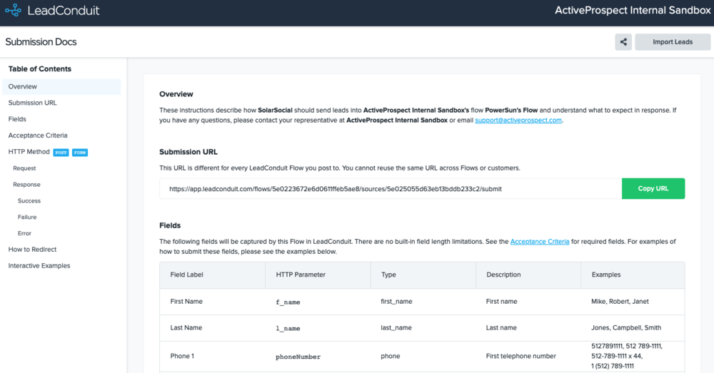
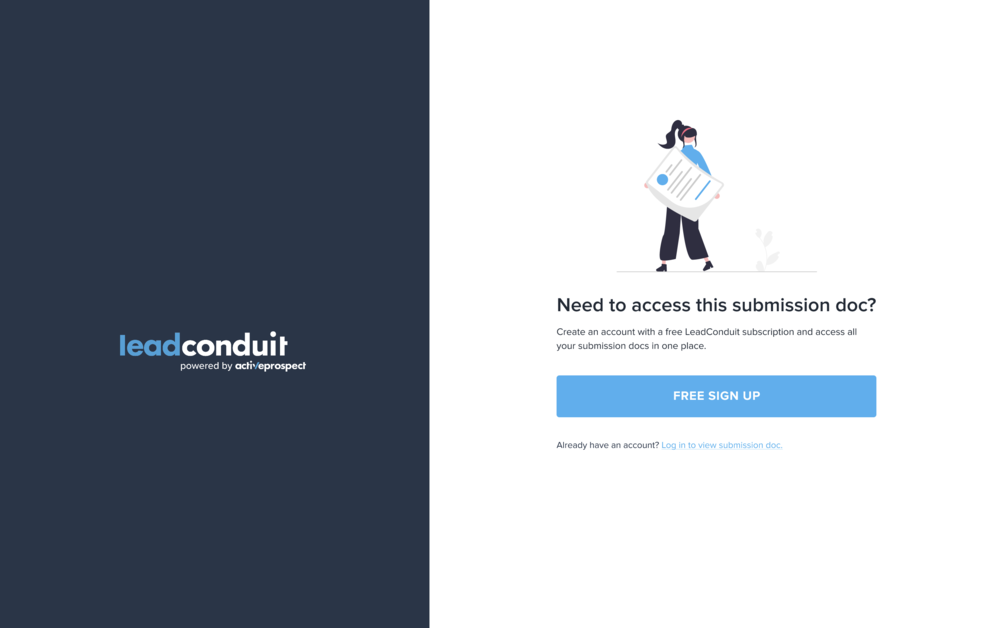
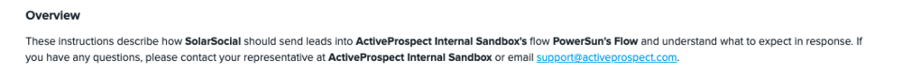
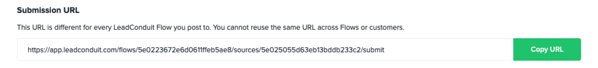
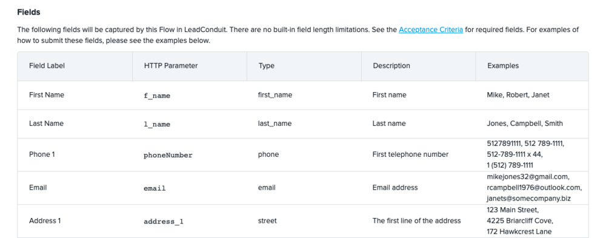
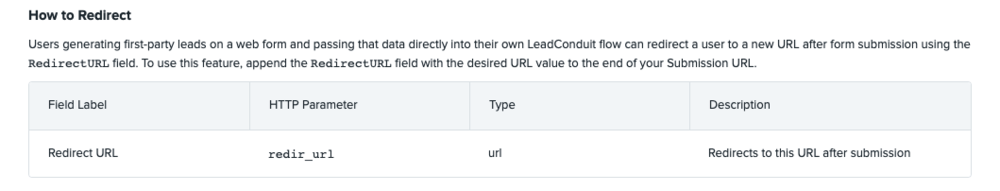

[_Scott McKee_](https://community.activeprospect.com/memberships/7557680-scott-mckee)

Updated February 13, 2024. Published June 27, 2022.

Details

# LeadConduit 101: Submission Instructions

# Overview

LeadConduit automatically generates instructions for sending lead data for each source in a flow. The instructions are called Submission Instructions and they are unique to each source. Submission Instructions  provide details on where to send the information (a Posting URL) and a list of fields the flow will accept. It also provides some insight into what kind of leads the flow will and won’t accept, as well as an interactive example.

# Submission Docs Access

If this is your first time opening a third party partners Submission Docs, you will be prompted to either log in or create a free account. Upon login or account creation, you will be redirected to your Submission Docs.

# Submission Instructions Sections

At the top right of the page is a ""share"" button and an ""Import Leads"" button for the leads provider to get started. Before they do that, though, they should review the individual sections on this page, as there is important information about what is accepted, how it is accepted, etc. These sections are hyperlinked on the left under ""Table of Contents"", so clicking on a section header will jump them directly to that section.

**Overview:** Explains how to use the Submission Doc and who to contact if there are issues.

**Submission URL:** Provides the URL for that customer's specific LeadConduit flow.

**Fields:** Provides a list of fields that can be submitted along with examples.

**Acceptance Criteria:** Explains what criteria is needed for the lead submission to be considered a success. If the criteria isn't met, the lead will be returned as a failure.

**HTTP Method:** Provides instructions on how to submit the leads, such as with GET or POST (recommended), using JSON or XML, etc., as well as what types of responses to expect (success, failure, or error) and in what format they will be provided. Selecting the Method in the dropdown will change the examples shown below.

2021-02-25\_14-07-46 - TechSmith Screencast

[Video](images/video-1.mp4)

Your browser cannot play this video.

An annotation is now visible

0:00 / 0:00

[Acknowledgements](https://www.techsmith.com/redirect.asp?target=SmartPlayerAcknowledgementLink&ver=1.0.0&lang=enu&os=na&product=smartplayer)

Player Settings

Closed Captions

Playback Speed2.01.751.51.25normal0.750.50.25

[Acknowledgements](https://www.techsmith.com/redirect.asp?target=SmartPlayerAcknowledgementLink&ver=1.0.0&lang=enu&os=na&product=smartplayer)

**How to Redirect:** Provides a redirect URL when customers are generating first party leads on a webform and want the user to be sent to a specific web page after submitting the form.

**Interactive Examples:** Allows the user to select their HTTP method from the dropdown, select test data on the left side, and click the ""Continue"" button at the bottom. This will generate an example request and response in the selected HTTP method format on the right side.

2021-02-25\_14-21-31 - TechSmith Screencast

Type something
