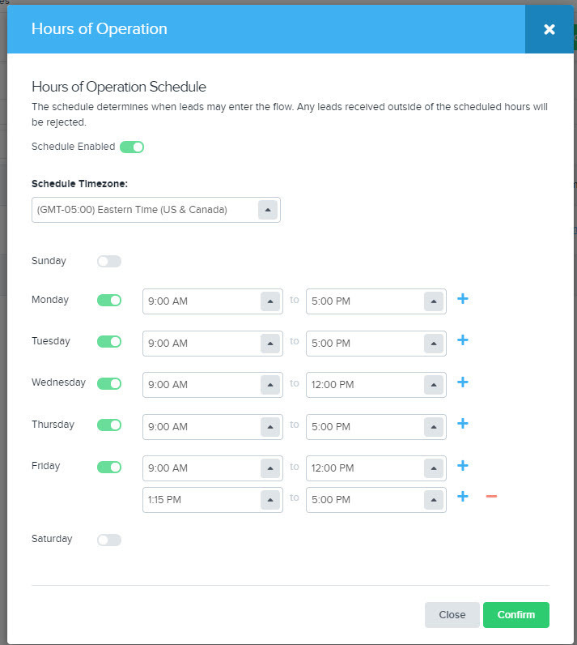

[_Scott McKee_](https://community.activeprospect.com/memberships/7557680-scott-mckee)

Updated March 11, 2022. Published January 11, 2022.

Details

# LeadConduit Hours of Operation

In LeadConduit you can use a weekly schedule to accept leads during your hours of operation.

It is very easy to make your flow accept leads only during your hours of operation schedule. Once the schedule is configured and enabled, the Submission document will display your schedule for vendors.  Leads sent outside of your hours will be failed with an explanation about your hours of operation.  For even more ways to create time-based criteria such as for a specific delivery steps, or source, see [Dayparting](https://community.activeprospect.com/posts/4540073-leadconduit-day-parting?video_markers=day%2Cdays).

#### How to create a schedule

1. Open your flow for editing
2. Locate the calendar icon near the top of the page.  If you do not have a schedule enabled currently this icon will appear greyed out.
4. Important - Click the toggle next to **Schedule Enabled**.  It will take effect after you save the flow.
5. Select the time zone appropriate for your schedule.  It will default to your account's timezone setting.
6. Click the toggle next the individual days that should be enabled or disabled for your schedule.
7. Select the start and end time for your operation schedule for that day.  If you are open the whole day, choose 24hrs
8. Click the plus icon to add additional open periods for that day.  If you close for lunch, you would setup a morning period and an afternoon period.
9. Click Save to store this schedule and close the menu, you also need to Save your flow in general to keep these changes.



#### What happens when a vendor pings or submits leads outside of my hours of operation schedule?

LeadConduit will respond to pings with a failure like this:

Collapse

{
""outcome"": ""failure"",
""reason"": ""Submission Timestamp must be within hours of operation"",
""price"": 0
}

LeadConduit will respond to lead submissions with a failure like this:

Collapse

{
""outcome"": ""failure"",
""reason"": ""Submission Timestamp must be within hours of operation"",
""lead"": {
""id"": ""622b62959de60206e36f0af5""
},
""price"": 0
}

```

```

Type something
