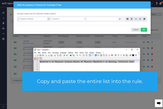

[_Scott McKee_](https://community.activeprospect.com/memberships/7557680-scott-mckee)

Updated May 10, 2023. Published January 19, 2022.

Details

# LeadConduit Pro Tip: An Easier Way to Work With Lists of Values in Rules

The LeadConduit UI lets you add or delete items to an “is included in” or “is not included in” rule’s RHV one at a time. This can be tedious when your list has more than a few items.

But here’s a handy short cut.

You can enter a comma-separated list into the RHV quickly by starting out your rule with the “is equal to” operator.

Next, enter your list of right-hand values as a comma-separated string. Don’t leave spaces before or after the commas, but if a single value contains a comma, enclose only that value in quotes.

Then simply change the rule operator to “is included in” or “is not included in” as desired. This works in reverse, too. You can revert from “is included in” to “is equal to” and back again is you need to edit or replace your list.

Collapse

00:00

01:04

#### Adding\_List\_Items\_to\_a\_LeadConduit\_Rule.mp4

Type something
