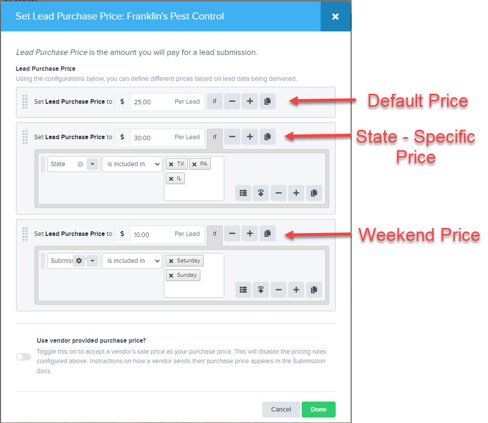
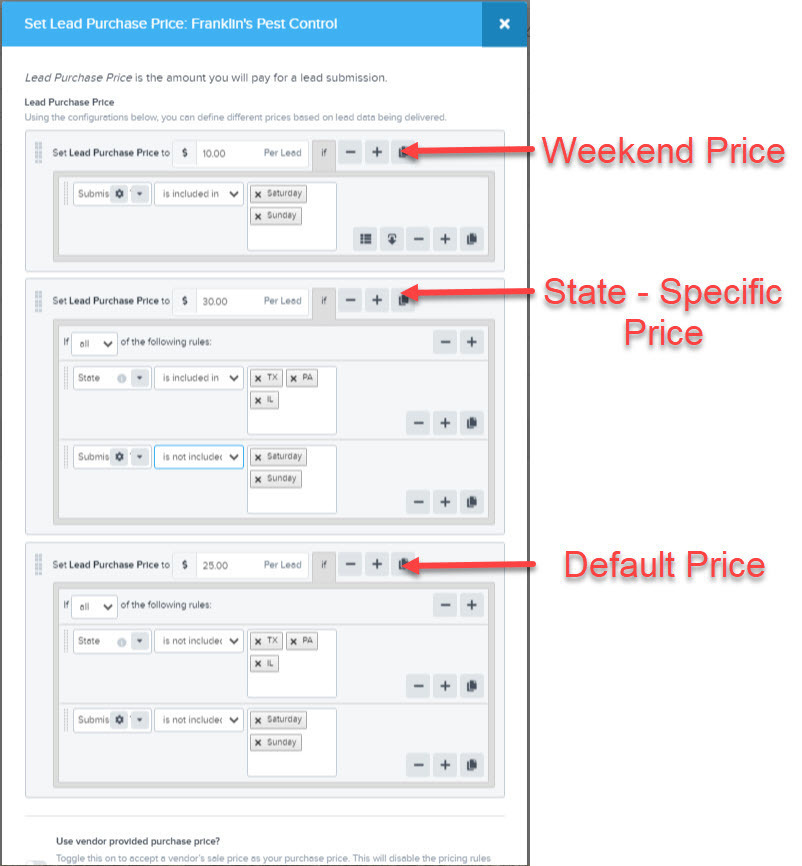

[_Scott McKee_](https://community.activeprospect.com/memberships/7557680-scott-mckee)

Updated January 19, 2022. Published January 19, 2022.

Details

# LeadConduit Pro Tip: Optimize the Sequence Order of Alternative Prices, Volume Caps, and Mappings

Sequence order matters when you're creating rules that choose between between multiple prices, volume caps, or mappings. You'll save setup time and your flow will be easier to understand if you put the options with the least-restrictive rules at the top and work down to those with the most restrictive rules at the bottom.

Here’s an example using Source price. We put the default price, with no rules, at the top. Next is a price rule that applies to leads from certain states, and below that is the price for leads received over the weekend.

Here’s how it might look if we hadn’t paid attention to the sequence. Note that this requires more rules, which wastes time and is confusing to read.

Type something
