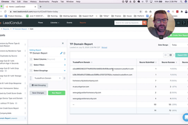
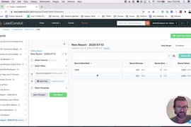
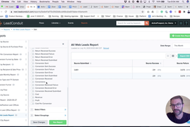

[_Scott McKee_](https://community.activeprospect.com/memberships/7557680-scott-mckee)

Updated February 17, 2021. Published February 17, 2021.

Details

# LeadConduit Reporting Examples

How to create some commonly-used custom reports

# Build a TrustedForm Domain Report

Expand

#### Build\_a\_TrustedForm\_Domain\_Report.mp4

# Create and Share a Basic Vendor Report

Expand

#### Create\_and\_Share\_a\_Basic\_Vendor\_Report.mp4

# Create a Vendor Conversion Report

Expand

#### Create\_and\_Share\_a\_Conversion\_Report\_for\_a\_Vendor.mp4

Type something
