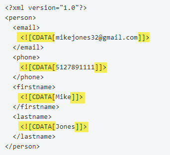

.

Details

# Mapping Values to a Custom XML Outbound Integration

When mapping values and fields in a custom XML outbound integration, use ""dot notation"" to define where each value being mapped should be placed in the request body.

(This article assumes that you understand the basics of how XML documents are structured. There are numerous resources and tutorials online that cover the basics of XML data structures.)

XML documents consist of hierarchically organized sets of tagged values. Use dot notation to map the structural path to each value you need to send to the recipient of your LeadConduit flow's Custom XML outbound step.

It's probably easiest to see how dot notation works by looking at an example. Here's a typical XML request body:

|     |     |
| --- | --- |
|  | <?xml version=""1.0"" encoding=""UTF-8""?> |
|  | <root> |
|  | <lead> |
|  | <Acode>D80731</Acode> |
|  | <FirstName>\*\*first\_name\*\*</FirstName> |
|  | <LastName>\*\*last\_name\*\*</LastName> |
|  | <HSGraduationYear>\*\* graduation\_year \*\*</HSGraduationYear> |
|  | </lead> |
|  | <phones> |
|  | <PhoneNumber>\*\*phone\_1\*\*</PhoneNumber> |
|  | <PhoneType>3</PhoneType> |
|  | </phones> |
|  | <phones> |
|  | <PhoneNumber>\*\*phone\_2\*\*</PhoneNumber> |
|  | <PhoneType>1</PhoneType> |
|  | </phones> |
|  | <leadEmail>\*\*email\*\*</leadEmail> |
|  | <address> |
|  | <Line1>\*\*address\_1\*\*</Line1> |
|  | <City>\*\*city\*\*</City> |
|  | <State>\*\*state\*\*</State> |
|  | <Country>US</Country> |
|  | <Zip>\*\*postal\_code\*\*</Zip> |
|  | </address> |
|  | <passcode>cjdujwofpf</passcode> |
|  | <programTypeCode>\*\*program\_of\_interest\*\*</programTypeCode> |
|  | </root> |

[view raw](https://gist.github.com/activeprospect-support/00026880a526fa72b34b6b55fe981474/raw/79c44aed4e6f0ee4fb5b7f8a8361b75ba8606a77/xml-request-body.sh)  \|  [xml-request-body.sh](https://gist.github.com/activeprospect-support/00026880a526fa72b34b6b55fe981474#file-xml-request-body-sh) hosted with ❤ by [GitHub](https://github.com/)

Note that it consists of a root object <root>...</root> that is a wrapper for several child XML objects (<lead>, <phones>, <leadEmail>, <address>, <passcode>, and <programTypeCode>) each of which may wrap a simple value (as do <leadEmail>, <passcode>, <programTypeCode>), or child objects (as do <lead> and <address>) or an array of child objects (as does <phones>).

To map a value to a simple object like <leadEmail>, set the recipient field type to ""Xml Path"", and map the path by simply linking the names of each wrapping object with a dot, beginning with the outermost and working inward: root.leadEmail or, for FirstName: root.lead.FirstName

When there are multiple instances of same-named objects inside the same wrappers, such as <phones> of which there are two distinct but similar instances, each of which has as its value an set of one or more child objects (<PhoneNumber> and <PhoneType>), treat the <phones> objects as an array of complex objects. Represent each by a numeric subscript that relates the components of each instance. For instance, to map phone\_1, the path for that object's phoneNumber would be root.phones.0.PhoneNumber and the path for that object's phoneType would be root.phones.0.PhoneType. Similarly, for phone\_2 the paths would be root.phones.1.PhoneNumber and root.phones.1.PhoneType. Subscripts must be assigned sequentially beginning with zero.

Here is an example of what the mappings for the above XML request body would look like in LeadConduit:

XML attributes are mapped using an ""@"" before the attribute name. Here's what the <phones> objects above would look like if the PhoneType was an attribute instead of a child object.

|     |     |
| --- | --- |
|  | <phones> |
|  | <PhoneNumber PhoneType=""3"">\*\*phone\_1\*\*</PhoneNumber> |
|  | </phones> |
|  | <phones> |
|  | <PhoneNumber PhoneType=""1"">\*\*phone\_2\*\*</PhoneNumber |
|  | </phones> |

[view raw](https://gist.github.com/activeprospect-support/34f90a4c621db8b9c77cea82e329f9ed/raw/51e3de5d23a632b1f422b8d072639192d8b62047/xml_with_attributes.sh)  \|  [xml\_with\_attributes.sh](https://gist.github.com/activeprospect-support/34f90a4c621db8b9c77cea82e329f9ed#file-xml_with_attributes-sh) hosted with ❤ by [GitHub](https://github.com/)

And here is how that section would be mapped:

What if you need to send an an array of same-named XML properties that are distinguished by their attributes? For example:

### Simply add **.\#text** onto the end of the value mapping.  Add a period after the array number in the attribute mapping. So here is how the above sample XML request  would be mapped:

### Wrapping XML data in <!\[CDATA \]\]> Tags

<!\[CDATA\[  \]\]> tags are supported by putting #cdata at the end of the mapping's XMLpath.

For example, These mappings produce a plain XML request body:

Adding #cdata to the mapping wraps the data in <!\[CDATA\[  \]\]> tags:

Type something
