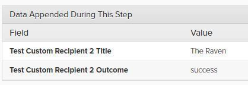

[_Scott McKee_](https://community.activeprospect.com/memberships/7557680-scott-mckee)

Updated February 2, 2021. Published November 4, 2020.

Details

# Parsing HTML and Plain Text Response Bodies Using ""Capture""

In recipient steps with well-formatted XML or Json response bodies, LeadConduit automatically captures the values of properties or tags as ""appended data"", but what if the response body is not well-formatted Json or XML?

For plain text or HTML responses (but _not_ XML or JSON), string values can be extracted into appended data by mapping regular expressions to ""capture"" variables.

For example, with a response like:

and this mapping in the outbound step:

The value from the regular expression's match group will be appended to the lead data:

**Note**: The formulation of expression can be tricky, especially for long or multi-line responses. Mapped regular expression values are lowercased, so take that into consideration, or use syntax like `/.../i`.

Line-separators in the response may not match anchors ( `^` & `$`) as expected, so the ""multiline"" modifier may be needed ( `/.../m`).

Another example, which will result in `title` being set with ""The Raven"":

Response:

Mapping:

Result:

**Mapping captured parameters into rules or outbound steps.**

Parameters that have been appended using ""Capture"" don't show up in the field dropdown as do other appended parameters. Here's how to map them:

Collapse

00:00

00:58

Mapping ""Capture"" Parameters

#### Mapping ""Capture"" Parameters

Type something
