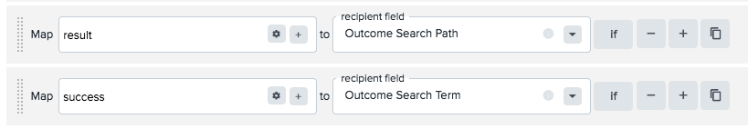
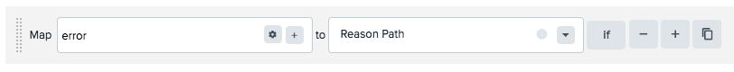
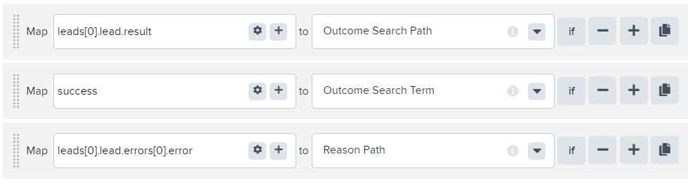
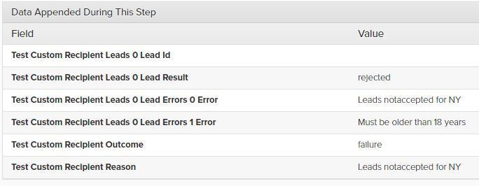
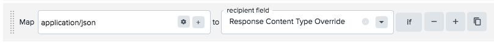

[_Scott McKee_](https://community.activeprospect.com/memberships/7557680-scott-mckee)

Updated December 23, 2021. Published November 4, 2020.

Details

# Parsing Json Response Bodies Using Dot Notation

Json is a hierarchically structured, human-readable format for representing data. It is not within the scope of this article to teach Json. To learn more, see [this tutorial](https://www.tutorialspoint.com/json/index.htm).

Dot Notation is a shorthand technique for drilling into a json object to extract the contents of a particular parameter. Beginning with the outermost (root) level of the json object, drill down into it by specifying the names of ever-deeper parameters, delimiting between each with a dot, until you reach the one you need to extract.

For example, if the response body for an accepted lead looks like:

```
{""result"":""success"",""error"":""""}
```

then these mappings would identify the lead as accepted:



If a rejected lead's response body looks like:

```
{""result"":""rejected"", ""error"":""Quota filled for red cars""}
```

then this mapping would extract ""Quota filled for red cars"" as the rejection reason:



If a parameter's value is an array (surrounded by square brackets \[ \] ) rather than a simple value or another json object (curly brackets { } ) use an integer enclosed in square brackets to identify which element of the array to select for that level of the traverse.

Before we move on, let's look at a more complex set of response bodies.

If the response body for an accepted lead looks like:

```
{
  ""leads"": [{\
    ""lead"": {\
    ""id"": ""12345678"",\
    ""result"": ""success"",\
    ""errors"": []\
    }\
   }\
  ]
}
```

and a rejection response body looks like:

```
{
  ""leads"": [{\
      ""lead"": {\
        ""id"": """",\
        ""result"": ""rejected"",\
        ""errors"": [{\
            ""error"": ""Leads not accepted for NY""\
          }, {\
            ""error"": ""Must be older than 18 years""\
          }\
        ]\
      }\
    }\
  ]
}
```

then these would be the appropriate response mappings:



For a rejected lead the event would show these results:



Note that although there is an array containing more than one rejection reason, we must select just one of them (usually the first one, index 0) to be mapped as the reason path. However, LeadConduit also automatically captures all of the reasons as appended data.

# Response Content-Type Override

If you find that properly-configured parsing is not working, the response's ""Content-Type"" header, which tells LeadConduit what format the response is supposed to be in, may not have been set correctly by the recipient system. You can override the actual header and force LeadConduit to parse the response as a different type by setting the desired Content-Type in the Response Content Type Override mapping:



Some common Json Content-Types are:

- application/json
- text/json

For an online dot-notation expression tester, [click here](https://jsonpath.curiousconcept.com/).

For a brief tutorial about dot notation [click here](https://idratherbewriting.com/learnapidoc/docapis_diving_into_dot_notation.html).


Type something
