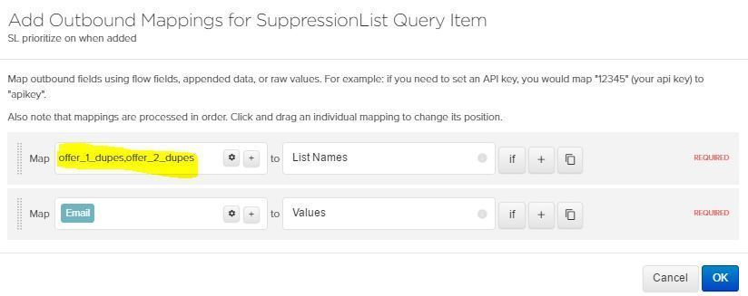

[_Scott McKee_](https://community.activeprospect.com/memberships/7557680-scott-mckee)

Updated December 15, 2020. Published December 15, 2020.

Details

# Querying Multiple Lists for One Value Simultaneously in SuppressionList

A SuppressionList Query step may look for a single value in multiple lists with just one query step.

The simplest use case for this feature would be if distinct lists are maintained for de-duping of different offers, but you want to filter for duplicate leads across multiple offers.

# Mapping The Query

Assume that offer 1 maintains a duplicate-checking list named ""offer\_1\_dupes"" and offer two maintains a separate list named ""offer\_2\_dupes"". You'd check in both of those lists by mapping both List Names into the query step, separated by a comma:

# Using the Results: Simple Duplicate Checking

If you don't care which list might contain the query Value, your related filters or rules could be based on the ""SuppressionList Query Item Found"" appended datum. This will be true if the query value is found in at least one of the lists:

# Using The Results: Identifying Which List(s) Contain the Query Value

Sometimes it may be important to know if the query value was found in a particular list or more than one list. That's where the ""SuppressionList Query Item Found In"" array comes into play. This is an array that contains elements containing the List Name of each list where the query value was found. For example, if as above you're querying two lists, there may be zero, one or two ""SuppressionList Query Item Found In"" appended data; Zero if not found, one if found in one of the lists, and two if found in both of the lists.

Here is a filter that will trigger if the query value was found in the ""offer\_1\_dupes"" list:

and this filter triggers only if the query value is found in both lists:

**Note:** You cannot query multiple values at once.

Type something
