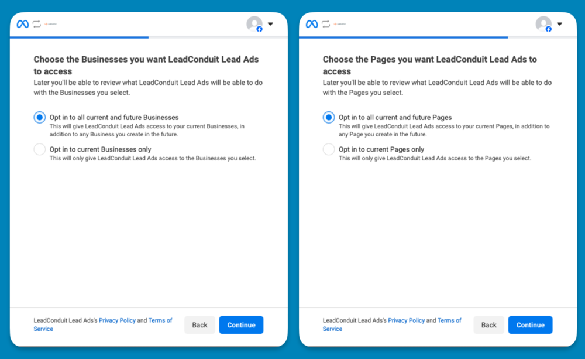

2024.

Details

# Required Permissions to Integrate Facebook Lead Ads with LeadConduit

The LeadConduit Facebook Ads Routed Inbound integration gives Facebook page owners control over which LeadConduit flows receive leads in real-time.

To connect a Facebook Lead Ads with LeadConduit, all permissions listed in the Business Integrations section under Settings on **your personal Facebook page** are required. For pages that are connected to a Meta Business, you will need to also **be connected to the business and have a role configured**, as well as approve LeadConduit’s access to the Business when the permissions are requested.

When connecting your Facebook account to LeadConduit for the first time, you will be prompted to grant LeadConduit all of these required permissions. The prompts will appear as below:

We recommend you opt in all current and future Pages and Businesses, as this will help mitigate future permissions issues.

To view a full list of permissions, reference our detailed guide on [Setting Up Facebook Lead Ads](https://community.activeprospect.com/posts/4062063-setting-up-facebook-lead-ads).

#### Need More Help?

Should you encounter any issues when connecting your Pages/Business, we recommend trying an incognito window or following our [troubleshooting steps](https://community.activeprospect.com/posts/4164984-facebook-lead-ads-troubleshooting-try-this-first).

If you find yourself confused about the integration or simply need help navigating through it, please send an email to [support@activeprospect.com](mailto:support@activeprospect.com) and we will be happy to help you!

Type something
