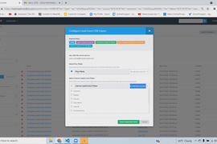

[_Arthur Holmes_](https://community.activeprospect.com/memberships/7557564-arthur-holmes)

Updated October 8, 2021. Published October 8, 2021.

Details

# Resubmitting Failed Leads

In this video we take a look at how to resubmit failed leads.

TIP: See our post "" [Discovering Reasons for Failed Leads](https://community.activeprospect.com/posts/4195562-discovering-reasons-for-failed-leads)"" to learn more about failed leads and how they occur.

Collapse

00:00

07:32

#### Resubmitting\_Leads.wmv

Type something
