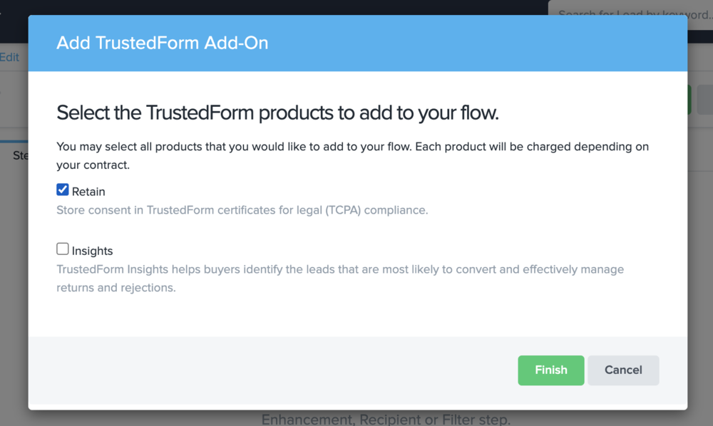

[_Ashley Thomas_](https://community.activeprospect.com/memberships/7557566-ashley-thomas)

Updated June 20, 2023. Published December 3, 2020.

Details

# Retaining TrustedForm Certificates in LeadConduit

ActiveProspect account holders with TrustedForm and LeadConduit subscriptions can easily retain TrustedForm certificates by adding a TrustedForm Add-on step to their flow.

If the TrustedForm step is successful (or even if it's a failure based on Page Scan requirements), we'll store your certificate for the amount of time you've specified in your account (5 years is the default). If the TrustedForm step produces an error, the certificate may have passed the retention period, the certificate URL may be invalid or missing, or the retain process may have encountered an error.

# Before We Begin

This article assumes you're able to post the TrustedForm certificate URL to your LeadConduit flow correctly. If you need a refresher, please see the Submission Docs located on the Source tab.

# Steps

**Step 1**: On the ""Flow Steps"" page in the flow editor, go to **Add Step** and select **Add-on**.

**Step 2**: Select the TrustedForm Add-on by clicking the **Add To Flow** button.

**Step 3:** Select Retain and click Finish.

**Step 4**: Decide where the TrustedForm step should occur in your flow and move the step to that location. Typically you'd want to retain/claim the certificate on leads that have passed other validations, such as duplicate-checking and phone validation.

To simply retain a certificate for your account, the step is ready to go. No mappings are necessary. The TrustedForm step will automatically look for and use the TrustedForm Cert Url field to retain/claim the certificate.

**NOTE:** The configuration of an Optional Filter step depends on how you choose to use TrustedForm.

# Filtering Examples

When the TrustedForm outcome is not a success (errors, skips, failures), you could to add a filter after the TrustedForm step to stop the flow and return a **Failure** response for the lead. Otherwise, LeadConduit will respond with a **Success** outcome, even though the TrustedForm certificate was not retained.

Another popular filtering example is:

- Fail a lead only when the TrustedForm step returns a **Error**, allowing TrustedForm Failures (and Skips) to pass through the flow.

Type something
