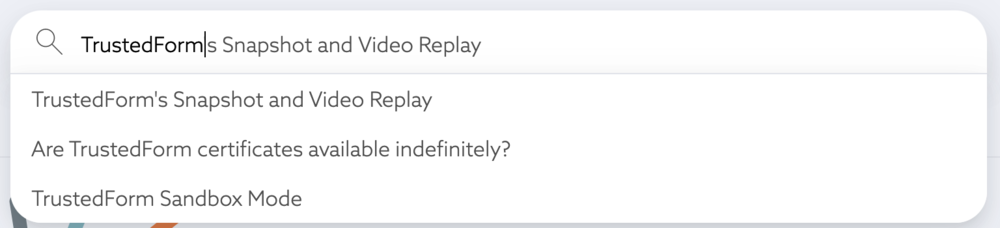
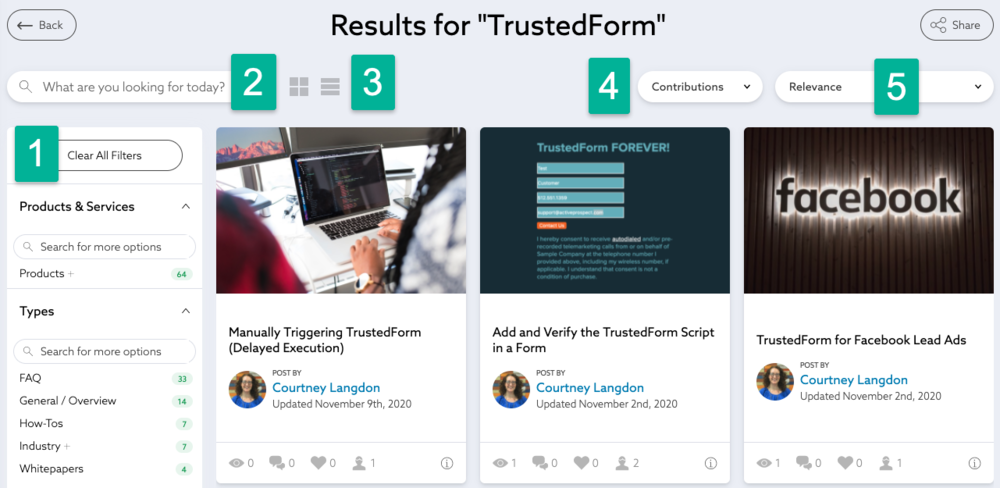

[_Kami Berge_](https://community.activeprospect.com/memberships/8005854-kami-berge)

Updated February 24, 2025. Published October 26, 2020.

Details

# Searching the ActiveProspect Knowledge Base

The community search engine is a powerful tool for finding information.

# Access the search functionality from any page in the knowledge base

On the homepage, the search bar is located at the very top of the page.

If you scroll down the homepage, or if you are on any other page in the community, you'll see a magnifying glass in the top right corner.

From either location, simply click to enter your search query.

# Search suggestions

As you are typing in the search bar, you will see recommended queries pop up based on titles of content in the knowledge base and/or queries entered by other users. You can hit enter/return to submit your query, or click on one of the suggested queries.

# Search results page

After entering your query, you will see the results for your search. When you find the contribution you are looking for, select the contribution to open it.

You can click **Share** to send these search results to another community member, or you can click **Back** to return to the previous page.

If you didn’t find what you were looking for, you can adjust your search results using the following options.

1. Select the filters on the left side to narrow down your search results. Click **Clear All Filters** to remove those filters, if needed.
2. Submit a new search query. If any filters are selected, they will apply to the new search query that you enter.
3. Toggle your view of the search results to card view or list view.
4. Choose if you want to see Contributions on this page, or other Members of the knowledge base.
5. Re-sort the contributions on this page. The default is to sort by relevance, but you can sort content by popularity, published date, etc.

# Using Boolean operators

The knowledge base search engine uses a default operator of OR instead of AND. For example, if you enter ""TrustedForm Sandbox Mode"" as your search query, it searches for contributions that contain ""TrustedForm"" OR ""Sandbox"" OR ""Mode"" and your search results will therefore show contributions that contain any of those words. You can use Boolean operators in your query to make the results of your search more specific.

The following Boolean operators are supported.

- \+ to use AND operation (example: coffee + tea)
- “ “ to search for a phrase (example: ""cat coffee mug"")
- \| for an OR operation (example: coffee \| tea)
- \- for removing a term from your search; spaces must be included on either side of the dash in order for this to work (example: coffee - decaf)
- ( ) to group terms logically (example: (strong +coffee) \| (green +tea))

Type something
