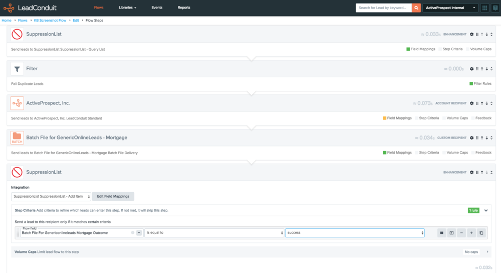
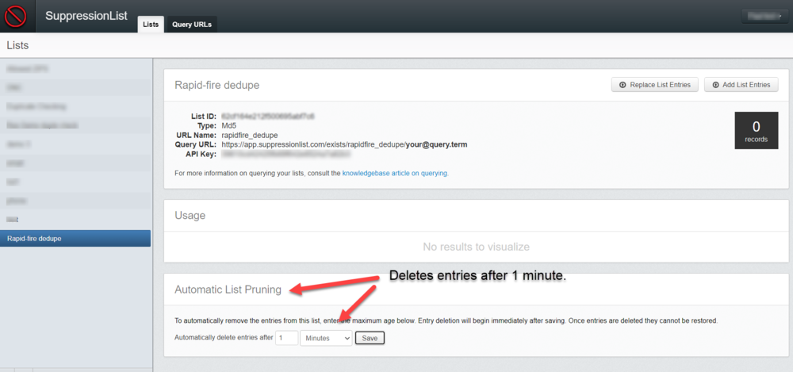
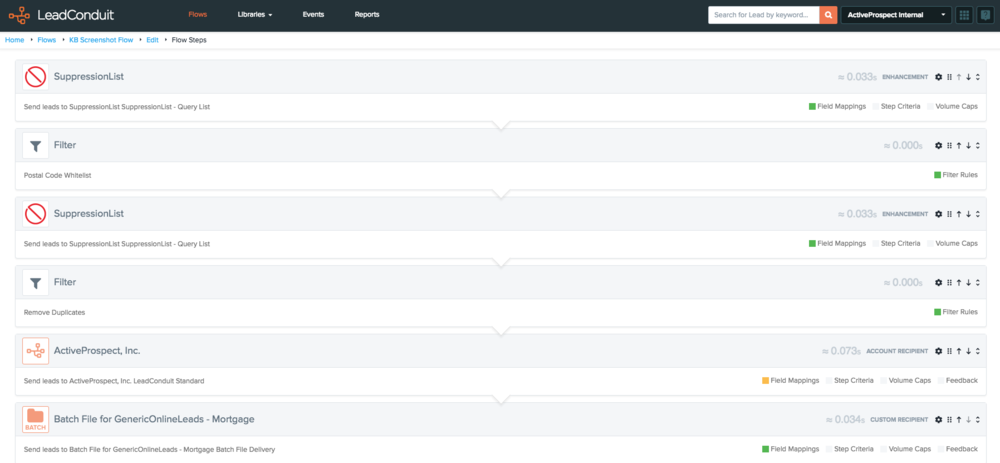

[_Scott McKee_](https://community.activeprospect.com/memberships/7557680-scott-mckee)

Updated July 13, 2022. Published December 22, 2020.

Details

# SuppressionList + LeadConduit Use Cases

Common use cases and best practices for SuppressionList + LeadConduit.

Duplicate Checking Method 1: Query, Filter, Add to a List when the lead is accepted.

This is the default method of using SuppressionList. It's the simplest to set up and requires a only three flow steps: A SuppressionList **Query** step, a **Filter** step to act on the outcome of that query and, when duplicate-checking, a SuppressionList **Add to List** step to update the list with the new lead's key value.

Duplicate Checking Method 2: Add to a List then Remove if the lead is not accepted.

The Query & Add Item step is effective at catching a rapid-fire ""stutter"" of duplicate lead submissions, and is especially useful in flows that take a long time to process each lead.

The ""Query and Add"" SuppressionList step first adds the key field to the list, then immediately checks to see if that value is unique within the list. If not, then it was already in the list, can be considered a duplicate, and an ""is Unique"" datum of ""false"" will be appended to the lead. A Filter step can then reject the lead based on the value of ""Is Unique"".

If ""Is Unique"" is true, then the key value is new to the list and the lead is not a duplicate. No further action is necessary unless a subsequent Filter rejects the lead. In that case, you'll want to delete the new key value from the list so as not to treat future leads to dupe out. You'd do this by placing a SuppressionList ""Delete Item"" step just before each subsequent filter, with step rules to limit it's execution to the same conditions that would cause the associated filter to reject the lead.

Because of the possible need for multiple ""Delete Item"" steps with step rules, this method is more complex to set up and maintain. But it's very effective at trapping rapid-fire duplicate submissions.

Best Practice is to use Query - Filter - Add by default, reserving Query & Add - filter - Delete for cases where the default method has proven inadequate.

**Rapid-Fire Submission Deduping: Combining duplicate checking methods 1 and 2 for with a short-term, self-pruning list.**

Occasionally with method 1 above, sources will submit duplicate leads to a flow before the original version of the lead has had time to reach the ""Add to list"" step near the end of the flow. While method 2 is effective at catching these, it also requires SuppressionList ""delete item"" steps mated to each and every post-query filter in the flow. Here's an effective way to achieve ""rapid-fire"" deduping while keeping most of the simplicity of method 1 deduping.

First, set up duplicate checking as described in level 1 above.

Next, create a new, ""rapid-fire"" list in SuppressionList, but set its ""Automatic List Pruning"" property to 1 minute.

Finally, at the top of your flow,  add an ""Is unique"" query step to check the rapid-fire list, with a filter as described in method 2 above. You don't need to include any of Method 2's ""Delete item"" steps at all, since the rapid-fire list will automatically clear any new items after 1 minute.

How this works:

- When a lead enters your flow, the ""Is Unique"" step attempts to add the query item to the rapid-fire list.
- If the item was already in that list the new, duplicate lead will immediately be stopped and rejected by a filter.
- If the lead is a duplicate of a successful one submitted more than a minute ago, the Method 1 query and its filter will reject the lead.
-  If the lead is not a duplicate per either method, the item value will, at the bottom of the flow, be added to the long-term list.
- Duplicate or not, the item value will automatically be deleted from the rapid-fire list 1 minute after the ""Is Unique"" step executes.

Use Cases Other Than Duplicate Checking

Sometimes your flow will query lists for reasons other than deduplication, like an existing-customer list, an area code whitelist, your internal do-not-call blacklist, or your own known litigators' list. In those cases an ""Add-to"" step is not needed. You can manually add new entries or replace the entire content of a list by importing the new key values in a csv file. This process is accessible in your account's SuppressionList dashboard.

# Best Practice For Filter Placement

When referencing SuppressionList step outcomes, a Filter will always see only the appended data from the most-recently-executed Query step. For instance, If your flow has two or more Suppression list Query steps, a filter located after (below) those steps will only be able to evaluate the ""Query Item Found"" value appended by the step that last executed a query.

Note that If a Query step in such a Flow doesn't execute (Outcome is ""skip"") the ""Query Item Found"" value will be that of the last Query step that DID execute, since the skipped step had no ""Query Item Found"" value to overwrite the previous result.

Obviously this can get complicated, so Best Practice is to always locate a filter immediately after the Query step it's evaluating, and if the Query step is subject to step rules, take that into account in your Filter's rules.

**What about Capitalization and Punctuation?**

SuppressionList lowercases capitalized letters in a value before storing or querying it, so ""Ted"" and ""ted"" would be seen as the same value in a query. What SuppressionList does not do is remove white space or punctuation to standardize against the possibility of variations in those characteristics. So ""John O'Hara"" and ""John Ohara"" would be treated as different values because of the apostrophe.

Type something
