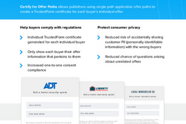

[_Christopher Williams_](https://community.activeprospect.com/memberships/7846678-christopher-williams)

Updated April 19, 2024. Published March 7, 2025.

Details

# TrustedForm Certify for Offer Paths Overview

Collapse

/ 1

127%

TrustedForm Certify for

Offer PathsCertify for Offer Pathsallows publishers using single path application offer paths to

create a TrustedForm certificate for each buyer’s individual offer.ActiveProspect, I n c .\|Austin, TX 7 8 7 4 5\|+1-512-394-4546 \|activeprospect.comIndividual TrustedForm c ertiffcate

g

enerated for each individual b uyerReduced risk of accidentally sharing

c

ustomer PII ( p ersonally identiffable

information) w ith the w rong b uyersOnly show each b uyer their offer

information that p ertains to themReduced c hance of q uestions arising

about unrelated offersIncreased one-to-one c onsent

c

omplianceHelp b uyers c omply w ith regulationsProtect c onsumer p rivacyff     









































































































































































































































































































































ff       ff       ff ff       

LOCAL REMODELER CO.By clicking, you provide an electronic signature by which you agree

to the following: I give my express consent to receive emails,

notifications, and calls, which may be auto-dialed, use artificial or

pre-recorded voices, and/or be text messages, about auto insuranceAmy Smith512-394-4546Get a home warranty quoteBy clicking, you provide an electronic signature by which you agree

to the following: I give my express consent to receive emails,

notifications, and calls, which may be auto-dialed, use artificial or

pre-recorded voices, and/or be text messages, about auto insuranceAmy Smith512-394-4546Get a home security quote

Trustedform Certificate

created forOffer #1

Trustedform Certificate

created forOffer #2

Trustedform Certificate

created forOffer #3

[https://activeprospect.com/?utm_source=Website&utm_medium=Marketing-Collateral&utm_campaign=AP-Collateral-TF-OfferPaths](https://activeprospect.com/?utm_source=Website&utm_medium=Marketing-Collateral&utm_campaign=AP-Collateral-TF-OfferPaths ""https://activeprospect.com/?utm_source=Website&utm_medium=Marketing-Collateral&utm_campaign=AP-Collateral-TF-OfferPaths"")

[https://activeprospect.com/?utm_source=Website&utm_medium=Marketing-Collateral&utm_campaign=AP-Collateral-TF-OfferPaths](https://activeprospect.com/?utm_source=Website&utm_medium=Marketing-Collateral&utm_campaign=AP-Collateral-TF-OfferPaths ""https://activeprospect.com/?utm_source=Website&utm_medium=Marketing-Collateral&utm_campaign=AP-Collateral-TF-OfferPaths"")

[https://activeprospect.com/trustedform/?utm_source=Website&utm_medium=Marketing-Collateral&utm_campaign=AP-Collateral-TF-OfferPaths](https://activeprospect.com/trustedform/?utm_source=Website&utm_medium=Marketing-Collateral&utm_campaign=AP-Collateral-TF-OfferPaths ""https://activeprospect.com/trustedform/?utm_source=Website&utm_medium=Marketing-Collateral&utm_campaign=AP-Collateral-TF-OfferPaths"")

#### AP\_TF\_OP\_24\_Certify\_OfferPaths.pdf

Type something
